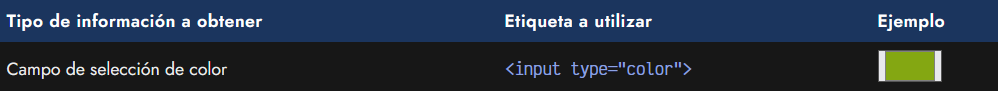
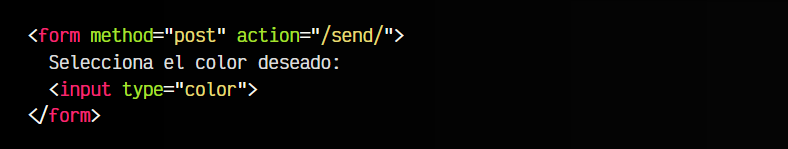
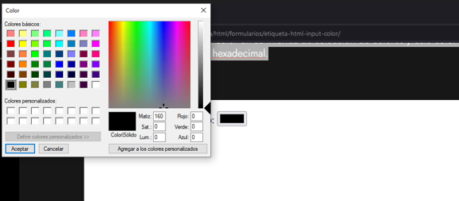
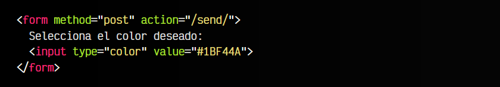
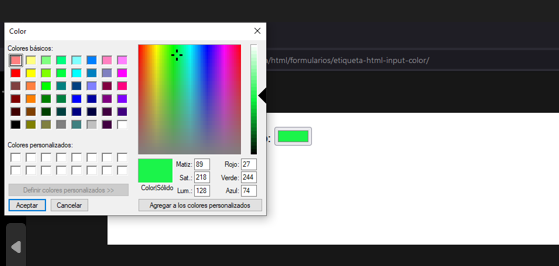
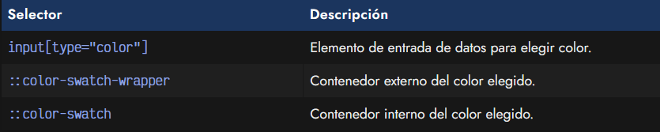
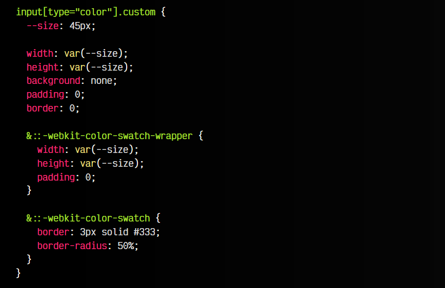
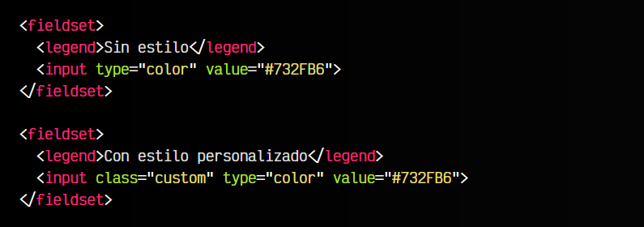
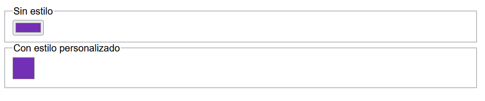
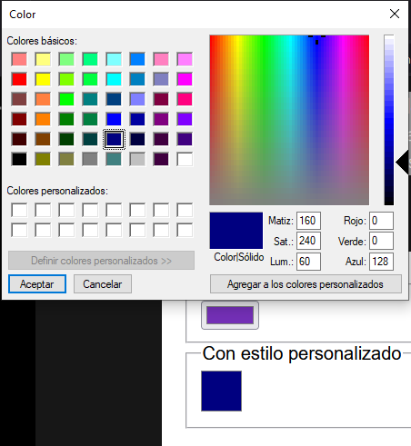

# 
La etiqueta < input > con colores.

En HTML5 se ha incluido un nuevo campo de entrada < input > que permite al usuario seleccionar un color específico. Dicho campo facilita una interfaz de usuario conocida como color picker, es decir, una ventana de diálogo selectora de colores que permite al usuario elegir un color específico de una rueda de colores o un sistema alternativo, generalmente dentro de uno de los diferentes modelos de [colores de CSS](https://lenguajecss.com/css/colores/codigos-color/).

## El atributo type="color".
La etiqueta que utilizaremos para mostrar esta interfaz será < input >, utilizando el atributo type al valor color. Ten en cuenta que el interfaz del color picker puede variar dependiendo del sistema operativo. Mientras en Windows saldrá de una forma, en dispositivos Apple o Android saldrá de otra:

El usuario puede elegir un color en su interfaz de selección de colores y este color es guardado en el atributo value en formato hexadecimal.

html:

vista:

## Color por defecto.
También se puede indicar un atributo value para establecer un color por defecto. Este valor debe estar en formato hexadecimal, con o sin #. Sin embargo, otros esquemas de color como palabras clave (red, tomato, green, etc...), RGB, HSL, HWB, OKLCH u otras no serán válidas:

html:

vista:

Este campo puede ser potenciado combinándose con la etiqueta HTML < datalist >. Lo veremos en otro artículo más adelante, donde explicaremos como funciona.

## Personalizar apariencia.
Vamos a echar un vistazo a la forma de personalizar este campo de entrada. Para ello, utilizaremos CSS y unos pseudoelementos especiales para los campos de entrada de color.

Veamos un ejemplo, donde modificamos los estilos para convertir el < input > de Color Picker en un elemento circular. Observa que utilizamos el background: none para quitar el color por defecto que tiene este campo. En el resto, le damos estilo para redondear las esquinas y añadirle un borde.

css:

html:

vista:

Ten en cuenta que la ventana de diálogo del Color Picker no es posible editarla con CSS, ya que es la que proporciona el sistema operativo. Windows, Mac/iOS, Linux o Android tienen su propio color picker particular.

Recuerda que esta API aún no es estable, por lo que hay que añadir el prefijo -webkit para dar soporte a navegadores basados en Chromium, y el prefijo -moz para dar soporte a Firefox. Cuando sea estable, simplemente escribiremos el código sin prefijos.

Ten en cuenta que no se pueden combinar dos selectores con prefijos diferentes, como es el caso de ::-webkit- y ::-moz-, ya que si el navegador no reconoce uno de ellos, ignorará y descartará el resto del selector.

