# 
La etiqueta HTML < select >.

En el artículo anterior hemos visto las casillas de verificación y los botones radio, que permiten al usuario elegir una entre varias opciones. Sin embargo, puede ocurrir que la cantidad de opciones disponibles a presentar sea muy alta, por lo que estos controles resulten poco prácticos. También, puede que simplemente no se adapten bien al aspecto visual que se quiere del formulario.

En el caso de que necesitemos mostrar una lista más extensa de datos, quizás sería conveniente utilizar una lista de selección, también llamada frecuentemente combo o lista desplegable. Estas listas nos permiten mostrar al usuario varias opciones disponibles para que se decanten por una.

Hay dos tipos de listas seleccionables:

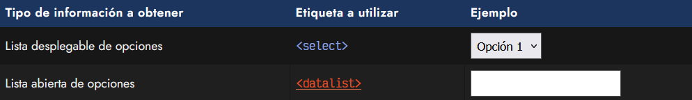

Vamos a centrarnos en el primer tipo de lista. Más adelante, en el próximo artículo, veremos el segundo.

## Listas desplegables.
La forma más básica de crear una lista desplegable de elementos se compone de una etiqueta contenedora < select > que en su interior incluirá varias etiquetas < option >, una por cada opción posible a elegir por parte del usuario:

html:
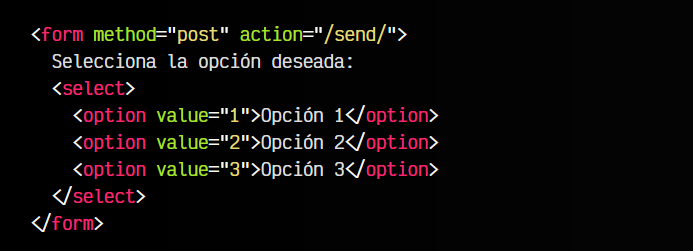

vista:

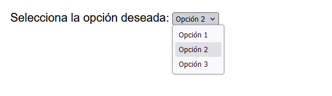

Observa que en este fragmento de código tenemos una etiqueta < select > con tres opciones < option >. El atributo value tiene el valor interno de la opción, mientras que el contenido de la etiqueta < option > es lo que el usuario observará visualmente en el formulario.

De forma alternativa, en lugar de colocar el texto de la etiqueta en el interior de < option >, también podemos hacerlo como valor del atributo label.

## Opción seleccionada por defecto.
Si queremos que una opción de la lista esté marcada por defecto, incluiremos el atributo selected:

html:
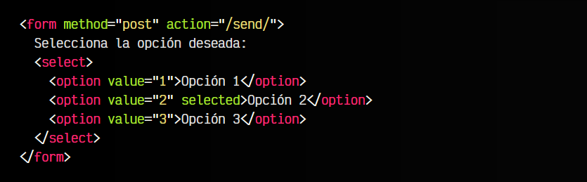

vista:
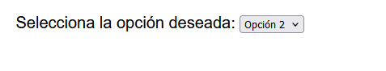
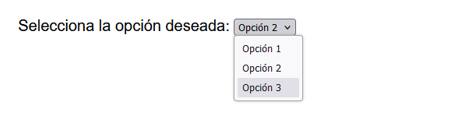
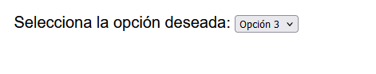

Como puedes ver, la Opción 2 aparecerá visualmente marcada. Intenta no confundir el atributo checked (utilizado en checkbox y radio) con el atributo selected, puesto que no son lo mismo.

## Sugerencia visual.
Es posible que queramos que por defecto, exista una opción marcada que de una pista o sugerencia al usuario de que debe seleccionar una opción. Sin embargo, nos interesa que dicha opción no pueda ser seleccionada finalmente, y que esté desactivada:

html:
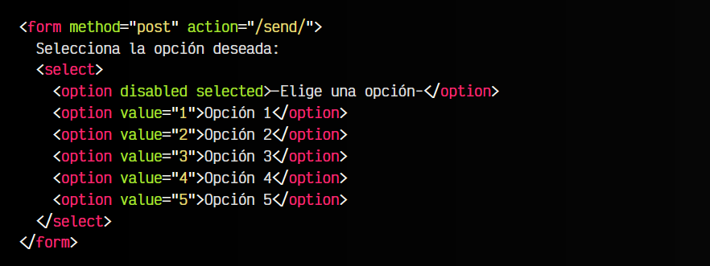

vista:
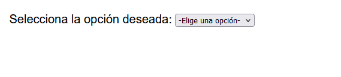
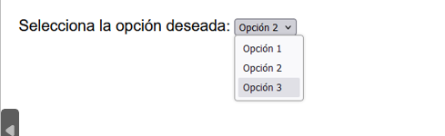
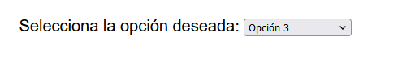

Para ello, hemos utilizado el atributo disabled para desactivar esa opción y no dejar seleccionarla, pero por otro lado, hemos utilizado el atributo selected para que aparezca marcada por defecto para que el usuario pueda leer su contenido.

Esta opción, al estar seleccionada inicialmente, no cumplirá la restricción de validación del formulario, algo que aprenderemos algo más adelante, en el capítulo de Validaciones HTML.

## Grupos de opciones.
Utilizando la etiqueta < hr > (separación temática) dentro de un elemento < select > podemos conseguir mostrar una línea entre opciones, de modo que tengamos grupos de opciones diferentes:

html:
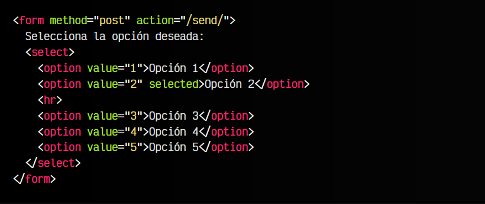

vista:

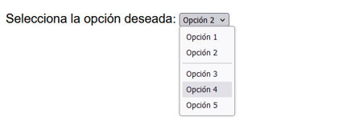

Sin embargo, quizás la mejor forma de separar elementos, sea la creación de grupos o categorías de opciones. Para ello, podemos utilizar la etiqueta < optgroup>, la cuál se utilizará de etiqueta contenedora, agrupando las etiquetas < option> que quieras incluir en el grupo. Por otro lado, el atributo label se utilizará para poner un texto visual que el usuario podrá ver:

html:
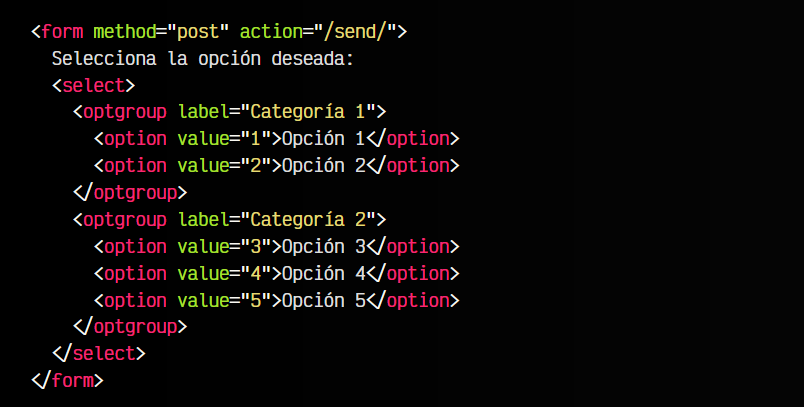

vista:
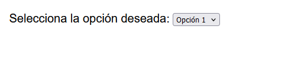
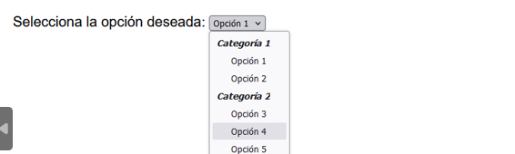

Ten en cuenta que las etiquetas < optgroup > no son seleccionables. Sin embargo, podemos incluir el atributo disabled, desactivando el grupo y además, impidiendo que el usuario seleccione cualquier opción de ese grupo.

## Listas seleccionables múltiples.
A la etiqueta < select > le podemos aplicar el atributo multiple. De esta forma, estaremos indicando al navegador que el usuario puede seleccionar múltiples opciones, por lo que la apariencia visual de la lista cambiará a una lista de selección marcable, donde podemos seleccionar múltiples valores, y no necesariamente uno:

html:
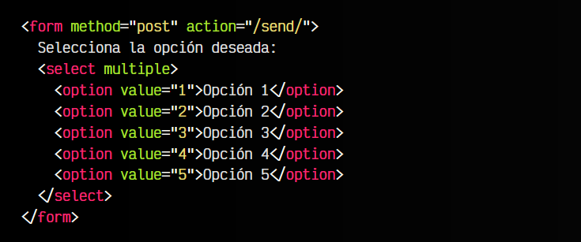

vista:
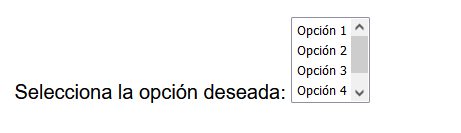
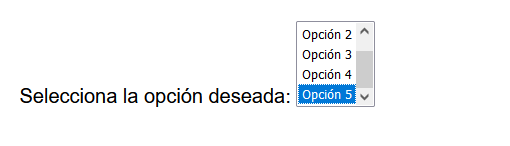
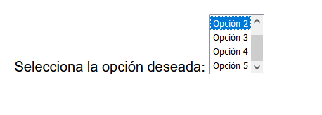

Aunque, si pulsamos en las diferentes opciones, sólo se marcará una, manteniendo pulsada la tecla CTRL podremos marcar todas las opciones que seleccionemos. Además, con la tecla SHIF pulsada, podemos marcar un rango de varias opciones.

## Personalizar apariencia.
Podemos personalizar la estética de nuestros elementos < select > de la página. Para ello, vamos a añadirle un CSS personalizado, donde utilizaremos la propiedad appearance para resetear los estilos del navegador y personalizarlos completamente:

html:
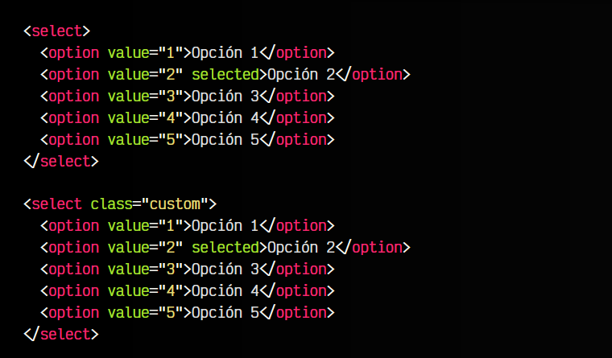

css:
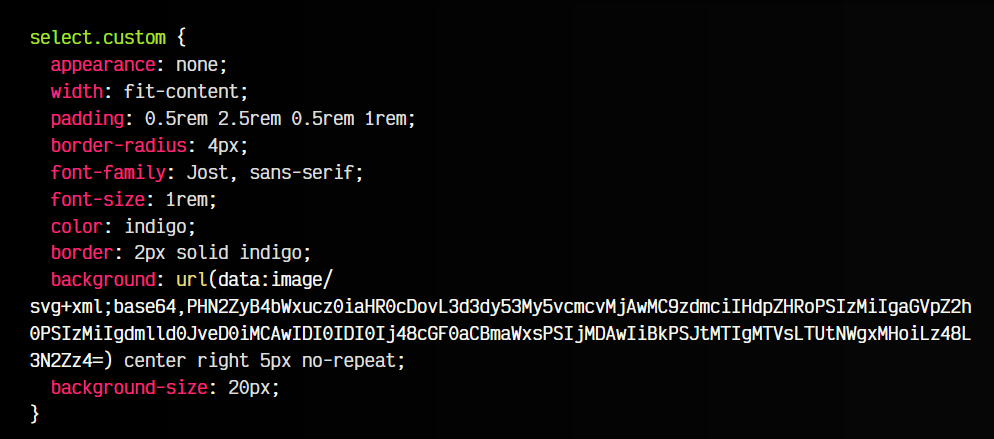

vista:
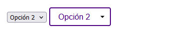
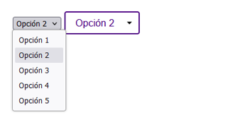
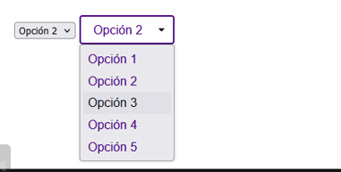

Observa que en el CSS, estamos añadiendo una imagen de fondo para personalizar la flecha del < select >. La URL de esta imagen es una imagen vectorial .svg codificada en base64, que realmente es esta de aquí:

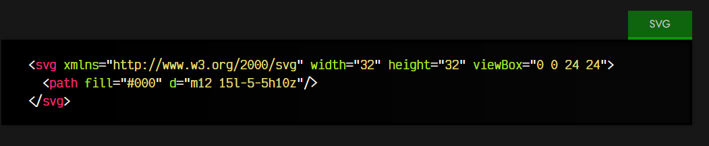

Lo hacemos así para ahorrarnos la petición externa y adjuntarla en el CSS, cosa que en algunos casos nos puede interesar. Ten en cuenta que también puedes darle estilo a los elementos < option > del interior del select, pero su personalización está algo limitada por el navegador. Podemos cambiar cosas como aspectos de tipografía con font-family, colores de texto o fondo con color o background, pero no tenemos mucho más rango de cambio.

## La etiqueta < selectlist >.
Existe una propuesta de una nueva etiqueta < selectlist > que nos permitirá hacer cosas muy potentes, como se puede ver en este ejemplo de < selectlist >. Listas desplegables con formas muy diversas, incluir imágenes dentro de un < select >, filtrado, listas con scroll, etc.

Sin embargo, aún es muy pronto para hablar de ella, ya que está en fase experimental.

