# 
La etiqueta HTML < datalist >.

Aunque hemos visto controles como las casillas de verificación, los botones de opción (radio), o las listas de selección hay situaciones en las que puede que ninguno de estos controles nos sirvan. Por ejemplo, una opción de varias posibles, pero también abierta a que se añadan más opciones por parte del usuario. Esto sería una mezcla entre un campo < input > de texto y una lista desplegable < select >.

## La etiqueta < datalist >.
Es posible crear este tipo de control mediante la etiqueta < datalist >, el cuál es una especie de «potenciador» para aumentar las posibilidades de otra etiqueta, y permitir personalizarlas de una lista de datos.

La etiqueta < datalist > debe indicarse con un atributo id para identificarse. En su interior, incluiremos varias etiquetas < option > para añadir opciones, al igual que lo hacemos en una etiqueta < select >:

html:
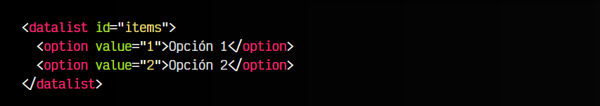

vista:

Como habrás podido comprobar, esto no mostrará nada visualmente, ya que esto solo crea la lista de datos, ahora tenemos que conectarla a otro campo de entrada de datos para potenciar sus funcionalidades.

## Entrada de texto.
Por ejemplo, utilicemos la etiqueta < input type="text" > para permitir al usuario introducir texto pero aumentándola con las capacidades de < datalist >. Utilizaremos el atributo list del < input > para conectar con el id del < datalist >:

html:
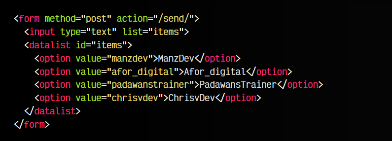

vista:
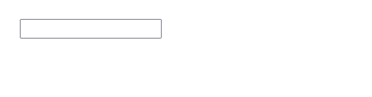
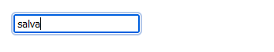

Esto hará que el usuario pueda utilizar el < input > como siempre lo ha hecho, pero también le aparecerá una flecha de modo que podrá usarlo como si fuera un < select > de opciones desplegables. Por otro lado, para campos < input type="number" > el < datalist > funciona exactamente igual, sólo que basado con números.

En listas con muchas opciones, también se tiene la ventaja que al escribir un fragmento de texto, sólo nos aparecen los ítems que contienen dicho fragmento, lo que lo hace ideal para crear listas de opciones extensas o de forma dinámica con Javascript.

## Rangos de números.
Para etiquetas < input type="range" > es bastante interesante el uso del < datalist >. Por normal general, el campo de rango nos muestra un slider que no determina los valores.

Sin embargo, si utilizamos los atributos min y max para restringir las opciones y combinamos el < input type="range" > a través del atributo list con el id del < datalist >, conseguiremos que el slider nos muestre unas marcas para delimitar cada una de las opciones posibles:

html:
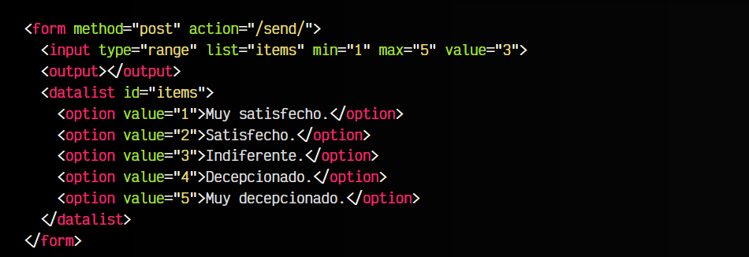

js:
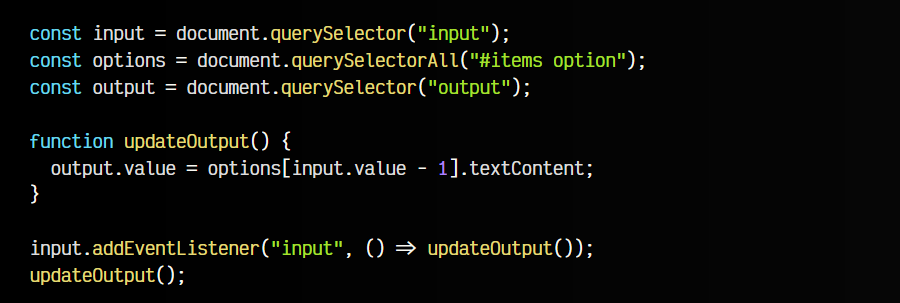

vista:

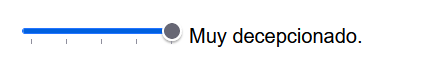

Observa que con un poquito de Javascript, podemos hacer que el formulario actualice los valores, obteniéndolos desde el HTML, por lo que si modificamos el HTML seguirá funcionando consecuentemente.

Recuerda que en [etiquetas < input >](https://lenguajehtml.com/html/formularios/etiqueta-html-input-numeros/) de números mencionamos como trabajar con los rangos numéricos y como mostrar sus valores.

## Selector de fechas (date picker).
Mediante la combinación del < input type="date" > y la etiqueta < datalist > podemos hacer un campo desplegable de fechas, con la diferencia que muestre varias fechas concretas prefijadas, definidas en las opciones del < datalist >, y si el usuario no escoge ninguna de ellas, también pueda desplegar el calendario habitual para elegir la fecha específica:

html:
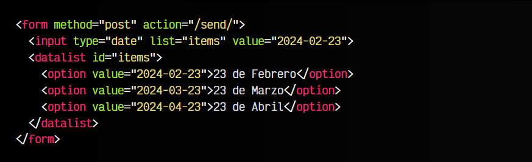

vista:
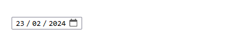

Esta combinación se puede realizar tanto con los < input type="date" >, como con sus variantes de fechas/horas como < input type="time" > u otras.

## Selector de colores (color picker).
Mediante la combinación de < input type="color" > y la etiqueta < datalist > podemos hacer una lista desplegable de colores predefinidos. El usuario tiene la opción de seleccionar uno de ellos, o pulsar en «Otras...» y elegir un color en el campo de colores tradicional:

html:
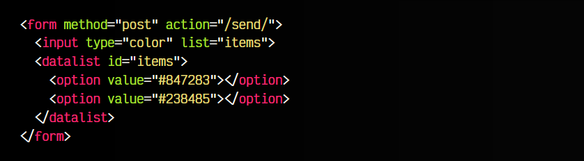

vista:

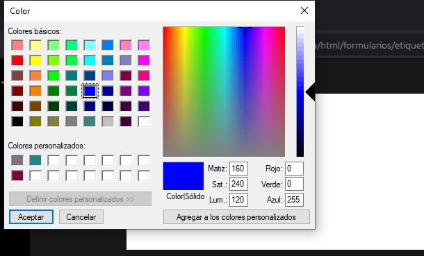

Tienes más información sobre colores en el artículo de [campos de colores](https://lenguajehtml.com/html/formularios/etiqueta-html-input-color/).

