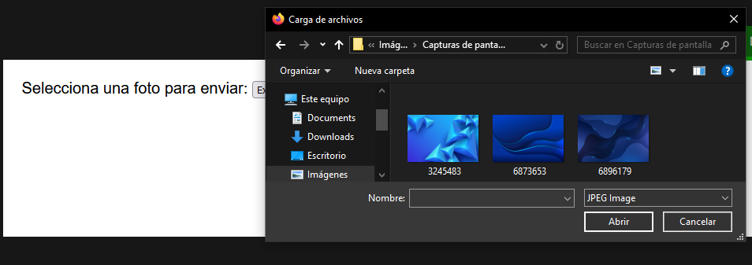

# 
La etiqueta < input > con ficheros.

Una de las características más interesantes de un formulario, es la posibilidad de enviar archivos por parte de un usuario a través de un formulario. Mediante la etiqueta < input type="file" > es posible seleccionar archivos, adjuntarlos y enviarlos junto al resto del formulario.

Esta interfaz habitualmente se muestra como un botón «Examinar...» o «Seleccionar archivo», mediante el cuál nos abrirá una ventana de diálogo del sistema operativo que nos permitirá seleccionar el archivo de las carpetas de nuestro equipo o dispositivo.

## Activar envío de archivos.
Si utilizamos un campo de envío de archivos en un formulario, debemos tener claro el atributo enctype de la etiqueta < form > contenedora, ya que es un punto importante en este tema. Este atributo indica el tipo de contenido que se va a enviar en el formulario, y puede tener varios valores:

Si omitimos el atributo de la etiqueta < form > o ponemos un valor incorrecto, asumirá el primero. Sin embargo, si queremos enviar archivos debemos asegurarnos de tener el valor multipart/form-data:

html:

 

vista:

Ya estamos listos para enviar un fichero. Ahora vamos a profundizar en los atributos de la etiqueta < input >.

## Sugerencias de archivos.
Es posible indicar el atributo accept a la etiqueta < input type="file" > a modo de sugerencia para el navegador, de modo que podamos indicar los formatos de archivos permitidos subir al formulario.

Veamos un ejemplo, utilizando este atributo:

html:

vista:

En el interior del atributo accept tenemos lo que se denomina un tipo MIME, una especie de fragmento de texto que identifica de forma única el formato de archivo. Algunas de las más interesantes para utilizar hoy en día en un formulario serían las siguientes:

Es importante saber que esto es sólo una sugerencia, el usuario puede subir otro tipo de archivos de forma malintencionada o no intencionada, por lo que al margen de esto, siempre debería comprobarse y revisarse en el backend.

## Seleccionar múltiples archivos.
Por otro lado, si indicamos el atributo multiple en la etiqueta < input type="file" >, estaremos dando la opción al usuario de poder enviar múltiples archivos en lugar de uno en el mismo campo:

html:

vista:

Como siempre, nos aparecerá el diálogo de selección de archivos, sólo que en esta ocasión el usuario podrá pulsar la tecla CTRL

, y seleccionar varios archivos a la vez, en lugar de uno solo.

En general, esta característica no suele verse mucho en el mundo real, y lo que se suele hacer es añadir múltiples campos de envío de fichero, uno por cada fichero que quieres enviar. Luego, esto se procesa en el lado del servidor por cada uno de ellos.

Recuerda que esto que hemos visto es sólo la habilitación de controles para que el usuario pueda adjuntar y enviar ficheros a través de un formulario, sin embargo, el proceso de obtenerlos y tratarlos se hace en el lado del servidor.