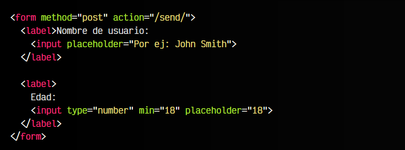

# 
Organización de campos.

Hasta ahora, nos hemos enfocado en conocer como funcionan campos concretos del formulario para obtener información determinada. Sin embargo, una buena práctica sería aprender y entender como funcionan ciertas etiquetas que sirven para organizar la información, tanto visualmente como semánticamente.

Las etiquetas que veremos son las siguientes:

Profundicemos en cada una de ellas.

## Agrupación visual.
La etiqueta < fieldset > es un elemento utilizado como etiqueta contenedora para agrupar visualmente, mediante un trazo simple, los campos de un formulario que tengan cierta relación (misma temática o mismo apartado, por ejemplo).

Observa un ejemplo:

html:

vista:

Como habrás visto, hemos indicado los datos personales (nombre y edad) en un mismo < fieldset > para agruparlos por temática.

La etiqueta < fieldset > también puede ser modificada mediante CSS, por ejemplo, cambiando el valor de border a un grosor, color o estilo diferente, así como el fondo mediante background o añadirle una sombra con box-shadow, por poner varios ejemplos.

## Leyenda de la agrupación.
Si creamos múltiples campos < fieldset > en un mismo formulario, puede ser difícil diferenciarlos, por lo que convendría tener una forma de etiquetarlos y mostrar que incluye ese campo. En el ejemplo anterior, vamos a añadir la etiqueta < legend >, que se incluye en el interior de la etiqueta < fieldset > en cuestión, para mostrar un título o leyenda en el trazo de esa agrupación.

html:

vista:

Esto nos permitirá tener un formulario mejor organizado y muy fácil de leer para el usuario.

## Personalizar apariencia.
Como siempre, utilizando CSS sobre las etiquetas < fieldset > y < legend > podemos personalizar la apariencia de esta agrupación visual. Para ello, trataremos como un borde el < fieldset > y utilizaremos tipografías de fuente para el < legend >:

html:

css:

vista:

Observa que hemos hecho varias cosas:

   - 1️⃣ En < fieldset > usamos border para cambiar color, grosor o estilo.
   - 2️⃣ También podemos redondear esquinas usando border-radius.
   - 3️⃣ En < legend >, podemos personalizar la tipografía.
   - 4️⃣ Podemos usar text-align para colocar el texto de leyenda.
   - 5️⃣ Con padding podemos conseguir darle «aire» entre texto y borde.

## Orden de campos.
Un detalle interesante: Cuando nos encontramos en un campo de formulario, al pulsar la tecla TAB podemos avanzar al siguiente campo sin necesidad de recurrir al ratón. También podemos conseguir la operación opuesta pulsando SHIFT+TAB, es decir, retroceder al campo anterior del formulario.

Por defecto, el navegador sigue el orden de los campos según el orden establecido en el HTML. Sin embargo, si queremos personalizar dicho orden, podemos utilizar el atributo tabindex, indicando un número con el orden en cuestión:

html:

vista:

Observa que en el ejemplo anterior hemos colocado varios atributos tabindex con un valor numérico. Este ejemplo no tiene una lógica real, simplemente hemos indicado esos valores numéricos para aprender como funciona.

Observa que el primer elemento tiene un 1, el segundo un 3 y el tercero un 2. Al contrario que como cabría esperar, cuando el usuario se posiciona en el primer campo y pulsa TAB, saltaremos directamente al tercer campo, ya que tiene indicado tabindex a 2, y al volver a pulsar TAB saltaremos al segundo campo, que tiene tabindex a 3.

Se recomienda utilizar el atributo tabindex sólo cuando esté justificado y las circunstancias lo requieran, ya que cambiar el orden de los campos puede confundir al usuario o facilitar equivocaciones al rellenar el formulario.

## La etiqueta < label >.
Un detalle muy importante en la organización de campos de un formulario es el uso de la etiqueta < label >. Esta etiqueta no tiene que ser necesariamente usada siempre, sin embargo, en muchas ocasiones puede mejorar la semántica y usabilidad de un formulario.

Cuando creamos varios campos de un formulario, hasta ahora, escribimos el texto que acompaña a los campos antes o después del propio control o campo de entrada de datos:

html:

vista:

Sin embargo, semánticamente, el texto Nombre de usuario no tiene relación con el campo de datos. Una buena práctica, es establecer una etiqueta < label > que haga referencia al campo relacionado, por ejemplo, usándola de etiqueta contenedora:

html:

vista:

En este caso, ahora los textos si que están relacionados con los campos en cuestión. De hecho, observarás que en el primer caso, si pulsas sobre el texto no ocurre nada. Sin embargo, en este último ejemplo, si pulsas sobre el texto relacionado, activarás el campo de entrada de datos, porque tienen una relación entre sí.

Otra forma de establecer los campos < label > es utilizando el atributo for. Este atributo hará referencia al id de un campo de entrada de datos, relacionándolo aunque la etiqueta < label > no incluya el campo de entrada de datos, permitiéndonos separarlo por si el aspecto visual o estético lo requiere:

html:

vista:

