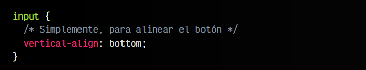

# 
La etiqueta HTML < input > submit.

Los botones de envío de formulario son un punto bastante importante en la creación de un formulario. Si bien un formulario puede carecer de estos botones, en ese caso, el usuario sólo puede enviarlo si pulsa ENTER en el último campo del formulario. No obstante, dependiendo de la situación, es posible que sea aconsejable incluir el botón explícitamente para que el usuario pueda pulsarlo y enviar el formulario de forma clara y sin confusión.

Tenemos varios tipos de botones que actúan sobre un formulario en general:

Veamos cada uno de ellos.

## Botón de envío de formulario.
El botón < input type="submit" > es el considerado botón de envío de formulario habitual. Una vez el usuario ha rellenado todos sus campos de entrada de datos, puede pulsar este botón para concluir el proceso y enviarlo al backend que debe procesar sus datos.

Por defecto, el texto del botón será Enviar (o un texto equivalente según el idioma del navegador). Sin embargo, podemos modificar el texto del botón mediante el atributo value:

html:

vista:

En este caso, el usuario pulsará en el botón y el navegador realizará una petición POST a la dirección del dominio actual, añadiéndole la ruta absoluta /send/, por lo que el backend que esté escuchando en esa página será el que tome los datos del formulario y los procese.

## Botón de envío con imagen.
De forma alternativa, nos podría interesar crear un botón de envío de formulario basado en una imagen. Para ello, usaremos el botón < input type="image" >, que es un botón de envío de formulario que tiene la misma funcionalidad que el botón anterior, pero es un híbrido entre < input type="submit" > y una etiqueta < img >.

De la misma forma que esta, también posee los atributos src, alt, width y height para indicar una imagen que actuará de botón de envío:

html:

css:

vista:

Si no recuerdas como funciona la etiqueta de imágenes < img >, puedes aprender más sobre ella en este artículo de aquí: [La etiqueta HTML < img >](https://lenguajehtml.com/html/multimedia/etiqueta-html-img/).

## Botón de resetear formulario.
El botón < input type="reset" > nos ofrece la posibilidad de resetear por completo el formulario a sus valores iniciales. Disponer de un botón que permite reiniciar los valores de todos los campos del formulario a su valor por defecto, puede ser muy interesante en algunas situaciones.

html:

vista:

Nuevamente, el atributo value permite personalizar el texto del botón, que por defecto suele ser algo similar a Restablecer o Reset, dependiendo del idioma.

Cuidado al incluir el botón de reseteo al lado del botón de envío de formulario. Quizás sería una buena idea separarlos notablemente para evitar que el usuario lo pulse sin querer.

## Botones personalizados.
También es posible que deseemos incluir un botón con un funcionamiento personalizado que no tenga nada que ver con el envío del formulario. Para ello, tenemos dos opciones a priori similares: la etiqueta < input type="button" > y la etiqueta < button >.

## La etiqueta < input type="button" >.
La etiqueta < input type="button" > cumple exactamente con el criterio anterior. Si deseamos incluir un botón que no realice el envío del formulario y simplemente realice otra operación que le indiquemos mediante javascript, este tipo de botón es perfecto:

html:

vista:

En este ejemplo, tenemos un < input > para la entrada de datos, un botón < input type="submit" > para enviar el formulario, y un botón < input type="button" > para llamar a otra operación Javascript que obtendrá automáticamente el username mediante un método alternativo.

Recuerda establecer un texto en el atributo value, ya que este botón no incorpora ningún texto por defecto.

Si utilizas una etiqueta < input type="button" > o < button > dentro de una etiqueta < form >, dicha etiqueta asumirá el rol del botón < input type="submit" > (o alternativo).

## Botón de envío alternativo.
Por último, aunque a priori no tenga mucho sentido, en un formulario es posible establecer múltiples botones < input type="submit" >. De esta forma, podemos ponerle un funcionamiento concreto a cada botón para el mismo formulario.

En el caso de que utilicemos varios botones de envío en un formulario, habría que utilizar los atributos siguientes:

Por norma general, los botones de envío del formulario funcionan en base a los atributos action, enctype, method, target y novalidate de la etiqueta < form > que los contiene. Sin embargo, es posible crear botones de envío alternativos que tengan un comportamiento de envío diferente a los botones por defecto.

Para ello, tenemos que crear un botón de envío < input type="submit" > o < input type="image" > e incluir los atributos correspondientes, según nos interese, ya que sobreescribirán el comportamiento por defecto del formulario:

html:

vista:

En este caso, dependiendo del botón pulsado enviará el formulario a una URL dependiendo del botón submit pulsado:

   - El primer botón envía un método POST a la url /send/.
   - El segundo botón envía un método POST a la url /send/?dpto=mkt en una pestaña nueva.
   - El tercer botón envía un método POST a la url /send/?dpto=sat en una pestaña nueva.
   - El cuarto botón envía un método POST a la url /send en una pestaña nueva con las validaciones de frontend desactivadas.

En estos ejemplos se ha usado la misma URL con una variable dpto diferente, pero podrían usarse URLs diferentes como /send-mkt/ o /send-sat/, por ejemplo.

