# 
La etiqueta HTML < button >.

Hasta ahora, hemos visto botones de tipo < input >, que suelen ser los botones apropiados para utilizar en formularios. Sin embargo, también existe otro tipo de botón, que puede ser útil incluso para usar fuera de formularios. Por defecto, este tipo de botones no tiene ninguna funcionalidad, pero podemos darsela mediante Javascript, como veremos más adelante.

## La etiqueta < button >.
La etiqueta < button > es muy similar a las que ya hemos visto, pero aún más simple. Recordemos que no tiene ninguna funcionalidad por defecto, por lo que sin Javascript sólo podemos hacer lo siguiente:

html:
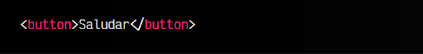

vista:
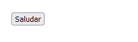

Se trata de un botón «Saludar», que es pulsable, pero que no tiene ninguna funcionalidad, ya que de momento no hemos añadido ningún fragmento de código Javascript.

Este botón sólo podría tener funcionalidad sin Javascript si lo añadimos como último botón en una etiqueta < form >. De esta forma, automágicamente asumirá el rol de botón para enviar formulario.

## Funcionalidad con Javascript.
Veamos ahora como podemos añadir un fragmento de Javascript, asociado a ese botón. Normalmente, se le asocia una función Javascript cuando realicemos una acción con el botón, generalmente un click:

html:
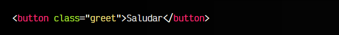

js:
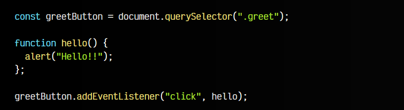

vista:
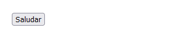
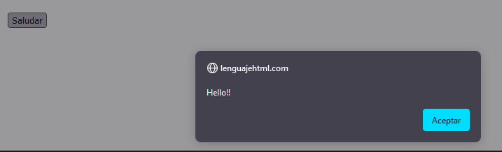

Hemos establecido una función hello() que se ejecutará cada vez que hagas click en el botón. De esta forma, puedes asignar acciones mediante funciones a eventos especificos (no sólo a clicks de ratón).

## Botón desactivado.
Añadiendo el atributo disabled podemos indicar al navegador que ese botón debería encontrarse desactivado. Observa los dos botones del fragmento de código siguiente:

html:
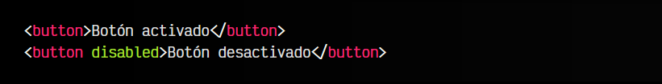

vista:
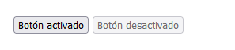

Intenta evitar añadir clases disabled redundantes, ya que tenemos el atributo estándar con el funcionamiento implementado por defecto. Si quieres cambiarle el estilo, lo explicamos en el siguiente apartado.

## Personalizar apariencia.
Un botón HTML es un elemento de navegador normal y corriente, por lo que podemos darle estilo simplemente aplicando las propiedades CSS apropiadas para modificar su apariencia.

A continuación tienes un ejemplo donde hemos creado un botón normal, redondeado y un botón desactivado:

html:
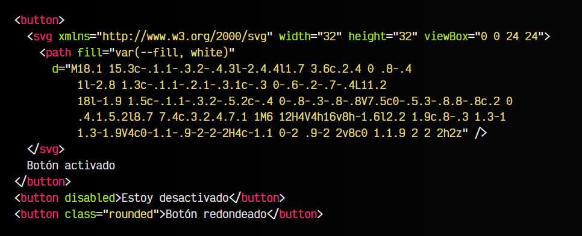

css:
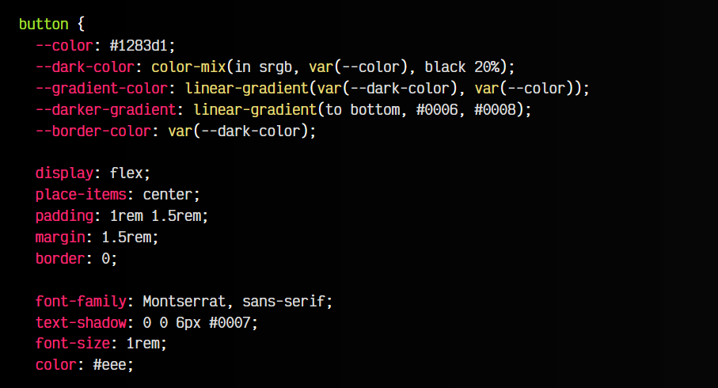
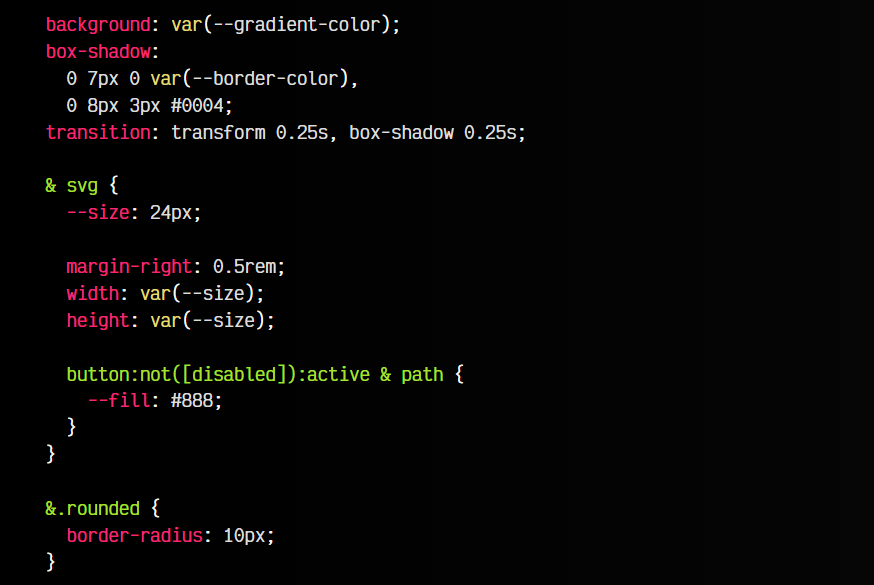

vista:
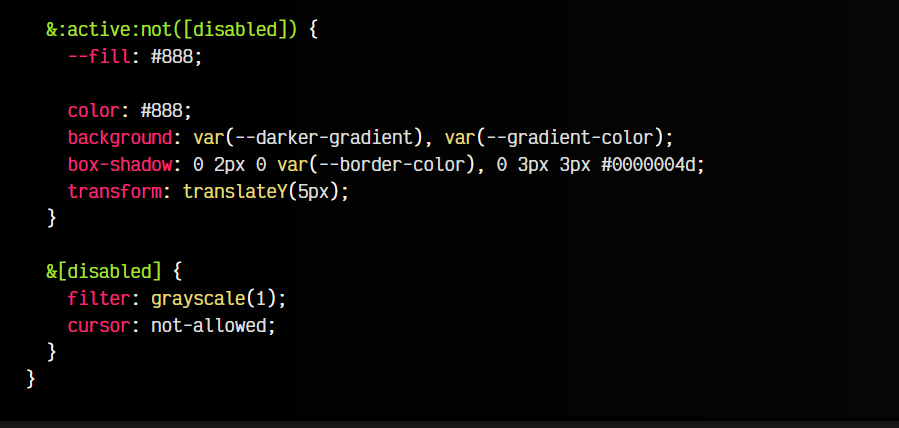

Observa que en el código CSS utilizamos características interesantes como [CSS Nesting](https://lenguajecss.com/css/calidad-de-codigo/css-nesting/), [variables CSS](https://lenguajecss.com/css/cascada-css/css-custom-properties/) o [gradientes CSS](https://lenguajecss.com/css/gradientes/linear-gradient/).

