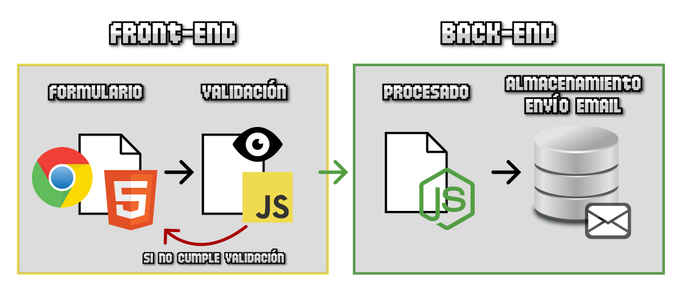
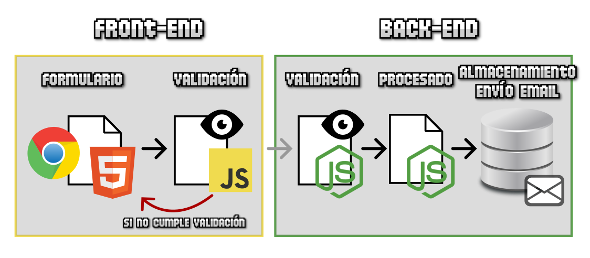

# 
¿Qué son las validaciones?.

Hasta ahora hemos ido aprendiendo las diferentes etiquetas HTML para crear elementos en un formulario, así como personalizarlas con contenido o atributos de dichas etiquetas. Sin embargo, al crear un formulario en HTML, debemos ser conscientes de un detalle ineludible: los usuarios se equivocan al rellenar un formulario.

Ya sea por equivocación del usuario, ambigüedad del formulario, o error del programador del formulario, el caso es que debemos estar preparados y anticiparnos a estos errores, para intentar que los datos lleguen correctamente a su destino, con el formato adecuado y esperado, y evitar cualquier tipo de moderación o revisión posterior para no perder tiempo.

## ¿Qué es una validación?.
Para evitar estos casos que hemos mencionado, se suele recurrir a un tipo de proceso automático llamado validación. En dicho proceso, establecemos unas pautas para comprobar si el usuario ha introducido la información de forma correcta o en el formato esperado, y en caso contrario, tenga que corregir los datos si quiere enviar el formulario correctamente.

Un esquema tradicional de validación de ejemplo podría ser el siguiente:

   - Tenemos un formulario HTML5 que el usuario debe rellenar.
   - Antes de enviar al backend, mediante Javascript validamos que no hay errores.
   - Si no se supera esa validación, se devuelve al usuario al formulario para que corrija los errores.
   - Una vez superada, el formulario se envía al back-end de la página para ser procesado.

Escenario tradicional de validación

Este sería un sistema de validación clásico, sin embargo, tiene varios problemas que comentaremos a continuación que no lo hacen un sistema de validación adecuado. Vamos a revisar el esquema anterior paso a paso, creando escenarios derivados, para detectar los posibles problemas y llegar a un sistema de validación más apropiado.

## Escenario 1 (sin validación).
El peor caso que podríamos plantear sería el siguiente: el formulario no tiene validación de ningún tipo. Ni en el frontend, ni en el backend.

   - El usuario escribe la información en el formulario y la envía.
   - El navegador no tiene validación, por lo que la envía al backend sin comprobar.
   - El backend no tiene validación, por lo que la envía por correo o guarda en base de datos sin comprobar.

Es el peor escenario posible, puesto que el usuario podría enviar información incorrecta, o incluso hasta datos malintencionados que podrían comprometer la seguridad del servidor, guardando información incorrecta, corrompiendo la base de datos u otros problemas.

## Escenario 2 (validación frontend).
Otro caso podría ser que el formulario tenga validación sólo en el front-end, es decir, en el navegador. Aunque es una mejora, sigue sin ser adecuado.

   - El usuario escribe la información en el formulario y la intenta enviar.
   - El navegador comprueba (valida) los datos antes de enviarlos. Si detecta errores, obliga a corregirlos.
   - Si no hay errores, se envían los datos al backend.
   - El backend no tiene validación (confía en la validación del front), por lo que la envía por correo o guarda en base de datos.

Este escenario plantea un problema grave. La validación del frontend se puede desactivar o modificar, por lo que un usuario malintencionado podría eliminar dicha capa de validación y estaríamos en el mismo escenario anterior. La validación de frontend tiene como objetivo aumentar la velocidad de respuesta y permitir validar los datos sin que tenga que viajar al backend y volver al front, por lo que la latencia es mucho menor. Sin embargo, nunca se debe confiar sólo en una validación de frontend.

Como veremos más adelante, las validaciones en frontend se pueden hacer con Javascript (más tradicionales) o utilizando ciertos atributos de HTML (más moderna). Incluso puedes utilizar una mezcla de ambas.

## Escenario 3 (validación backend).
Veamos un nuevo escenario. El tercer caso posible es uno donde el formulario tiene validación sólo en el back-end.

   - El usuario escribe la información en el formulario y la envía.
   - Como no hay validación en frontend, la información llega al backend y se comprueba.
   - Si no hay errores, se envía por correo o se guarda en base de datos.
   - Si hay errores, el feedback debe volver a viajar al front para que el usuario lo corrija.

En este escenario, al tener validación en el backend, no dejaremos pasar casos malintencionados. Sin embargo, la desventaja de este método es que el usuario puede rellenar un formulario y se debe enviar al backend para que lo valide, lo que tiene dos problemas principales:

   - Validar en el backend conlleva una comunicación frontend-backend y la vuelta backend-frontend, lo que conlleva latencia y puede tardar.
   - Es muy probable que al volver desde el backend, no se pueda recuperar la información del usuario, por lo que tiene que volver a rellenar el formulario desde cero.

## Escenario 4 (doble validación).
Por último, tendríamos el caso ideal, donde el formulario tiene validación en el frontend y en el backend, también denominado doble validación.

   - El usuario escribe la información en el formulario y la envía.
   - El navegador valida los datos, y en el caso de existir error, obliga al usuario a corregirlo inmediatamente.
   - Si no hay errores, la información se envía al backend y se valida allí que efectivamente no haya problemas.
   - Si también pasa la validación del backend, se procede a enviar emails o guardar en bases de datos.

Recuerda siempre realizar la validación en el servidor o back-end, ya que puede evitar problemas graves de seguridad.