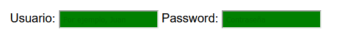

# 
Validaciones básicas con HTML5.

Tradicionalmente, la validación de un formulario se ha hecho siempre en Javascript, sin embargo, HTML5 introduce unos nuevos atributos para formularios que permiten realizar la validación del formulario directamente en HTML5, sin necesidad de recurrir a Javascript. El caso ideal sería aplicar una capa de validación HTML5, y si se desea algo adicional o más potente, recurrir a Javascript.

En muchos de los campos de entrada de datos de nuestro formulario, se pueden utilizar ciertos atributos HTML5 para realizar validaciones básicas. Algunos de estos atributos ya lo hemos visto en apartados anteriores, sin embargo, vamos a comentarlos uno por uno:

Estos son los atributos principales de validación. Para entender bien cuando un campo pasa la validación y cuando no, vamos añadir unos estilos CSS a nuestra página:

Estos estilos harán que si un campo < input > o < textarea > de un formulario no pasa la validación, aparezca en rojo. En caso contrario, si pasa la validación, aparecerá en verde.

## Atributos minlength / maxlength.
El atributo minlength y el atributo maxlength son atributos para restringir la longitud de texto escriba en un campo de entrada de texto. Puede utilizarse tanto en elementos < input > de tipo text, search, url, tel, email, password, como en elementos < textarea >.

html:

css:

vista:

Este ejemplo plantea dos validaciones de tamaño en los campos < input >. Si intentamos escribir más carácteres de los permitidos, comprobaremos que el navegador bloquea y no deja seguir escribiendo:

   - El usuario debe tener entre 5 y 40 carácteres.
   - El password debe tener 11 carácteres como mínimo.

## Los atributos min y max.
El atributo min y max (no confundir con los anteriores) sirven para establecer un valor mínimo o máximo permitido en campos de entrada < input > de datos numéricos (número o rango) o de fecha (fecha, mes, semana, hora o fecha-hora):

html:

css:

vista:

En este ejemplo planteamos dos campos < input > que tienen validaciones con los atributos min y max:

   - La edad debe estar entre 18 y 60. Se puede escribir otro valor, pero no pasará la validación (en rojo).
   - Si usamos las flechitas del < input > solo nos permitirá movernos entre el rango permitido.
   - La fecha de inicio debe estar entre 01/01/2024 y 01/12/2024. otro valor, no pasará la validación.
   - Los valores permitidos son siempre del año 2024, por lo que ese campo se bloqueará (en gris).
   - Si usamos el widget del calendario, nos bloquea en gris las opciones no permitidas por validación.

## El atributo step.
De la misma forma que en el apartado anterior, el atributo step nos permite realizar validaciones en los campos numéricos o de fechas. En esta ocasión, el atributo step trabaja conjuntamente con los atributos min y max y establece el incremento o decremento que es posible permitir.

Así pues, por ejemplo, si en un valor numérico tenemos un min de 5 y un max de 10...

   - Con un step a 1 se permitirán los valores 5, 6, 7, 8, 9 y 10.
   - Con un step a 2 se permitirán los valores 5, 7, 9.
   - Con un step a 3 se permitirán los valores 5 y 8.
   - Con un step a 4 se permitirán los valores 5 y 9.
   - Con un step a 5 se permitirán los valores 5 y 10.
   - Valores step superiores a 5 sólo permitirá el valor inicial, es decir, 5.

De la misma forma, podemos utilizar el atributo step para fechas:

html:

css:

vista:

Observa que para los campos de fecha, el valor step representa días, por lo que si indicamos un step a 2, al pulsar sobre el calendario, observaremos que nos muestra un calendario con los días pares bloqueados en gris (no pasan la validación).

## El atributo required.
Por defecto, los campos de entrada de datos de un formulario son opcionales. Por esa razón, aunque tengamos un campo de datos vacío, nos mostrará el color de fondo verde.

html:

css:

vista:

Sin embargo, si le añadimos el atributo required, estaremos indicando que ese campo de entrada de datos es obligatorio, y no de no rellenarse, no cumpliría la validación y por lo tanto el navegador no dejará enviar el formulario.

El atributo required se puede utilizar prácticamente con cualquier campo de entrada de datos, salvo < input > de tipo hidden, color, range o los botones de reseteo o envío de formulario.

## El atributo disabled.
El atributo disabled nos permite desactivar un campo de entrada o elemento HTML de modo que el usuario no puede interactuar con él:

html:

css:

vista:

Observa que los dos campos < input > tienen el atributo disabled indicado. Por lo tanto, la caja de texto nos aparecerá en gris, desactivada, sin posibilidad de que el usuario introduzca información. Por otro lado, el botón submit nos aparecerá también desactivado, de modo que es imposible pulsar en él para enviar el formulario.

Si tenemos un botón de envío de formulario activo, pero alguno de los campos del formulario tiene el atributo disabled, el navegador enviará los datos del formulario, pero no del elemento desactivado.

## El atributo readonly.
Aunque parecen muy similares, el atributo readonly tiene ciertas diferencias con el atributo disabled. En principio y aparentemente, el atributo readonly también desactiva los campos de entrada a los que se le aplica. Sin embargo, hay una pequeña diferencia respecto al anterior:

html:

css:

vista:

En este caso, el < input type="text" > nos aparecerá como un campo normal, sin embargo, no podremos modificar su contenido (es de solo lectura). Se puede interpretar que funciona exactamente igual que el disabled, pero tiene una diferencia principal: mientras que los campos desactivados y los campos de sólo lectura no permiten modificar su contenido, sólo el campo desactivado no se envía en el formulario. En el caso de un campo de sólo lectura, siempre se enviará al pulsar el botón de envío de formulario.

