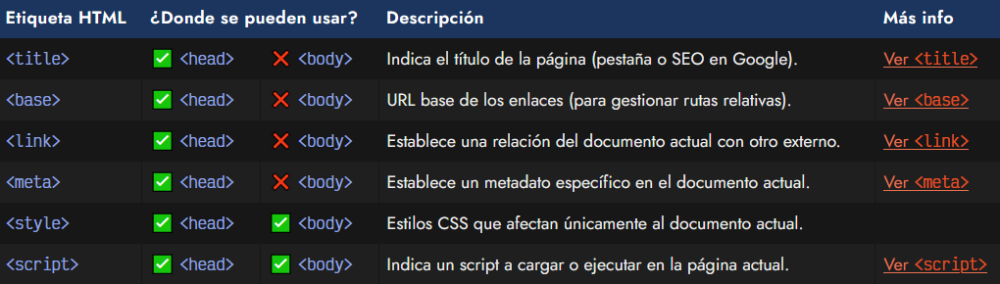
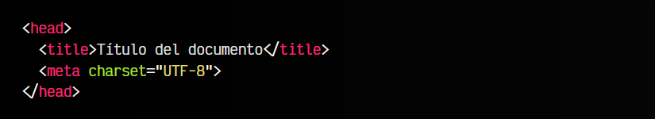

# 
¿Qué son las etiquetas head?

Habíamos mencionado que la [estructura de un documento HTML](https://lenguajehtml.com/html/documento/estructura-documento-html/) debía contener siempre dos etiquetas HTML principales:

   - 1️⃣ La cabecera de la página o etiqueta < head >
   - 2️⃣ El cuerpo de la página o etiqueta < body >

El primero de ellos, del que hablaremos en este apartado, se encarga de contener las etiquetas HTML de metadatos (información sobre el documento) así como establecer relaciones con otros documentos.

Por otro lado, el segundo de ellos, la etiqueta < body > se encarga de la parte visual que verá el usuario en el navegador, y es la que engloba la mayor parte de etiquetas HTML.

## La etiqueta < head >.
La etiqueta < head > simplemente es una etiqueta contenedora que puede englobar muchas otras etiquetas, generalmente para definir metadatos o relaciones. Es importante tener en cuenta que, en general, las etiquetas que se colocan en la parte del < head > son etiquetas que necesitamos que se lean y carguen antes de que el navegador comience a dibujar la página. Sin embargo, ya veremos que no siempre es tan sencillo.

Existen varias etiquetas que se pueden utilizar en la sección < head > del documento HTML:

Especial atención a las dos últimas. Son dos etiquetas que tradicionalmente solían incluirse en la cabecera < head > de un documento HTML. Sin embargo, actualmente también pueden utilizarse en el cuerpo de la página.

   - La etiqueta < style > sirve para incluir estilos CSS que afecten sólo a la propia página HTML.
   - La etiqueta < script > sirve para incluir código Javascript en la propia página HTML (o de forma externa), pero profundizaremos más tarde en ello.

## La etiqueta < meta >.
Una etiqueta interesante es la etiqueta < meta >. Esta etiqueta se utiliza para añadir información adicional sobre el documento actual. Un poco más adelante profundizaremos en ella, pero de momento vamos a añadir el ejemplo más básico que existe:

La etiqueta < meta > con el atributo charset es una etiqueta que se utiliza para indicar al navegador la codificación a utilizar. En nuestro caso, usaremos UTF-8, que es la estándar hoy en día.

Es muy importante utilizar siempre de forma coherente una misma codificación en todos nuestros documentos. Así evitaremos problemas con vocales acentuadas, o carácteres como ñ , ¿ , ¡ u otros.

Para evitar este tipo de problemas, se recomienda revisar los siguientes pasos:

   - 1️⃣ Usar la etiqueta < meta charset="utf-8"> en el < head >. En general, con esto es suficiente.
   - 2️⃣ Asegúrate que el archivo .html se está guardando con codificación UTF-8 en el editor.
   - 3️⃣ Asegúrate que el servidor web está configurado como UTF-8.

En general, estos dos últimos suelen estar configurados como UTF-8 por defecto. De esta forma reducimos la probabilidad de tener problemas de este tipo.

En resumen, con la etiqueta < meta > se pueden indicar aspectos generales, información o metadatos para que el documento HTML tenga en cuenta. Existen muchísimas más etiquetas < meta > a parte de la etiqueta < meta charset >, que es una de las más básicas. Las analizaremos más adelante.

► Aprende más sobre [la etiqueta < meta >](https://lenguajehtml.com/html/cabecera/etiqueta-html-meta/)

