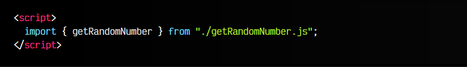
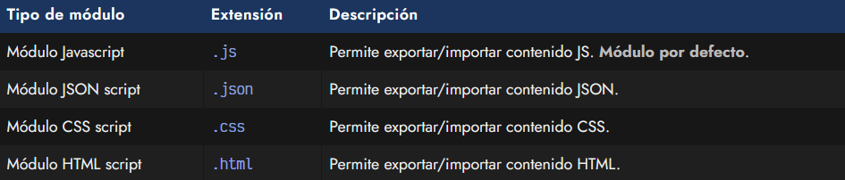
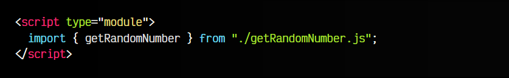
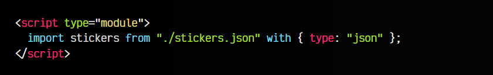
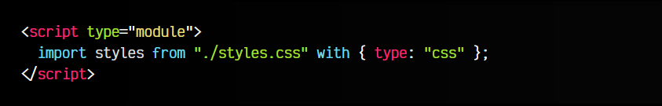
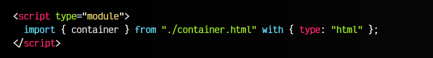
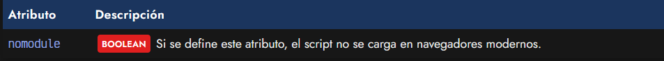
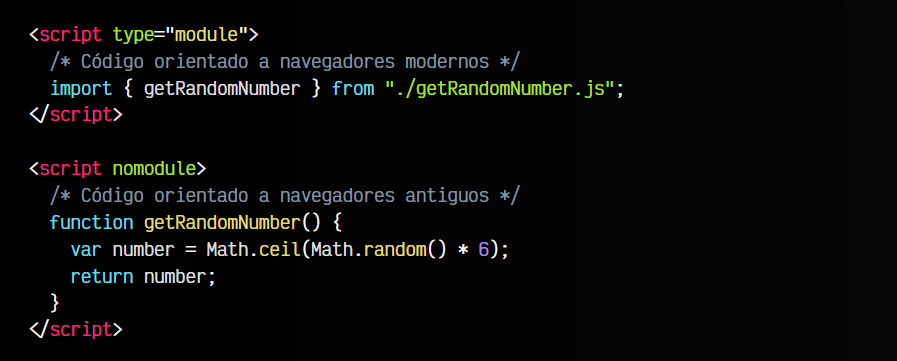

# 
Los módulos Javascript (ESM).

Antiguamente, Javascript sólo se escribía en navegadores y en un sólo fichero Javascript. En el mejor de los casos, podíamos incluir varios ficheros en diferentes etiquetas < script >. Sin embargo, era complicado comunicar información entre unas y otras.

Las versiones modernas de Javascript permiten trabajar con módulos Javascript, muchas veces denominado ESM (ECMAScript Modules). Se trata de una forma moderna de cargar y procesar ficheros externos para incorporarlos a nuestro código Javascript.

Si quieres saber más sobre la historia de ESM y los Módulos Javascript, echa un vistazo al artículo CommonJS vs ECMAScript modules, donde explico su evolución y diferencias.

## Módulos (ESM).
Los módulos más populares son los módulos Javascript. Se trata de una forma moderna de reutilizar y compartir contenido (variables, constantes, funciones, etc...) entre diferentes ficheros Javascript, organizando mucho mejor nuestra aplicación.

En un script tradicional (modalidad clásica) no se pueden utilizar las palabras clave import y export, ya que están prohibidas por defecto. Estas palabras clave se utilizan para incorporar contenido de un fichero externo.

Por ejemplo, si intentamos importar un archivo externo en la etiqueta HTML < script >:

En este ejemplo, estamos importando una funcionalidad llamada getRandomNumber desde el módulo getRandomNumber.js, donde dicha función debe estar exportado mediante la palabra clave export. Puedes aprender más sobre esto, en Exportar módulos en Javascript.

Si intentamos realizar este ejemplo, obtendremos el siguiente error:

Uncaught SyntaxError: Cannot use import statement outside a module

Esto ocurre porque no hemos indicado el atributo type="module" en nuestro script, que es lo que habilita la posibilidad de importar y exportar módulos. Así que vamos a ver como se debería hacer.

## Tipos de módulos ESM.
Cuando hablamos de módulos ESM, solemos referirnos a módulos Javascript, pero los módulos van mucho más allá. La idea es que podamos cargar multitud de archivos directamente en el navegador y utilizarlos en nuestro código Javascript.

Por ejemplo, estos son algunos de los módulos que podemos utilizar:

Para poder importar un módulo externo, recuerda que siempre tendrás que indicar el atributo type="module" en la etiqueta < script >. Veamos como usar cada uno de ellos.

## Módulos Javascript.
El caso más habitual es cargar módulos Javascript, por lo que simplemente utilizaremos la palabra clave import e indicaremos el fichero .js a importar y el contenido que queremos importar. Tenemos varias formas de hacerlo que puedes ver en Importar módulos.

El fragmento de código correspondiente sería el siguiente:

Recuerda que no tiene por que ser un script en línea, se puede utilizar el atributo src para cargarlo de forma externa.

Los scripts cargados como módulos, se ejecutarán por defecto en [modo diferido](https://lenguajehtml.com/html/scripting/atributo-defer-async/).

## Módulos JSON .
Si queremos cargar un módulo JSON, también es posible hacerlo utilizando la palabra clave import. Sin embargo, en este caso tendremos que hacer uso de un with:

Con este fragmento de código podemos importar un archivo .json externo, pero ten en cuenta varias cosas:

   - La etiqueta < script > debe llevar type="module".
   - La importación se hace directamente, sin llaves { }.
   - Indicamos with { type: "json" } para definir el formato esperado.

Ten en cuenta que por defecto las importaciones se hacen sobre ficheros .js, por lo que si queremos cambiar este tipo de importaciones, hay que indicar explícitamente el formato, para evitar posibles problemas de seguridad.

El resultado obtenido en stickers no es un STRING de texto, sino un objeto JSON, tal y como si lo hubieramos procesado con el método JSON.parse().

## Módulos CSS.
Si queremos cargar un módulo CSS, también es posible hacerlo utilizando la palabra clave import:

Con este fragmento de código importamos un archivo .css externo. Ten en cuenta lo siguiente:

   - La etiqueta < script > debe llevar type="module".
   - La importación se hace directamente, sin llaves { }.
   - Indicamos with { type: "css" } para definir el formato esperado.

El resultado obtenido en styles no es un STRING de texto, sino un objeto CSSStyleSheet, mediante el cuál podemos acceder al CSSOM (el DOM de CSS).

## Módulos HTML .
Si queremos cargar un módulo HTML, la idea es que sea posible hacerlo a través de import:

Sin embargo, esta característica es sólo una propuesta y no está soportada en navegadores aún. La idea es que se puedan importar fragmentos del DOM, según sus ids o clases y utilizarlas como cuando las creamos con el createElement() o las localizamos con el querySelector().

Actualmente, si lo intentamos, obtendremos el siguiente error:

Uncaught TypeError: "html" is not a valid module type.

## El atributo nomodule.
En algunos casos, podemos crear etiquetas < script > que utilicen un atributo nomodule:

Dicho atributo indicará a navegadores modernos que soportan el atributo type=module, que no deben descargar ni ejecutar ese script. Por otro lado, los navegadores antiguos que no soportan módulos, no conocerán ese atributo, por lo que lo tratarán como un script normal y lo ejecutarán:

La finalidad de este atributo es poder crear scripts a modo de fallback para realizar tareas equivalentes en navegadores antiguos y dar soporte a otros sistemas menos modernos. Esto es lo que se conoce como el patrón module/nomodule.

Ten en cuenta que para un navegador moderno, no es necesario desperdiciar recursos en descargar, parsear y ejecutar código Javascript orientado a navegadores antiguos, y en el caso contrario, el de los navegadores antiguos, no tiene sentido descargar, parsear y ejecutar código Javascript orientado a navegadores modernos, por lo que conviene que estén separados y cargarlo sólo en la situación que sea apropiada para cada usuario.
