# 
Etiqueta HTML 
.

En HTML5, aparecen algunas nuevas etiquetas que proporcionan características interactivas a una página o documento. En dichas etiquetas, el usuario debe tomar parte de forma activa para activarlas o utilizarlas.

Una de ellas es el llamado Acordeón HTML o elemento desplegable. Se trata de un elemento que muestra un texto y forma o icono identificativo que el usuario puede pulsar y desplegar una información que por defecto está contraída.

Para usar este elemento, tenemos varias etiquetas disponibles:

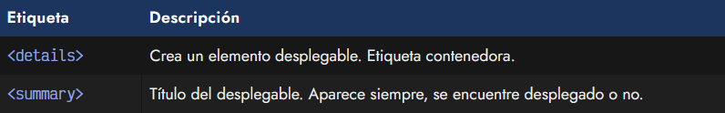

Vamos a irlas explicando una a una.

## La etiqueta < details >.
La etiqueta < details > nos proporciona la posibilidad de crear un elemento desplegable, que el usuario puede expandir o contraer para ver más información que en principio estará oculta. Se trata de una etiqueta contenedora que actúa como un < div >, salvo que todo el contenido de esta etiqueta no se muestra inicialmente.

En su lugar, aparece una flecha identificativa, que indica si el desplegable está contraído (y su contenido oculto) o desplegado (y su contenido visible).

html:
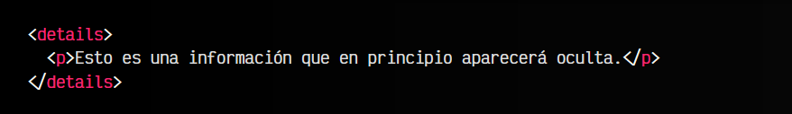

vista:

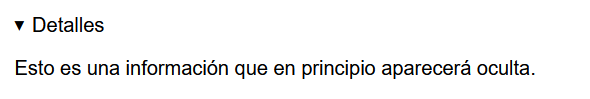

Observaremos que el navegador nos mostrará una fecha apuntando a la derecha, con el texto «Detalles» (o similar, puede depender del navegador). Si pulsamos sobre la fecha o sobre el texto «Detalles», la flecha apuntará hacia abajo y se desplegará el contenido de la etiqueta < details >.

Esta es una fantástica forma de añadir contenido en una página de modo que no ocupe demasiado espacio y que el usuario decida si quiere ampliar información rapidamente o seguir leyendo el resto del contenido de la página.

## El atributo open.
La etiqueta < details > tiene un atributo open, que si se indica, el contenido del desplegable estará visible por defecto, por lo que pulsando encima lo contraemos. Esto puede ser muy interesante en algunas situaciones donde el contenido es muy importante y merece la pena estar mostrado por defecto.

html:
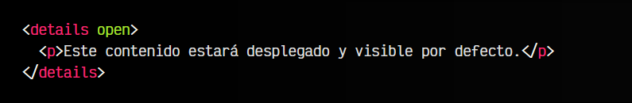

vista:
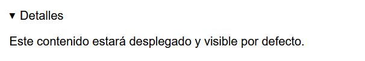

Ten en cuenta que al tratarse de un atributo, podemos utilizar Javascript y el DOM para mostrarlo de forma dinámica. Un fragmento de código Javascript que realizaría esto sería el siguiente:

En la primera línea, estamos localizando el elemento que nos interesa. En este caso, localizamos la etiqueta < details > haciendo referencia a la propia etiqueta, aunque generalmente es mejor hacerlo a través de un id, o mejor aún, una clase.

En la segunda línea, utilizamos el método .toggleAttribute() que añadirá un atributo si originalmente no lo tiene, o lo eliminará si originalmente lo tiene. Le indicamos que lo haga con el atributo open. Si este código lo incluímos dentro de una función, cada vez que lo ejecutemos, desplegamos o contraemos el acordeón HTML.

## El evento toggle.
Si sabemos trabajar con [eventos Javascript](https://lenguajejs.com/javascript/eventos/que-son-eventos/), esto también es detectable desde Javascript, aplicando un .addEventListener() que escuche un evento toggle en ese elemento:

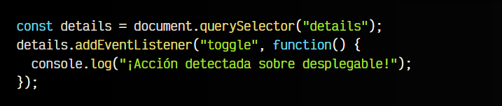

El evento toggle se disparará cada vez que el usuario pulse sobre el elemento y este se despliegue o contraiga, así como cuando nosotros lo hagamos dinámicamente a través de código, como en el ejemplo anterior usando el método .toggleAttribute().

## La etiqueta < summary >.
Por defecto, la etiqueta < details > añade el texto «Detalles» al acordeón, texto que depende del idioma del navegador. Sin embargo, si dentro de la etiqueta < details > indicamos una etiqueta < summary > podremos personalizar el contenido de ese texto informativo al texto que queramos.

Observa este ejemplo:

html:
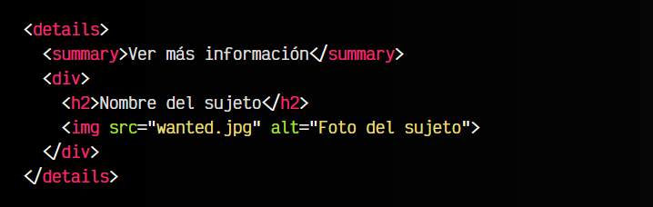

vista:

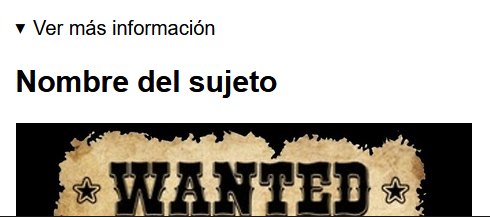

Hemos incluido una etiqueta < summary > para personalizar el texto del desplegable. A continuación, hemos añadido un elemento < div > que tiene todo el contenido a desplegar del acordeón, que por defecto estará oculto, salvo que la etiqueta < details > tenga el atributo open indicado.

## Acordeón exclusivo.
Es posible crear un acordeón exclusivo con HTML. Este es el nombre que se le da a una serie de acordeones HTML donde sólo se permite tener desplegado a uno sólo. La forma de conseguir es simplemente añadir a todos los acordeones el atributo name con el mismo nombre.

Observa este ejemplo:

html:
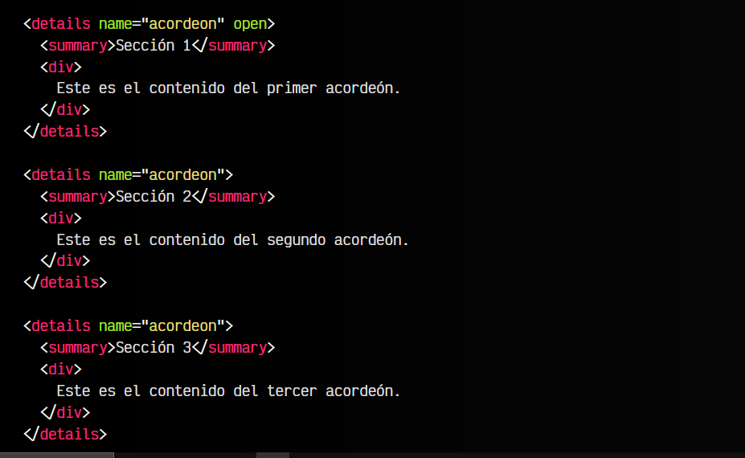

vista:
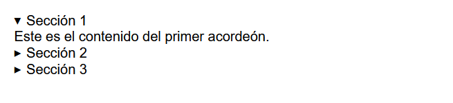
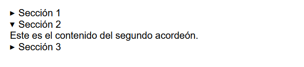
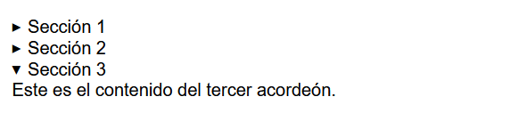

Si pulsas en cada acordeón, comprobarás que se cierra el resto de acordeones.

## Personalizar la flecha.
Por defecto, los navegadores suelen identificar el desplegable mediante una flecha hacia la derecha o hacia abajo, dependiendo de si el desplegable está colapsado o desplegado, respectivamente.

Mediante CSS, podemos cambiar este comportamiento, haciendo uso del pseudoelemento ::marker sobre la etiqueta < summary >:

html:
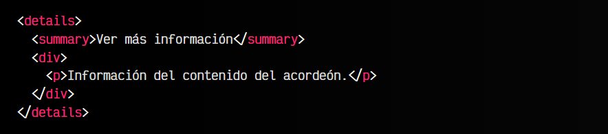

css:
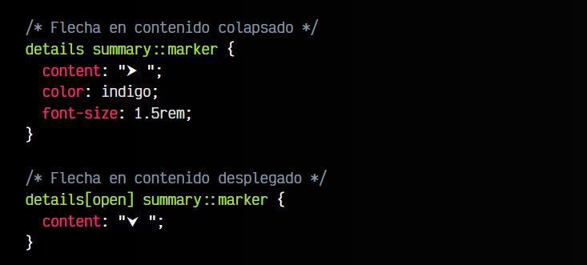

vista:

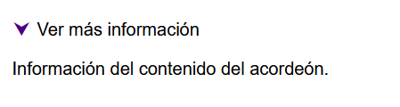

En el primer caso, estamos personalizando la flecha de un desplegable que esta colapsado, ocultando su contenido. En el segundo caso, personalizamos la flecha de un desplegable con el contenido desplegado.

Observa que estamos haciendo uso de la propiedad content, ya que es un elemento autogenerado de CSS. Si tienes dudas sobre esto, echa un vistazo a los [pseudoelementos CSS](https://lenguajecss.com/css/pseudoelementos/que-son/).

