# 
Popovers: Elementos emergentes>.

Los popover (pop over, salta por encima) son una nueva forma en HTML5 de crear elementos emergentes, es decir, contenido que aparecerá al usuario por encima del contenido que ya estaba visualizando, para así llamar temporalmente su atención.

## Creando un popover.
La forma de crear este contenido emergente es muy sencilla. Se puede aplicar a contenido ya existente, ya que se basa en simplemente añadir un atributo HTML popover, que es el que realizará toda la magia.

Observa el siguiente fragmento de código:

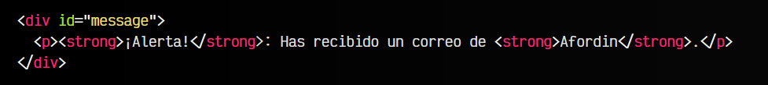

Como ves, este fragmento de código no tiene nada en especial. Se trata de un elemento < div > con código HTML mostrando un mensaje. Sin embargo, si le añadimos el atributo popover la cosa cambia.

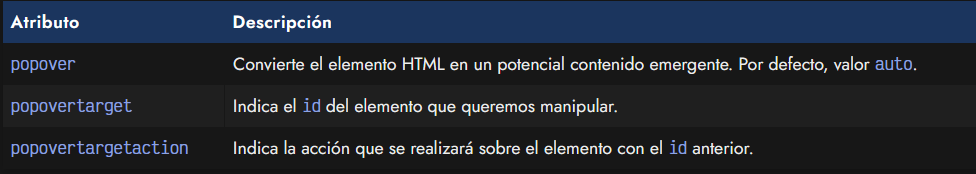

En primer lugar, habrás comprobado que al añadir el atributo popover desaparece el contenido. Esto ocurre porque los navegadores tienen por defecto un estilo CSS para que los elementos con atributos popover se oculten.

Sin embargo, desde un < button > o < input > podemos controlarlo mediante los atributos siguientes:

   - popovertarget indica el id del elemento que se va a controlar.
   - popovertargetaction indica la acción que va a realizar, entre show, hide o toggle.

html:
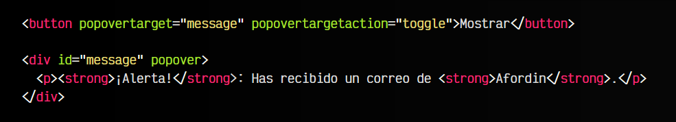

vista:
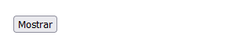
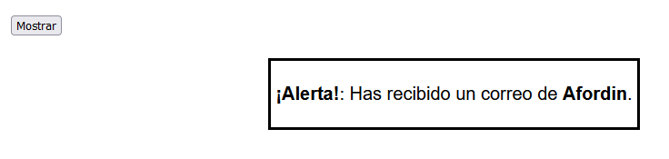

Cada vez que pulsemos sobre el botón, haremos que el elemento con id="message", si es un popover, se mostrará cuando esté oculto, y se ocultará cuando se encuentre visible.

## Estilos del popover.
Habrás observado que el popover se posiciona en el centro de pantalla por defecto. Al ser contenido HTML, podemos cambiar su CSS sin problema mediante algunas lineas de código. Podemos añadirle clases específicas o aprovechar su atributo HTML popover:

html:
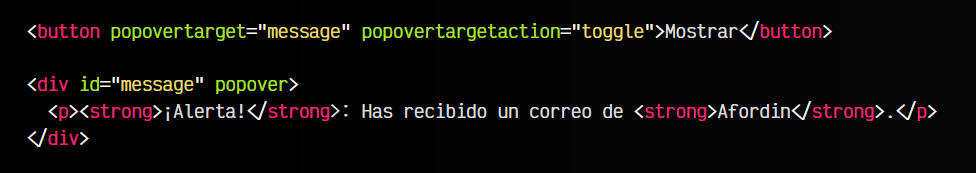

css:
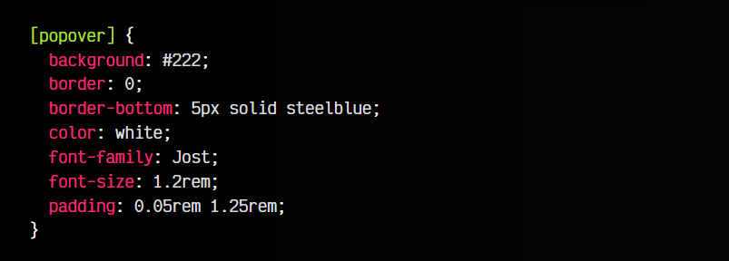

vista:

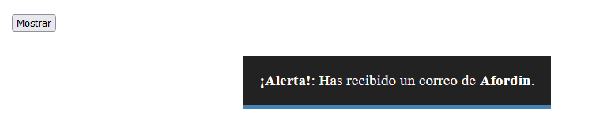

Además, también podemos darle estilo al fondo de la página, o al propio elemento cuando se está mostrando el popover:

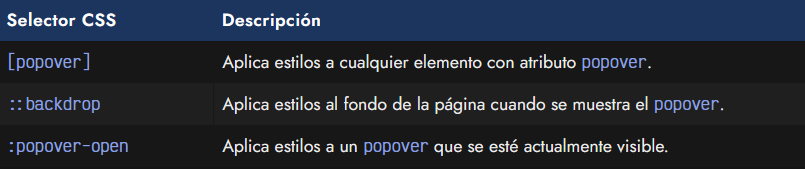

html:
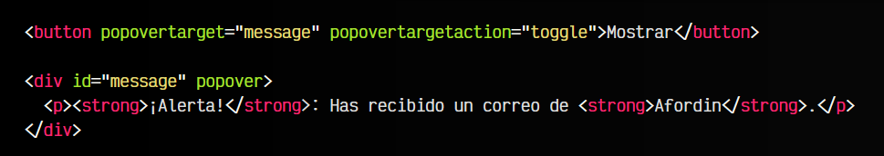

css:
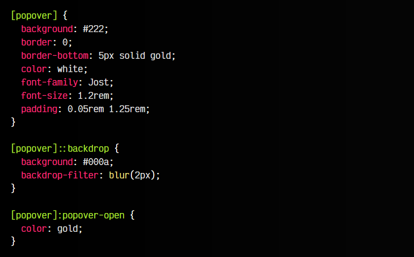

vista:
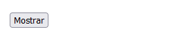
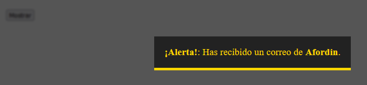

## Descarte automático.
El descarte automático (light dismiss) es un modo en el que funcionan los popover por defecto. Si no establecemos ningún valor al atributo popover o le establecemos el valor auto, si pulsamos en cualquier parte de la página (fuera del popover) o presionamos ESC

con el popover abierto, este se descartará y se ocultará.

Si establecemos el parámetro con el valor manual, no lo hará. Esto interesa si queremos controlarlo sólo con HTML o si por el contrario lo vamos a controlar detalladamente con Javascript.

html:
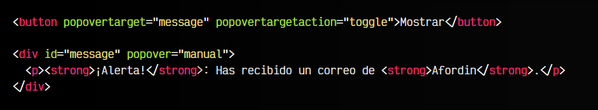

vista:
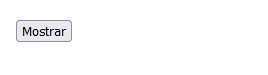
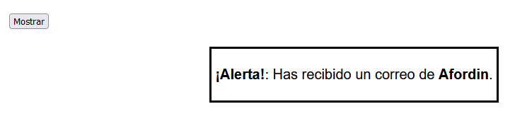

Observa que en este ejemplo, aunque pulsemos fuera del elemento, no se oculta. Tendremos que volver a pulsar en el botón, para llamar a un método Javascript que haga el trabajo o a un atributo HTML que tenga la acción predefinida.

## API de Popover.
Si buscamos un comportamiento más potente y flexible, necesitaremos Javascript. Mediante programación podemos llamar a ciertos métodos que realizarán acciones de mostrar, ocultar o alternar entre visible y oculto, simplemente llamando a estas funciones de los elementos popover:

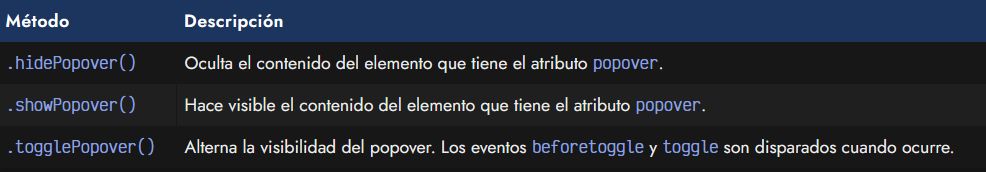

Esto nos podría permitir hacer contenido más elaborado como múltiples popover anidados, menús con submenús o interfaces de usuario más avanzadas.
