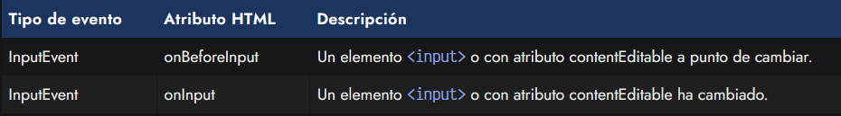

# 
Eventos en HTML.

En Javascript hay un concepto llamado evento que se utiliza para referirse al instante justo en el que ocurre un determinado suceso. Por ejemplo, existe un evento llamado click que se dispara cuando un usuario hace clic sobre un elemento HTML.

Nosotros podemos utilizar estos eventos para comunicar al navegador que, cuando ocurra un evento determinado, realice una acción Javascript. De esta forma, podemos preparar nuestra página para que actúe según las acciones del usuario (u otros eventos más complejos).

## Eventos.
Existen muchísimos tipos de eventos en Javascript. Vamos a comenzar con eventos click, que son los más sencillos de entender. Lo primero es elegir la etiqueta en la que queremos que ocurra el evento. Una vez elegida, colocaremos un atributo en dicha etiqueta para detectar si se produce el evento.

## Eventos en línea.
Por ejemplo, si queremos detectar el evento click, lo prefijamos con un on y lo añadimos como atributo en la etiqueta HTML:

html:

vista:

En este sencillo ejemplo, hemos especificado una imagen que es la que estará «escuchando» el evento click. Si el usuario pulsa sobre ese elemento, el navegador disparará el evento y ejecutará el código Javascript al que hace referencia ese atributo. En este caso, es un código en línea, pero podría ejecutar una función u algo similar.

Si quieres saber más sobre los eventos HTML, echa un vistazo a [eventos HTML](https://lenguajejs.com/javascript/eventos/eventos-html/).

## Eventos desde Javascript.
En algunas situaciones, utilizar eventos desde HTML no es lo más apropiado, ya que estás mezclando código Javascript dentro del HTML, y eso hace que sea difícil de mantener y organizar. Por esta razón, lo habitual suele ser darle un nombre al elemento mediante un id o class, y luego realizar la tarea o funcionalidad desde Javascript:

html:

vista:

Observa que en este caso, el fragmento de código Javascript de la etiqueta < script > la podemos extraer a un fichero externo y enlazarlo mediante el atributo src de la etiqueta < script >. De esta forma tendríamos separado el código y sería más fácil de mantener de cara al futuro.

Si quieres saber más sobre este enfoque, echa un vistazo a [el método addEventListener()](https://lenguajejs.com/javascript/eventos/addeventlistener/).

## Detalles del evento.
En los eventos, puede que queramos obtener información más específica, como por ejemplo, el número de veces que hizo clic el usuario sobre la imagen, si fue un solo clic, si fue doble clic, etc... Estos datos específicos, podemos encontrarlos en un objeto que tenemos disponible en los eventos.

En este caso, en el HTML, en lugar del alert() usado antes, vamos a ejecutar una función javascript con un código diferente. Observa que también hemos añadido un párrafo de texto que contiene una frase y un fragmento < span > con id="number" que contendrá el número de veces que se ha pulsado sobre la imagen. Inicialmente se encuentra establecido a 0.

html:

js:

vista:

Por otro lado, la función pasa por parámetro una variable especial event, que es la que nos va a dar la información sobre el evento ocurrido, y que posteriormente utilizaremos para extraer dicha información.

Este código busca la etiqueta HTML que tiene un id="number", y mediante .textContent modificamos su contenido. El nuevo contenido es event.detail que no es más que un dato que se encuentra en el evento click que se ha disparado. En este caso concreto, ese dato devuelve el número de veces seguidas que el usuario pulsó sobre la imagen.

Ten en cuenta que en el caso de parar de hacer click, y volver a pulsar, el contador volvería a iniciarse, ya que sólo cuenta el número de clics seguidos.

## Tipos de eventos.
Existen muchos eventos, prácticamente uno para cada acción que pueda ocurrir en un documento HTML. A continuación, muestro algunos grupos de eventos muy utilizados frecuentemente de la gran cantidad de eventos existentes en Javascript.

## Eventos de documento.
Es posible poner a escuchar ciertos eventos sobre el documento HTML completo, estableciendo el atributo del evento en la etiqueta < body >:

## Eventos de carga de recursos.
Sobre las etiquetas que cargan un archivo externo, como podrían ser < img > o < script >, e incluso < style > con estilos CSS en línea. Los archivos multimedia < audio > y < video > tienen sus propios eventos específicos, ya que tienen un proceso de carga especial:

## Eventos de foco en elementos.
Sobre etiquetas < input >, < textarea >, < select >, < a > o cualquier otra etiqueta que pueda ser seleccionable por el usuario pulsando la tecla TAB, existen una serie de eventos para controlar cuando gana o pierde el foco un elemento:

## Eventos de ratón.
Los eventos de ratón se utilizan para detectar todas aquellas acciones que el usuario realiza mediante el ratón con algún elemento de la página, como podría ser mover el ratón por encima de ellos, hacer clic, mover la rueda del ratón, etc...

## Eventos de entrada de datos.
Sobre elementos < input > o elementos HTML con el atributo contentEditable, y por lo tanto, elementos HTML que son editables por el usuario:

## Eventos multimedia.
Sobre elementos multimedia como < audio > o < video >, donde se carga un recurso (MP4, WebM, MP3, OGG...) externo:

Todos estos eventos (y muchos otros no incluídos en esta sección) se pueden llamar desde Javascript para realizar personalizaciones más específicas, pero en ese caso ya hay que recurrir a Javascript y realizar tareas y metodologías de programación más específicas.