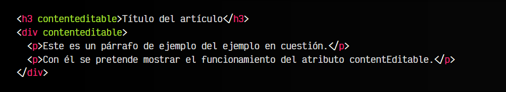
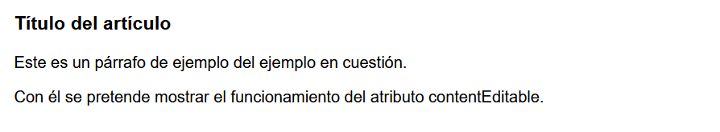
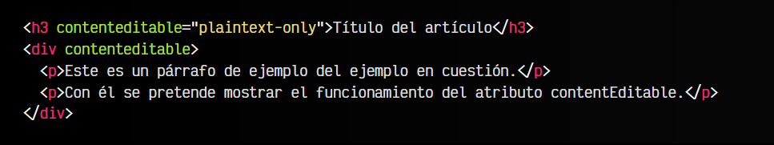
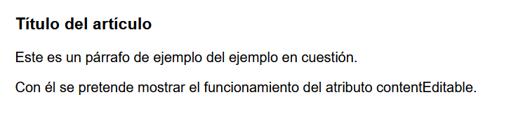

# 
El atributo contenteditable.

Cuando creamos una página HTML, el contenido creado es estático. Es decir, el usuario visita esa web y el contenido es fijo, el usuario no puede modificarlo. Siempre podrá acceder a las herramientas de desarrollador del navegador (Dev Tools) y modificar el HTML, pero el contenido de esa web se considera estático.

A través de Javascript y utilizando el DOM se puede convertir en contenido dinámico y que cambie dependiendo de acciones del usuario. Sin embargo, existe un atributo que se puede colocar en cualquier etiqueta HTML visual para que el usuario pueda modificar su contenido.

## El atributo contenteditable.
En HTML5 podemos utilizar el atributo contenteditable sobre una etiqueta HTML para dar al usuario la capacidad de editar su contenido de texto. De esta forma, incluyendo el atributo contentEditable a una etiqueta < p > de párrafo, o a una etiqueta < h3 >, por ejemplo, el usuario podrá, al pulsar sobre dichos elementos, modificar el texto que aparece:

html:

vista:

De esta sencilla forma, podemos dotar de capacidades de edición al usuario sobre una página. Recuerda siempre que el HTML, CSS y Javascript son tecnologías que trabajan en el front-end, o lo que es lo mismo, son descargadas desde el alojamiento web y transferidas a una carpeta temporal de nuestro sistema, donde las almacena y lee el navegador. Es ahí donde estamos realizando dichas modificaciones.

Si el usuario volviese a recargar la página tras modificar ciertos elementos, los cambios no se verán reflejados. Para ello, hay que hacer ciertas operaciones y enviarlas al backend del alojamiento web para que guarde dichos cambios.

Este atributo está bien soportado en navegadores actuales, por lo que se puede usar de forma segura.

## Texto plano solo .
Es posible utilizar el valor plaintext-only en el atributo contenteditable para indicar que el usuario sólo puede modificar con contenido de texto y no puede incluir etiquetas HTML, algo que es posible en el caso anterior, donde solo incluímos el atributo contenteditable, sin valor.

html:

vista:

En este ejemplo, el contenido del < h3 > puede ser modificado solo con texto plano, sin HTML, mientras que en el contenido del < div > pueden incluirse etiquetas HTML, además del contenido de texto.

## El atributo designMode.
Si el atributo anterior te ha resultado interesante, debes saber que existe una propiedad Javascript denominada designMode que puede añadirse al documento para convertir en editable todo el documento. Para ello, sólo tienes que hacer lo siguiente:

Con esta simple linea, todo el documento se convertirá en editable y el usuario podrá modificarlo. Si elimina la propiedad o la establece a off, eliminará la capacidad de edición de todo el documento.