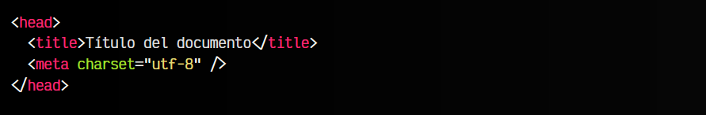
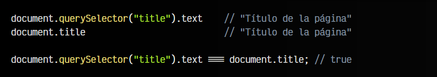

# 
La etiqueta < title >

La etiqueta < head > es una etiqueta contenedora que contiene otras etiquetas en su interior. En su interior, es aconsejable como mínimo, indicar siempre las siguientes dos etiquetas:

Como verás más adelante, la etiqueta < meta charset="utf-8" /> permite indicar al navegador que codificación utilizar. Al indicar utf-8, no tendremos problemas con la codificación de carácteres si utilizamos acentos o ciertos carácteres especiales.

## La etiqueta < title >.
La etiqueta < title > sirve para indicar un título para nuestra página o documento HTML, y es obligatoria, por lo que cualquier documento HTML debería tener una etiqueta < title > (y sólo una, no deben existir varios).

El título puede servir para varias cosas:

   - 1️⃣ El título se mostrará junto al icono de la pestaña del navegador.
   - 2️⃣ Si se indexa en Google, es posible que use el título en los resultados donde apareces (no siempre).
   - 3️⃣ Es un título identificativo que pueden usarlo bots o sistemas automáticos que lean la página.

## Requisitos del título.
No vale cualquier título para una página. Es decir, puedes colocar cualquier título, pero hay títulos que podrían repercutir de forma negativa en nuestra página o su SEO (posicionamiento en Google).

Intenta seguir las siguientes recomendaciones al dar un título a la página:

   - 1️⃣ Los títulos no deben estar vacíos, ni con texto incompleto.
   - 2️⃣ Cada página del sitio web debe tener un título diferente a otras páginas.
   - 3️⃣ El título debe ser descriptivo, breve y claro y reflejar el contenido de la página.
   - 4️⃣ Google no recomienda un tamaño ideal. Se suele decir que lo recomendable es entre 50-60 carácteres. Si es muy largo o corto, Google podría ignorarlo.
   - 5️⃣ No repitas palabras clave o textos pensando que se va a posicionar mejor en Google. Puede que incluso fuerces a que ocurra lo contrario.
   - 6️⃣ Busca algo claro y útil para el usuario. Si necesitas aportar más información, utiliza la descripción con la etiqueta <meta name="description"> que explicaremos más adelante.

## Acceder al título desde Javascript.
Desde Javascript, es posible acceder al título de varias formas. La más sencilla es utilizando document.title, que es equivalente a acceder al atributo .text del elemento < title > del DOM:

En el caso de necesitarlo, podrías acceder de cualquiera de esas dos formas.