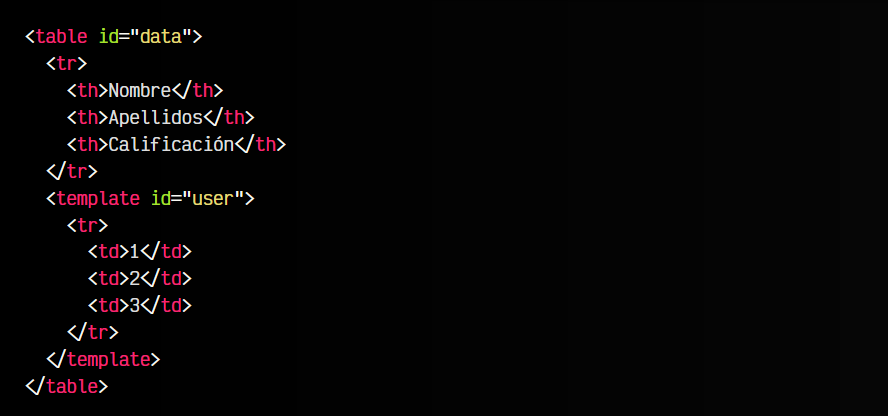
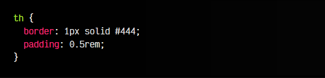
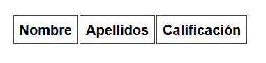
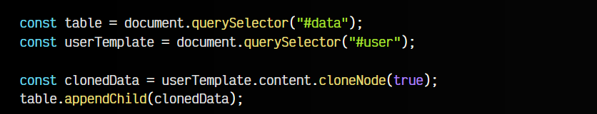
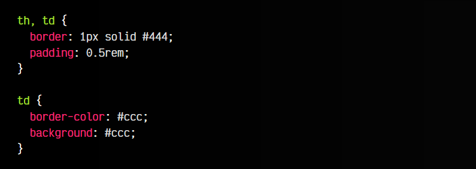
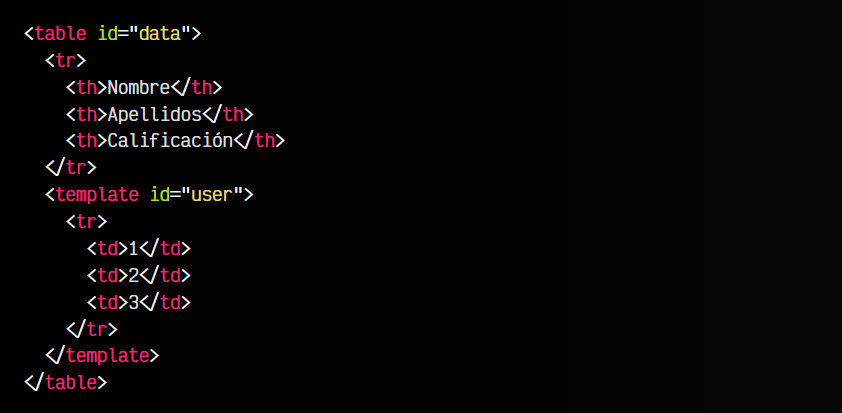
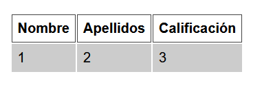
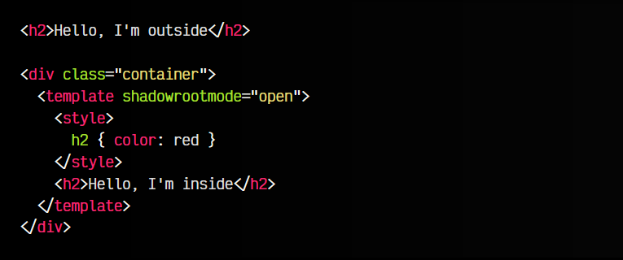
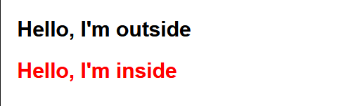

# 
Etiqueta HTML < template >.

La etiqueta < template > es un método ideal para agrupar información HTML que no vamos a utilizar actualmente o en un futuro inmediante, pero que es muy probable que más adelante utilicemos. En resumen, la etiqueta < template > se utiliza para reutilizar información.

## La etiqueta < template > es inerte.
Observa el siguiente ejemplo, donde tenemos una tabla HTML que sólo tiene definida la cabecera de la misma. Sin embargo, un poco más abajo hay una etiqueta < template > que contiene una fila con 3 celdas:

html:

css:

vista:

Lo primero que hay que saber de la etiqueta < template > es que su contenido es inerte. Esto significa que el navegador no interpreta su contenido: si contiene imágenes no las descarga, si contiene scripts no los descarga ni ejecuta, etc. El navegador no dedica recursos a ese código, hasta que lo clonemos y reutilicemos.

## Clonar un < template >.
En este ejemplo anterior, nosotros podríamos obtener el contenido de la plantilla < template >, clonarlo y añadirlo al final de la tabla de forma dinámica, para posteriormente modificar los datos de cada fila. Esto lo podríamos hacer con Javascript de la siguiente forma:

js:

css:

html:

vista:

Observa que en este fragmento de código hacemos varias cosas:

   - 1️⃣ Obtenemos la tabla en la constante table
   - 2️⃣ Obtenemos la plantilla en la constante userTemplate
   - 3️⃣ En clonedData guardamos una copia del contenido de la plantilla
   - 4️⃣ Añadimos ese contenido clonado en la tabla

Este proceso se puede repetir en un bucle, leyendo un fichero .json con los datos, por ejemplo, o recorriendo la información de un array.

Si te interesa este tema, tienes más información sobre la etiqueta < template > (y plantillas en general) en este artículo sobre[ Plantillas, DOM y WebComponents](https://lenguajejs.com/webcomponents/componentes/plantillas-html-webcomponents/).

## Shadow DOM declarativo.
La etiqueta < template > tiene un atributo shadowrootmode que nos permite crear un Shadow DOM de forma declarativa, es decir, indicar que el contenido HTML del interior de < template > está encapsulado y aislado al exterior. Esto, en principio, tiene muchas diferencias al funcionamiento normal, como veremos a continuación:

html:

vista:

   - 1️⃣ El atributo shadowrootmode de < template > hace que no sea inerte, se muestra inmediatamente.
   - 2️⃣ El atributo shadowrootmode crea un Shadow DOM en el elemento < div >, sin necesitar Javascript.
   - 3️⃣ El contenido HTML de < template > está aislado. El < h2 > del exterior no es afectado por el CSS.
   - 4️⃣ De la misma forma, el CSS global que tengamos fuera, no afectará al contenido de < template >.
   - 5️⃣ En caso de usar closed en lugar de open, no se puede acceder al Shadow DOM desde Javascript.

Esto nos puede servir para aislar 
