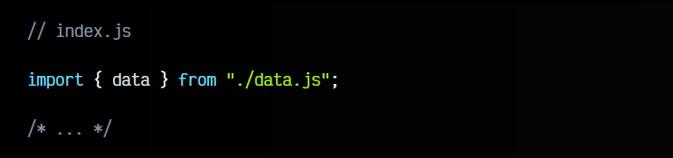
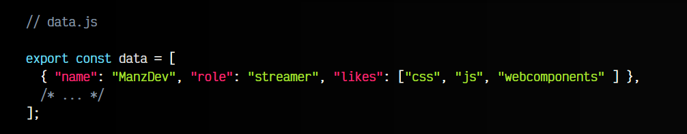
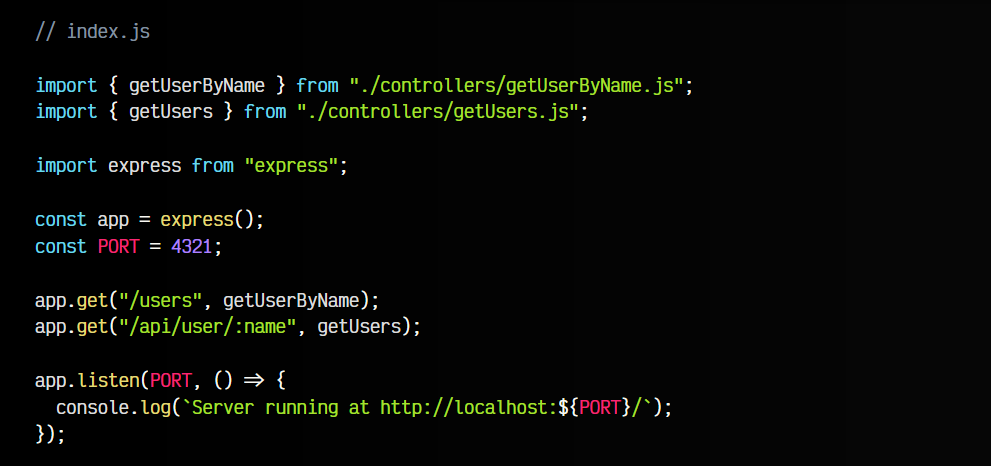
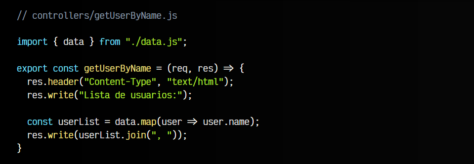
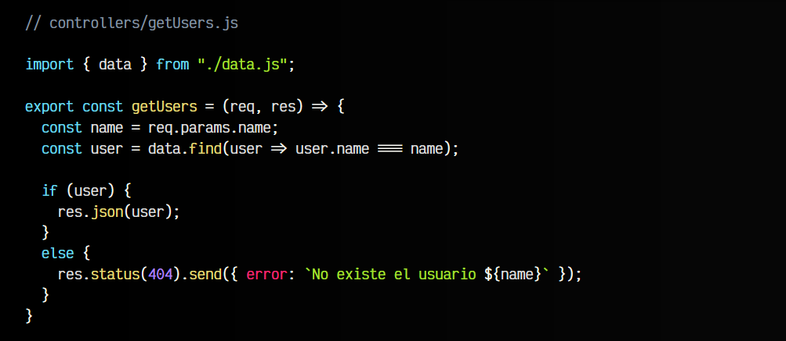
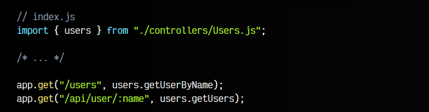
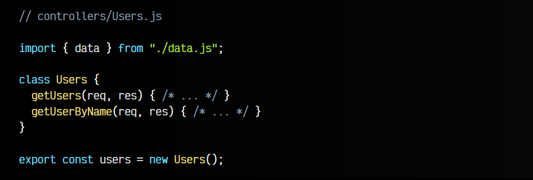

# 
Creando controladores

En este artículo nos centraremos en mejorar y organizar nuestro código, ya que a medida que aumente el número de endpoints de nuestra API, se volverá difícil mantenerlo limpio y organizado.

En nuestro ejemplo anterior sólo creado dos endpoints, pero podría haber muchos más. De hecho, lo normal suele ser que tengamos muchas más rutas en nuestra aplicación. Para organizar el código y evitar que se haga difícil de mantener podemos crear controladores.

## ¿Qué es un controlador?.
Un controlador (controller) no es más que una función que se encarga de controlar la lógica de ese endpoint o ese grupo de endpoints. Dependiendo del caso, esto se podría hacer mediante una clase (Programación orientada a objetos), mediante funciones (Programación funcional), siempre idealmente colocándolo en un archivo diferente para tenerlo todo mejor organizado.

Vamos a tomar el ejemplo final del último artículo y vamos a tomarnos un tiempo en reorganizarlo un poco, por lo que si no lo has visto aún, echale un vistazo antes de seguir.

Empezaremos por sacar a un fichero los datos de usuario. Podríamos colocarlos en un fichero .json e importarlos con [JSON modules](https://lenguajejs.com/webcomponents/componentes/caracteristicas-webcomponents/#htmljsoncss-modules), pero de momento lo haremos con un fichero data.js, que tiene mejor soporte:

Esto mantendrá nuestros datos aislados de la aplicación. En el futuro estarán en una base de datos, pero de momento los tenemos así para simplificarnos el ejemplo.

## Crear controladores.
Para simplificar lo máximo posible nuestro código, lo que vamos a hacer es crear una carpeta /controllers donde vamos a colocar uno o varios ficheros que se encargarán de controlar la lógica de las rutas. De esta forma será mucho más sencillo acceder al código de cada endpoint, modificarlo y extenderlo.

## Usando funciones.
Una primera forma de abordarlo, sería separando en un fichero por cada función que controla un endpoint, es decir, por cada controlador. Nuestro fichero principal quedaría así:

Observa que los controladores tienen el mismo nombre que los endpoints para que sean sencillos de encontrar. Luego, en el app.get() observa que colocamos simplemente la referencia a la función importada. Los parámetros de la función bastará con indicarlos en cada fichero de controlador.

A continuación tienes los dos ficheros de controladores de la carpeta controllers:

## Usando una clase (OOP).
En este caso hemos optado por utilizar funciones separadas en archivo por simplicidad, pero otra opción interesante podría ser usar programación orientada a objetos para crear una clase con todos los métodos relacionados. En ese caso, el código del fichero principal sería el siguiente:

Observa que sólo importamos un fichero, que contiene una clase con los métodos controladores. Veamos ahora el contenido de ese controlador /controllers/Users.js:

La ventaja de esta opción es que tenemos todos los métodos relacionados en una estructura de tipo clase. Es muy fácil de ampliar y extender. Observa que al final lo que exportamos es un objeto con la propiedad users que contiene una instancia de la clase Users, de modo que no tengamos que hacerlo fuera.