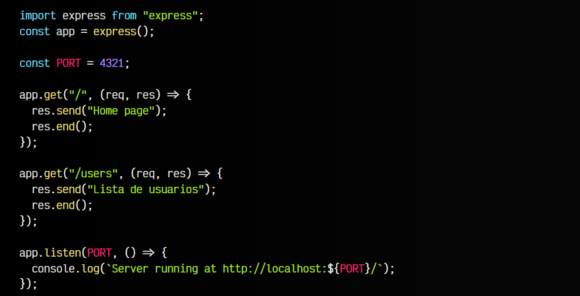
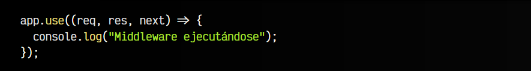
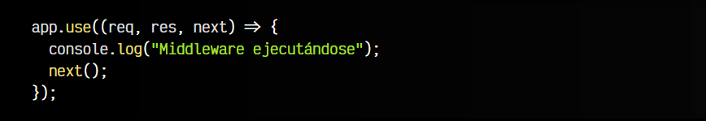
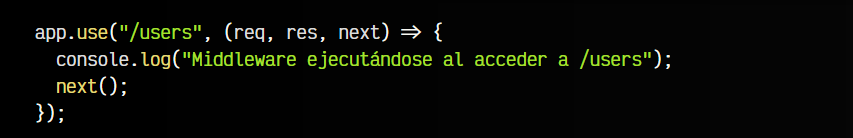

# 
Utilizando Middlewares

Los middlewares son funciones que se ejecutan antes de que la lógica de las rutas sea procesada. Esto nos permite anticiparnos y hacer cambios en el funcionamiento de la aplicación, añadir cabeceras, o en general, realizar tareas previas a el procesamiento de las rutas.

Esto puede venir genial para realizar tareas previas a la lógica de las rutas, o a interceptar una petición y realizar comprobaciones previas antes de continuar.

## Creando un Middleware.
Para entender bien los middlewares, vamos a partir del siguiente ejemplo, en el que aún no tenemos ningún middleware implementado. Se trata de un código muy sencillo, gestionando sólo dos rutas:

Tenemos dos rutas concretas: / y /users. Si accedemos a una ruta inexistente, nos da un error. Ahora vamos a añadir un middleware para interceptar las peticiones de ambas rutas. El middleware se crea utilizando app.use() antes de la lógica de las rutas y pasándole una función con la lógica por parámetro:

Ahora, si accedes a alguna de las rutas definidas (e incluso alguna ruta inexistente), comprobarás que se está interceptando la petición y el middleware ha sido ejecutado. De hecho, «secuestra» la petición y no continua a las rutas.

Si nos fijamos bien, la función recibe tres parámetros: req, res y next. Los dos primeros son iguales a como estamos acostumbrados en las rutas, sin embargo, el tercero, es una función que indica si queremos continuar procesando reglas o, de no ejecutarla, queremos que termine ahí. Esto podría ser un excelente caso donde si un usuario no es válido, lo redireccionamos a la ruta de la página de login.

En este caso, el middleware se ejecuta, pero una vez termina, se continua procesando las rutas, por lo que el middleware está actuando como una funcionalidad previa.

## Middleware por rutas.
También es posible definir middlewares por rutas específicas, simplemente añadiendo un parámetro previo con la ruta en cuestión:

En este caso, el middleware se ejecuta sólo cuando accedemos a la ruta /users y luego ejecuta next() y continua buscando si hay más middlewares o lógica de rutas que coincidan.

## Servir ficheros estáticos.
En el desarrollo web, es muy habitual tener una carpeta public/ para indicar que todos los ficheros que están en su interior se permiten servir como ficheros estáticos, esto es, enviarlos tal cuál, sin procesamiento de ningún tipo.

Esto se puede hacer fácilmente con Express, utilizando un middleware y la función express.static():

Ahora, si creamos una carpeta public/ en el raíz de nuestro proyecto y en su interior colocamos un fichero de texto info.txt, podemos acceder a él desde la ruta http://localhost:4321/info.txt, y de la misma forma, con cualquier fichero que coloquemos en esa ruta.

Esto nos permite montar un pequeño servidor web estático para archivos de front de forma muy sencilla. Aún así, en producción siempre se suele recomendar utilizar un servidor web profesional como por ejemplo [Nginx](https://www.nginx.org/) o [FreeNginx](https://freenginx.org/).

Ten en cuenta que dichos ficheros serán enviados como ficheros estáticos, es decir, nunca se procesará su código, aunque sean ficheros con código Javascript o similar.

