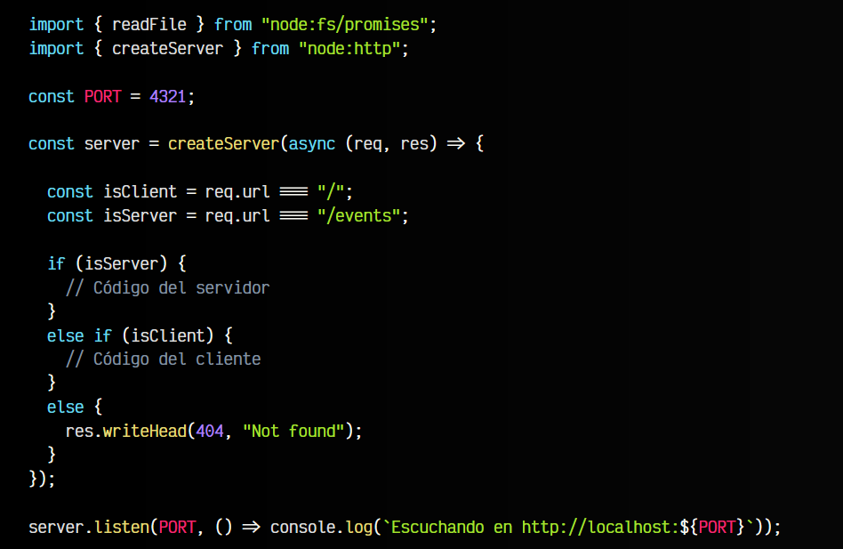
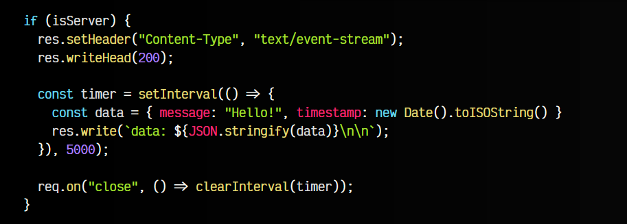
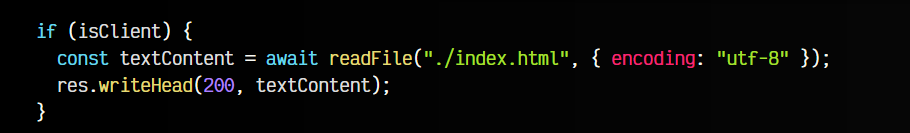
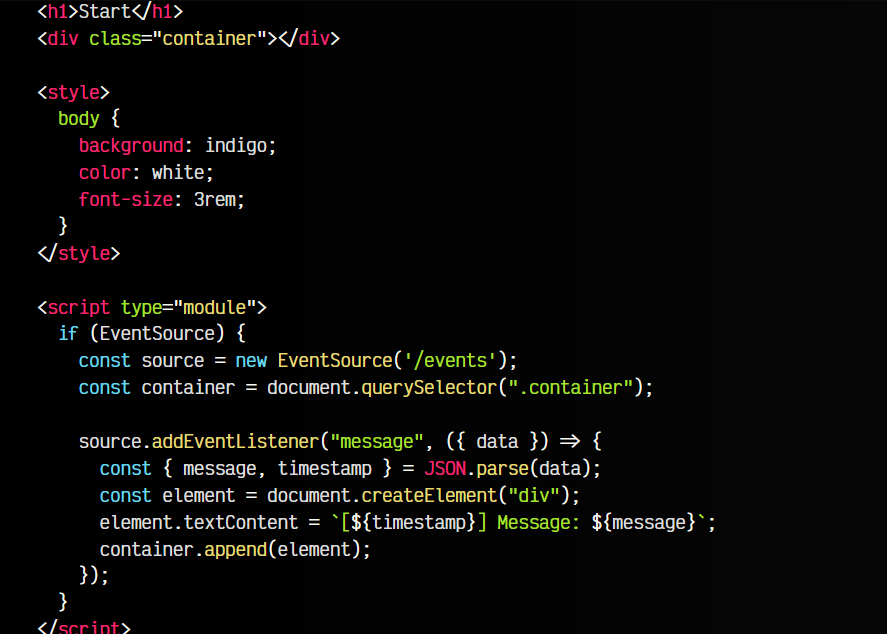

# 
Usando Server-Sent Events

En el artículo anterior explicamos las diferencias principales entre Server-Sent events y WebSockets. Vamos ahora a ver un ejemplo real de SSE en NodeJS, para entenderlo.

## Estructura principal del ejemplo.
Recordemos que el aspecto clave de Server-Sent Events es que la comunicación es unidireccional, por lo que sólo podemos comunicarnos de servidor a cliente.

La estructura principal de nuestro ejemplo sería el siguiente:

Observa que hemos creado un servidor donde escuchamos dos rutas:

   - 1️⃣ /events es la ruta del servidor SSE.
   - 2️⃣ / es la ruta del cliente (navegador)
   - 3️⃣ En el caso de acceder a cualquier otra ruta, obtendremos un 404 error.

Veamos ahora el fragmento de código de cada parte, servidor y cliente.

## El servidor.
En el caso del servidor vamos a enviar una cabecera Content-Type con el valor text/event-stream. Esto nos indica que estamos enviando streams de datos, es decir, un grupo de información cada cierto tiempo:

Un poco más abajo creamos un temporizador setInterval() que cada 5 segundos enviará el contenido del objeto data a través del stream de datos del servidor.

## El cliente.
Ahora vamos con el fragmeto de código del cliente, donde simplemente leemos el contenido del archivo index.html y lo enviamos al navegador:

El contenido de dicho index.html sería el siguiente:

   - Creamos un HTML básico, donde mostramos un < h1 > y un < div > contenedor vacío.
   - Un poco más abajo, le damos un estilo CSS básico.

Vamos ahora al código Javascript. Tras comprobar si está soportado, creamos un nuevo objeto EventSource con la ruta a la que se conectará para obtener los datos. A continuación, simplemente escuchamos los eventos message y cada vez que se reciba uno, añadimos un nuevo elemento al DOM de la página HTML.