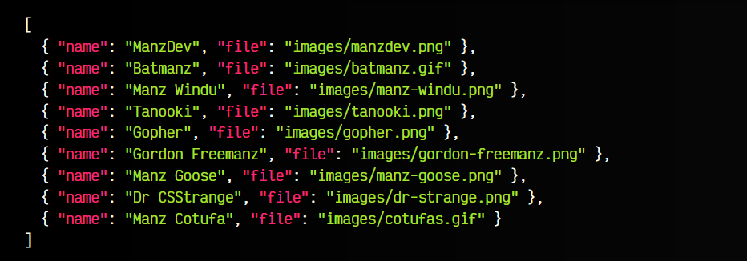
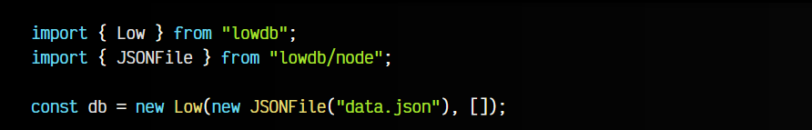
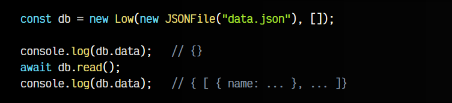
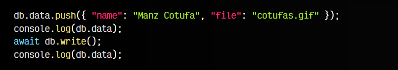
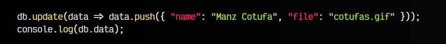

# 
Introducción a LowDB

[LowDB](https://github.com/typicode/lowdb) es una base de datos ligera y sencilla que parte de los datos de un fichero [JSON](https://lenguajejs.com/javascript/objetos/json/). Está diseñada para ser muy fácil de usar, y una primera aproximación al uso de una base de datos, de forma natural y sencilla, muy interesante si no tenemos grandes exigencias o esquemas sencillos.

A diferencia de otras bases de datos, LowDB carga la información en memoria y va realizando el guardado en un fichero .json cuando deseemos garantizar persistencia (cambios permanentes).

## Instalación y configuración.
Para utilizar LowDB, lo primero que necesitamos es instalar el paquete lowdb con npm en nuestro proyecto:

json:

Listo. Nuestra intención es utilizar LowDB en nuestra aplicación, de modo que se utilice este fichero data.json como base de datos.

## Conexión a la base de datos.
En primer lugar, importamos Low desde nuestro paquete, y JSONFile desde lowdb/node. Una vez hecho esto, nos creamos una instancia db de la base de datos, donde le pasamos como parámetro el fichero new JSONFile("data.json") y el objeto inicial, que es un OBJECT vacío:

Con esta simple acción, ya tenemos una instancia db que contiene dos propiedades: un adapter y un data que son los datos de nuestra base de datos. Nuestra intención utilizando LowDB es poder acceder a dichos datos en cualquier momento para leerlos o modificarlos, y sincronizarlos con el fichero .json cuando sea necesario.

Si haces un console.log() de db.data, observarás que el objeto está vacío y aún no tiene datos. Explicaremos el por qué en el siguiente apartado.

Ten en cuenta que LowDB tiene una API síncrona, por lo que podemos importar LowSync si queremos utilizar dicha API en lugar de Low, que es asíncrona.

## Obtener y guardar datos.
Al haber realizado la instancia de nuestra base de datos en db, podemos acceder a db.data y modificar dichos datos en cualquier momento. Sin embargo, aún no tiene los datos, ya que aún no hemos leído el contenido del fichero .json.

Para leer los datos, debemos llamar al método db.read(), que como es asíncrono, nos devuelve una promesa:

Al realizar el db.read(), LowDB ha accedido al fichero .json y guardado los datos en la estructura de db.data. De la misma forma, podemos llamar a db.write() para sincronizar y guardar los datos que tenemos en db.data en el fichero data.json.

Por ejemplo, vamos a agregar un nuevo elemento en db.data. En este momento, tenemos la estructura db.data actualizada, sin embargo, el fichero data.json aún no tiene los cambios. Para ello, tenemos que llamar al método asíncrono db.write():

Este método sincronizará los datos de db.data en el fichero data.json. Una forma alternativa y más rápida es utilizar el método db.update(), que nos permite introducir los datos y llamar a db.write() de forma implícita:

Con es## < span style="color:orange">Obtener y guardar datos.</ >
tas simples acciones, podemos trabajar con la base de datos LowDB.

## Limitaciones de LowDB.
LowDB es una base de datos simple, que se basa en fichero .json para guardar los datos. Es interesante en casos simples y bases de datos no demasiado complejas. Si tu fichero .json tiene entre 10-100MB es posible que puedas experimentar problemas de rendimiento.

Una forma de mitigar dichos problemas podría ser realizar múltiples operaciones de guardado y controlar el número de llamadas a db.write(), reduciéndolas al mínimo sólo cuando sea necesario. Si necesitas más que eso, lo mejor sería escalar a otro sistema de bases de datos como SQLite, que explicaremos en el siguiente artículo.

