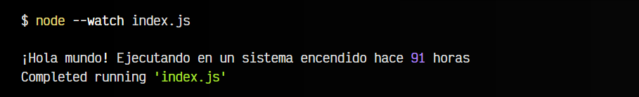

# 
Primeros pasos con NodeJS

Para empezar con Node, si ya te has asegurado que cumples los requisitos necesarios, vamos a crear nuestro primer ejemplo en NodeJS, para aprender a escribir algunos fragmentos de código Javascript sencillos y ejecutar nuestros primeros scripts.

## Inicializa el proyecto.
En primer lugar, vamos a crear una nueva carpeta node-project e inicializar un proyecto utilizando el gestor de paquetes npm (o cualquier otro que desees):

Es posible que posteriormente, al ejecutar nuestro primer ejemplo nos aparezca un error similar al siguiente:

En estos tutoriales vamos a utilizar NodeJS moderno, por lo que si obtienes este error al ejecutar tu index.js, simplemente asegúrate de que existe un "type": "module" en tu archivo package.json, y si no es así, añadelo. También es posible saltarse este error renombrando la extensión de .js a .mjs, aunque es preferible utilizar la primera solución en lugar de esta última.

## Mi primer ejemplo en NodeJS.
Ahora que tenemos nuestra carpeta y proyecto creado, vamos a crear un fichero index.js donde escribiremos un pequeño fragmento de código Javascript. Lo habitual es tener instalado Visual Studio Code, por lo que si no lo tienes, lee el post Instalar VSCode. Una vez lo tenemos instalado, podemos ejecutar el comando code para abrirlo en la carpeta actual:

En el archivo vamos a escribir un código Javascript que va a importar las constantes del sistema operativo hostname y type, que nos dan el nombre del sistema y el tipo de máquina que es (Linux, Windows, etc...).

Observa también que a la hora de importar los módulos, indicamos node: seguido del nombre del módulo que queremos importar. Esto es la manera recomendada de importar módulos que sean específicos de Node:

Ahora, si vamos a una terminal y escribimos node index.js, ejecutaremos nuestro script y node lo ejecutará. Asegúrate de estar en la ruta de la carpeta que hemos creado:

¡Ya tenemos nuestro primer script en NodeJS! Observa que en mi caso, aún usando Windows, me aparece bajo Linux porque estoy usando WSL y a efectos prácticos se trata de un Linux dentro de Windows.

## Vigilando cambios: node --watch.
Observa que cada vez que escribamos node index.js se ejecutará el código y nos mostrará el resultado. Esto está muy bien, pero puede ser algo incómodo a la hora de desarrollar.

Vamos a ampliar nuestro ejemplo y a utilizar una característica llamada --watch, que se encarga de ejecutar el script cada vez que el código cambia:

En este caso, observa que hemos hecho varias cosas:

   - Importamos uptime, una función del sistema operativo node:os
   - Dicha función nos devuelve el tiempo que lleva la máquina encendida (en segundos)
    -Creamos una constante hours que convierte los segundos en horas y los redondea
   - Creamos una constante RTF, que es un objeto RelativeTimeFormat. Este objeto formateará números en tiempos relativos (hace X, dentro de X...).
   - Creamos una constante time que donde formateamos las hours y las guardamos como STRING.

Ahora, vamos a ejecutar nuestro script, colocando el parámetro --watch para que vigile los cambios. Ahora, si hacemos modificaciones en nuestro código y guardamos con
CTRL+S, comprobaremos que se vuelve a ejecutar el código sólo, haciéndolo mucho más cómodo para el programador:

Observarás que si todo ha ido bien, cada vez que guardes los cambios del código, aparecerá un mensaje Restarting 'index.js', que indica que ha detectado cambios y vuelto a ejecutar el script.

Antiguamente, se solía utilizar [nodemon](https://nodemon.io/) para este propósito. Sin embargo, ya no es necesario, puesto que podemos utilizar --watch.

