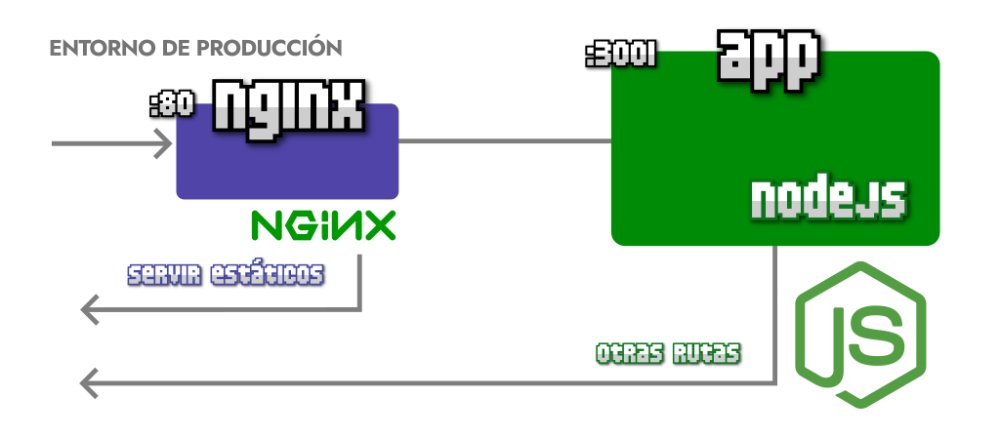
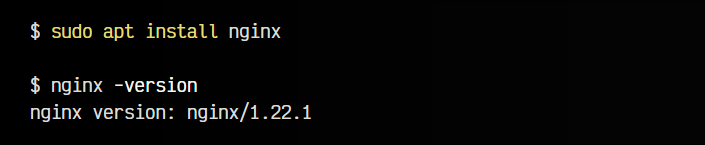
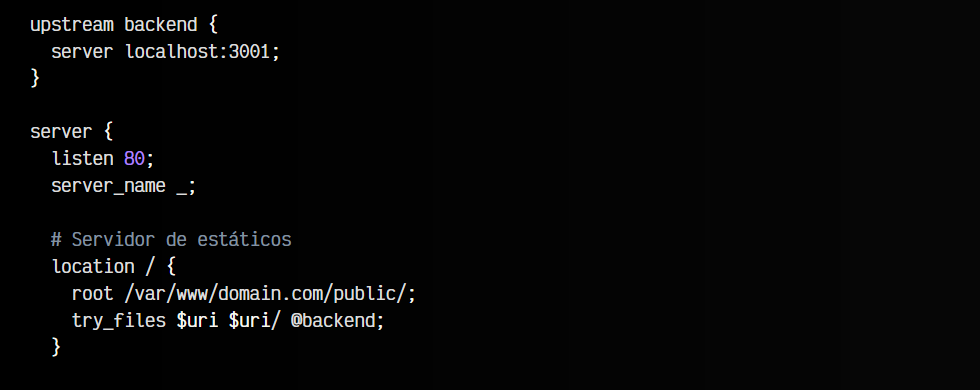
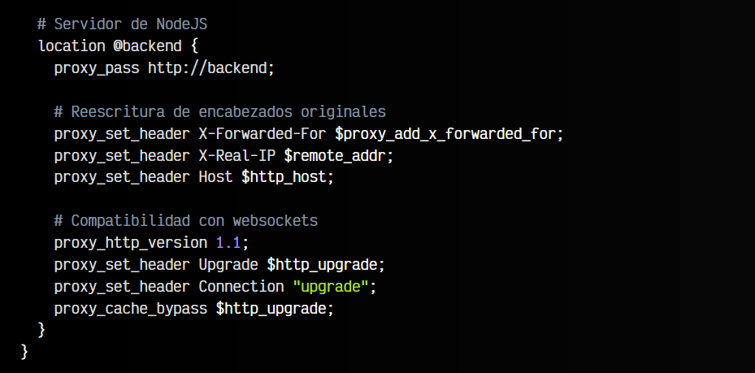
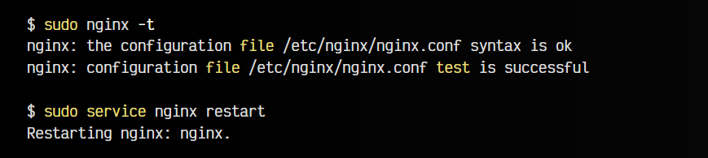
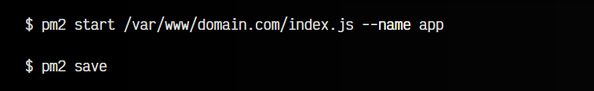

# 
Servidor nginx con NodeJS

En este artículo vamos a explicar los pasos necesarios para montar y configurar un servidor de NodeJS, mediante un servidor web Nginx como proxy inverso y PM2 como gestor de proceso de NodeJS.

## ¿Qué es un proxy inverso?.
Un proxy inverso es un programa (servidor web) que se encarga de redirigir las peticiones entrantes a otros servidores. Esto nos proporciona la ventaja de utilizar nginx como capa inicial, que se encargará de gestionar las peticiones sencillas de archivos estáticos (html, imágenes, etc...) y las peticiones más complejas, pasárselas a NodeJS para que las procese ahí.

Esto permite que nuestro servidor sea más rápido y eficiente, aproveche mejor los recursos, así como beneficiarnos de todas las ventanas profesionales que nos brinda nginx de seguridad, rendimiento, cache y otros.

## Instalación de nginx.
Para instalar nginx, basta con ejecutar el comando apt install nginx en nuestra terminal. Esto instalará la última versión disponible del servidor web [nginx](https://nginx.org/en/):

Podemos ejecutar nginx -version después de la instalación para comprobar la versión instalada y si realmente se ha instalado correctamente.

## Configuración de nginx.
Por defecto, nginx tiene una página por defecto configurada en el archivo /etc/nginx/sites-enabled/default. Vamos a modificarla para configurar nuestro sitio en ella. Abrimos el fichero de configuración con un editor de textos:

En este fichero de configuración debemos crear las siguientes lineas para configurarlo correctamente. Vamos a explicarlo por partes. Localiza las primeras secciones que explicaremos en breve:

   - 1️⃣ El bloque server configura el servidor general.
   - 2️⃣ Dentro, el bloque location / configura el acceso a archivos estáticos.
   - 3️⃣ Luego, el bloque location @backend configura el acceso a archivos de NodeJS.
   - 4️⃣ Por último, el bloque upstream backend que aparece al principio, define nuestro servidor NodeJS.

El fichero de configuración de nginx quedaría así:

Expliquemos cada uno de los bloques mencionados.

## El bloque server.
El bloque server configura el servidor general. En este caso, lo único que hace es indicarle a Nginx que escuche en el puerto 80 (http). Además, con server_name _ se indica que el servidor es genérico, y que accederemos a él desde cualquier dominio.

## El bloque location /.
Este bloque se utiliza para definir la ruta de acceso a los ficheros estáticos. Con root definimos la ruta donde tenemos nuestros archivos. Observa que se trata de la ruta /var/www/domain.com/public/. Nuestra ruta /var/www/domain.com es la carpeta donde tenemos los archivos de nuestra aplicación, mientras que en la subcarpeta public/ tenemos todos los archivos estáticos de front-end que se sirven directamente y no necesitan un servidor como NodeJS.

Por otro lado, el try_files nos indica que si existe un archivo $uri o una carpeta $uri/ entonces la procese con nginx, pero en caso contrario, se dirija al bloque @backend.

## El bloque location @backend.
Este bloque se utiliza para definir que debe hacer nginx cuando le llegue una potencial petición para NodeJS. Rutas como por ejemplo /, /api/, /faq/ o /about/ son rutas que, si no existen dichas carpetas, serán procesadas por Node, donde si tenemos un servidor de endpoints con express, las procesará ahí. Si acaso existieran, serían procesadas con el try_files de Nginx que mencionamos antes, en caso contrario con proxy_pass lo enviamos al upstream que explicaremos más adelante.

Observa que tenemos varias directivas proxy_set_header o similares, que sirven para reescribir cabeceras o añadir compatibilidad que se puede perder al redireccionar a otro lugar.

## El bloque upstream.
Por último, el bloque upstream nos indica que tenemos un servidor escuchando en esta máquina localhost y en el puerto 3001. Ahí debemos poner a escuchar PM2, con nuestro script de NodeJS.

## Arrancar los servidores.
Una vez tenemos guardada esta configuración, vamos a comprobar si todo está escrito correctamente. Ejecutamos el comando nginx -t y si todo ha ido bien, nos debería salir algo como esto:

Restarting nginx: nginx.

Una vez comprobado, escribimos sudo service nginx restart y reiniciamos el servicio para que tome los cambios de configuración. Con esto tendríamos nginx funcionando.

Ahora, vamos a arrancar pm2 con el script de NodeJS, que presumiblemente tendríamos en /var/www/domain.com. Si no conoces pm2, lo explicamos previamente en el artículo PM2: Gestor de procesos:

Recapitulando, tendríamos 2 servicios funcionando:

   - Nginx en el puerto 80, vigilando todas las peticiones entrantes
   - PM2 en el puerto 3001, esperando las peticiones redirigidas por nginx
   - Si realizamos peticiones como /index.html o /imagen.jpg, si existen, las devolvería nginx.
   - Si realizamos peticiones como /about o /api/users, si existen, las procesaría NodejS vía PM2.

## Futuros pasos.
Recuerda que esto es una versión simplificada para entender como montar un servidor nginx y pm2. Hay ciertas características que sería ideal tener también en cuenta:

   - Establecer variables de entorno adecuadas en PM2
    Configurar Nginx para HTTPS (SSL) en lugar de HTTP
   - Establecer un firewall para limitar el acceso al puerto 3001 desde fuera del servidor
   - Añadir la gestión de 404 en los endpoints de NodeJS
   - Considerar utilizar Docker para tener todo bien aislado y organizado
   - Establecer un workflow de despliegue automatizado

