# 
Comandos y parámetros

Al comenzar a trabajar en NodeJS, es muy recomendable conocer un poco sobre la línea de comandos de terminal y no sólo saber como trabajar con ella, sino también saber como crear pequeños scripts que permitan trabajar con los parámetros indicados en dichos comandos.

Vamos a ver una serie de buenas prácticas a la hora de trabajar con comandos en NodeJS.

## Parámetros o argumentos.
En NodeJS, podemos controlar los parámetros que le pasamos al ejecutar el comando mediante el array argv de node:process. Este array es un array especial que nos devuelve:

   - Un primer elemento con la ruta y nombre del script que se está ejecutando.
   - El resto de parámetros son los argumentos de dicho script.
  
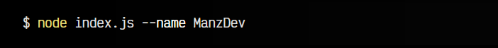  

En este caso, NodeJS nos devolvería:

   - Un primer elemento: /path/bin/node, que es el comando que se ejecuta
   - Un segundo elemento: /path/to/index.js, que es el script que ejecutamos
   - Un tercer elemento: --name, que es el primer argumento de nuestro script
   - Y un cuarto elemento: ManzDev, que es el segundo argumento de nuestro script

Hagamos algunos cambios y veamos el fragmento de código completo:

   - Creamos argc (argument counter) que nos da el número de argumentos
   - Creamos args, que son los argumentos del script

js:
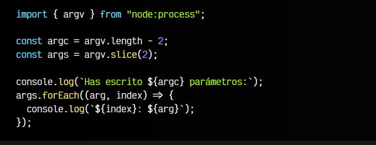

bash:
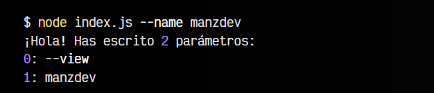

Observa que en ambos descartamos los dos primeros argumentos (node y el script JS). Ahora, si ejecutamos el comando node index.js --name ManzDev, nos mostrará los argumentos pasados por parámetro.

## Trabajando con parseArgs.
El método parseArgs es un método de node:util que sirve para gestionar los parámetros de una forma cómoda y rápida por parte del desarrollador.

Antes de utilizarlo, vamos a preparar un fragmento de código para que nos ayude a entenderlo mejor:

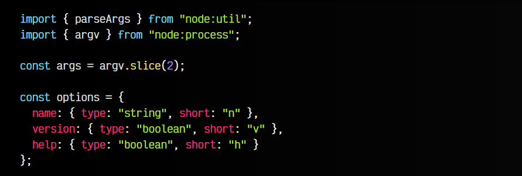

Observa que la constante options es un objeto con una lista completa de todos los parámetros posibles que se pueden indicar, donde definimos type, el tipo de dato de cada uno de ellos (string o boolean), y short, el nombre corto del parámetro.

Esto nos permite que el usuario pueda indicar tanto node index.js --name ManzDev como node index.js -n ManzDev, o node index.js -v como node index.js --version.

Ojo que aún nos falta la parte clave del código utilizando parseArgs, lo veremos a continuación, ya que hay 3 formas diferentes de usarlo.

## Argumentos vía values.
En la última línea es donde realmente se procesan los argumentos y se extrae la variable values, que contiene todos los parámetros indicados por el usuario:

js:

bash:
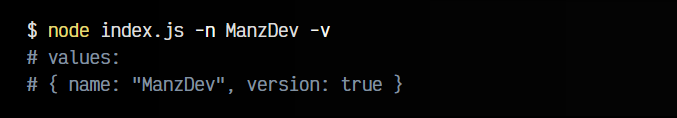

## Argumentos vía tokens.
Si indicamos tokens: true en las opciones de parseArgs(), podremos recuperar los tokens en lugar de values, un array mucho más detallado argumento por argumento:

js:
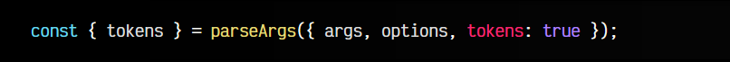

bash:
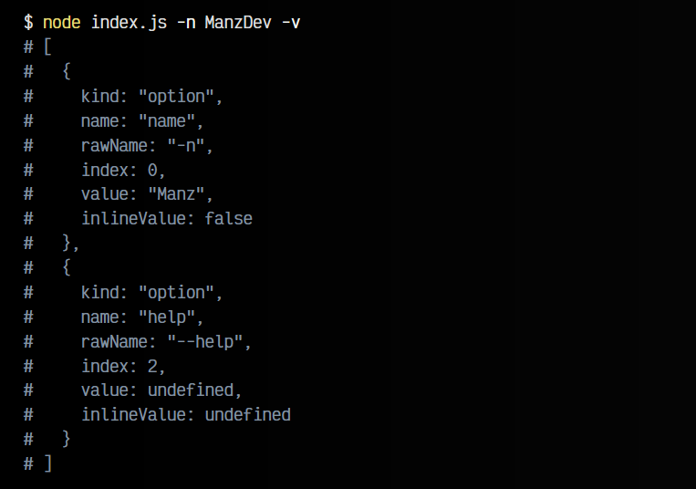

## Argumentos vía positionals.
En el caso de que sólo nos interesen los argumentos sin valores, podemos indicar allowPositionals: true en las opciones de parseArgs(), de esta forma, podemos extraer positionals donde obtendremos un array ordenado con los parámetros indicados:

js:
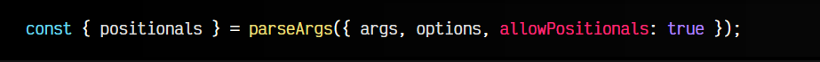

bash:
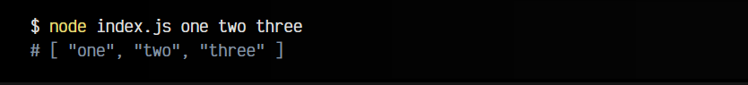

Estas operaciones tradicionalmente se venían realizando con librerías como yargs o commander, pero ahora están disponibles de forma nativa en NodeJS.

## Usar un shebang #!.
Aunque para desarrollar no lo utilizaremos demasiado, esto es muy útil si hacemos scripts que solemos ejecutar desde una terminal y queremos ejecutarlos directamente, sin hacer referencia al comando node.

Los shebangs son la primera línea que encontramos en los scripts de GNU/Linux, que comienzan por el texto #! seguido de la ruta del programa que va a ejecutar el script. Si quisieramos hacer un script de Node, podemos escribir esto en la primera línea del fichero:

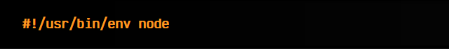

Esto indicará al sistema que se debe ejecutar /usr/bin/env, un comando que a su vez ejecutará node con el script mencionado. De esta forma, podemos añadirle permisos de ejecución con un chmod +x index.js y ejecutarlo con un simple ./index.js, en lugar de escribir node index.js.

Por otro lado, mientras estamos desarrollando, puede ser útil indicar el shebang #!/usr/bin/env -S node --watch, que lo ejecutará en modo de vigilancia de cambios, y lo reininciará en el caso que se modifique su contenido:

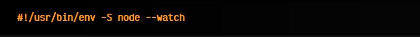

No te olvides cambiarlo al primero cuando ya lo tengas terminado.

