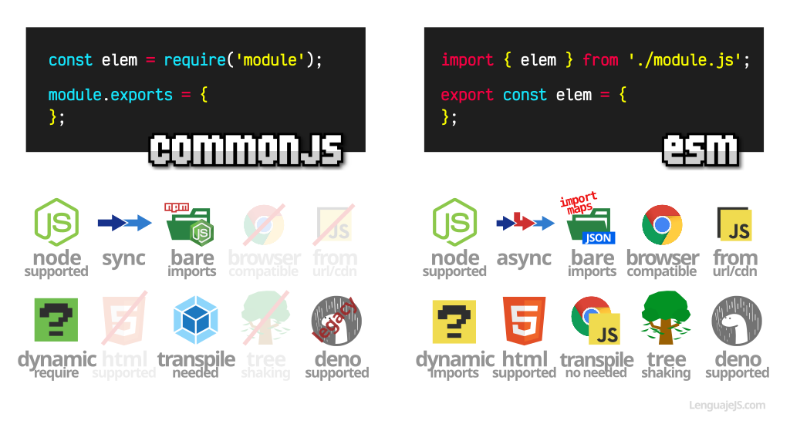

# 
CommonJS vs ES Modules

Es probable (sobre todo si no llevas mucho tiempo en el ecosistema Javascript) que te hayas encontrado con términos como CommonJS (CJS) o ES Modules (ESM) y no tengas claro a que se refieren. Incluso, algunos términos ya menos frecuentes como AMD, System, UMD, IIFE o similares. Dichas siglas o nombres, suelen hacer referencia sistemas de módulos (importaciones desde otros archivos) utilizados en Javascript.

## Un poco de historia.
Antes de 2015, momento en el que nace ECMAScript 2015 (previamente llamado ES6), Javascript carecía de sistema de módulos oficial. Aunque pueda parecer extraño, tiene su sentido: Javascript nació como un lenguaje de programación para el navegador, que servía de apoyo a las páginas HTML+CSS para dotar de interactividad y de mayor dinamismo.

Con el tiempo, se comienza a utilizar más y más Javascript en los sitios web. Pero donde se produce un antes y un después, es cuando se hace posible utilizar Javascript fuera del navegador. Su implementación más popular es NodeJS, aunque actualmente existen otras como por ejemplo Deno.

Todo esto, junto a la fuerte evolución de Javascript, convierte en una necesidad el tener un sistema para incluir código desde ficheros externos. Organizar mejor el código Javascript es algo necesario, y es inviable seguir haciéndolo en un sólo fichero o múltiples < script > en una o varias páginas HTML.

## ¿Qué es IIFE?.
Las siglas IIFE significan Expresión de función invocada inmediatamente (Immediately-invoked function expression), y es una de las primeras formas que aparecen de conseguir encapsular contenido privado en Javascript, antes de 2015.

Eso, unido a una cierta estructura, hacía posible conseguir algo que se solía conocer como patrón módulo revelador (Revealing Module Pattern):

Aunque no lo parezca, el funcionamiento era simple. Como no teníamos forma de declarar datos privados, la opción utilizada era crear una FUNCTION que en su interior contiene variables y/o funciones. Por último, se devolvía un OBJECT con los datos/funciones que queríamos que fueran públicos. Los demás, eran privados porque no salían de la función, la cuál se encerraba entre paréntesis y se «autoejecutaba». De esta forma, lo que recibíamos en module era el «objeto revelado».

Como se puede ver, algo muy similar al concepto de clases que conocemos habitualmente. Sin embargo, seguíamos con el problema de no poder importarlo/exportarlo en ficheros a parte.

## ¿Qué es CommonJS (CJS)?.
CommonJS surge cerca de 2009 como una serie de pautas para crear un sistema de módulos en el ecosistema Javascript, ya que oficialmente carecía de uno. Algo más tarde, el equipo de NodeJS implementó parcialmente una versión síncrona de CommonJS, por lo que consigue popularizar un sistema de módulos no oficial como el que puedes ver a continuación:

De esta forma, haciendo un require() podemos importar módulos CommonJS que se exportan con un module.exports desde otros archivos o desde node_modules, obteniendo la carpeta principal del campo main del package.json. Este último sistema se conocería más tarde como bare imports (importaciones desnudas), haciendo referencia a que no se indica una ruta de un archivo, sino un STRING con el nombre del paquete.

Sin embargo, estos require() son creados por NodeJS y no son compatibles directamente en navegadores, salvo que se preprocese o transpile antes con alguna herramienta como podría ser un empaquetador o automatizador del estilo de Webpack, Parcel, Rollup, Babel o similar. Estas herramientas buscan los require() y los sustituyen por el código del fichero correspondiente, uniendo y empatando todos los archivos Javascript necesarios de nuestra aplicación web en un sólo archivo con todo el Javascript de la aplicación llamado bundle.

## ¿Qué es AMD?.
AMD (Asynchronous Module Definition) nació del descontento de las limitaciones síncronas que tenía CommonJS, que no permitían cargar eficientemente módulos en el lado del cliente. No se llegó a hacer tan popular y extendido como CommonJS, además de que su sintaxis era algo más compleja de entender:

AMD podría verse como una mezcla del patrón módulo revelador y una sintaxis donde se usa define(deps, module) para cargar módulos. El parámetro deps es un ARRAY donde se definen los nombres de las dependencias que se necesitan para ejecutar la función module. Si están cargados, se ejecuta, si no, se carga asincronamente hasta que estén disponibles.

La implementación más popular de AMD fue require.js y era bastante prometedora, sin embargo, los ES Modules aterrizaron en 2015 y al ser nativos y estándar (y mucho más simples), todos estos sistemas de módulos pasarían a un segundo plano o un plano legacy.

Antes de popularizarse CommonJS con Node, nunca se llegó a decidir de forma unánime entre AMD y CommonJS, por lo que apareció también un patrón llamado UMD (Universal Module Definition), que básicamente era un fragmento de código que permitía cargar módulos independientemente de si eran AMD o CommonJS, ya que permitía cargar ambos. Eso sí, la sintaxis era considerablemente más fea y compleja. Poco más tarde, aparecería System.js ofreciendo lo mismo.

## ¿Qué es ES Modules (ESM)?.
En 2015, aterriza ECMAScript 2015 (antiguamente ES6) y con ella multitud de novedades en Javascript. Una de ellas, el sistema de módulos nativos de Javascript. Los tienes detalladamente explicados en Módulos ECMAScript (ESM), pero básicamente, son una evolución de lo mejor de los anteriores, en versión simplificada:

Este sistema de módulos nativo por fin nos permite cargar módulos externos con una sintaxis simple y de forma síncrona y asíncrona. Eso sí, con una pequeña pega que seguiremos sufriendo durante un tiempo: esperar que la industria y ecosistema Javascript vaya abandonando CommonJS a favor de ESM.

## CommonJS vs ESM.
Hoy en día, de todo lo anterior, lo más común suele ser utilizar enfoques como CommonJS o ESM. Actualmente, el uso de ESM parece ser bastante alto, en ecosistemas donde se trabaja directamente en navegador o en Deno, que soporta ESM. En el caso de Node, aunque es posible utilizarlo con ESM, frecuentemente nos encontramos código antiguo que aún no ha migrado y sigue desarrollando utilizando CommonJS.

Al margen de su sintaxis, la cuál ya hemos visto en los ejemplos anteriores, ambos tienen sus diferencias pero las más populares son las siguientes:

1️⃣ NodeJS soporta tradicionalmente la sintaxis require() de CommonJS, pero también soporta ESM, por lo que puedes usar ambos.

2️⃣ CommonJS sólo permite cargar módulos de forma síncrona (bloqueando la ejecución hasta que haya cargado y ejecutado), mientras que ESM permite carga síncrona y asíncrona.

- NodeJS permite hacer require() de bare imports utilizando npm. Por otro lado, ESM tiene una estrategia similar basada en el cliente que se basa en import maps, un fichero .json que incluye la URL de referencias a los nombres de los paquetes «desnudos».

- Los require de CommonJS no son compatibles en el navegador de forma directa, mientras que los import de ESM si lo son, siempre que se indique el atributo < script type="module" > en los scripts que lo utilicen.

- CommonJS no permite cargar directamente desde una URL o CDN un módulo, mientras que con ESM puedes hacerlo sin problemas y funciona directamente desde un navegador.

- ESM está diseñado teniendo tree-shaking (eliminación de código no utilizado) en mente, mientras que en CommonJS no. Por lo tanto, al utilizar un automatizador para hacer tree-shaking, será mucho más óptimo y adecuado hacerlo con ESM.

- CommonJS se utiliza en sistemas que generan bundles y utilizan técnicas de preprocesado o transpilado. Por otro lado, ESM puede utilizarse tanto en entornos de procesados/transpilado como directamente desde el navegador, sin necesidad de transpilar.

- Deno utiliza ESM por defecto, y aunque puede soportar CommonJS, es altamente recomendable utilizar ESM si es posible.

Como ves, hay una larga lista de diferencias entre ambos. Sin embargo, en general, el uso de ESM es más adecuado para proyectos modernos y sería recomendable utilizarlo siempre que se pueda.