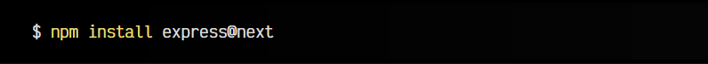
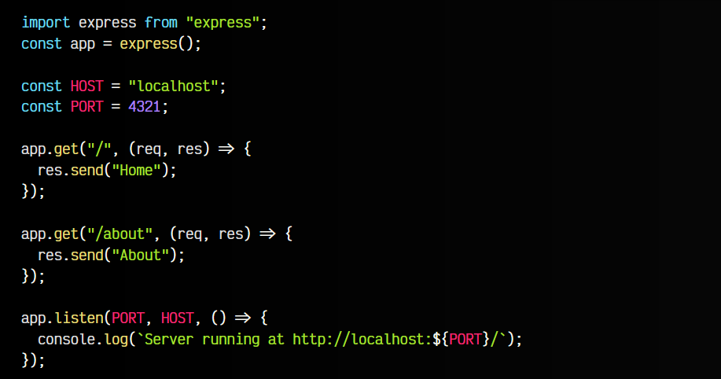
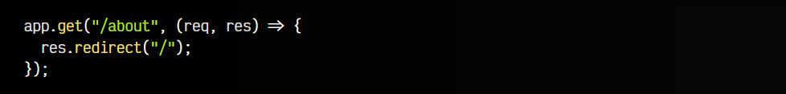
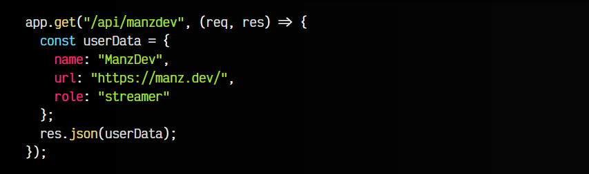
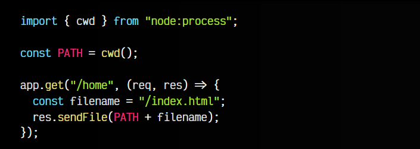
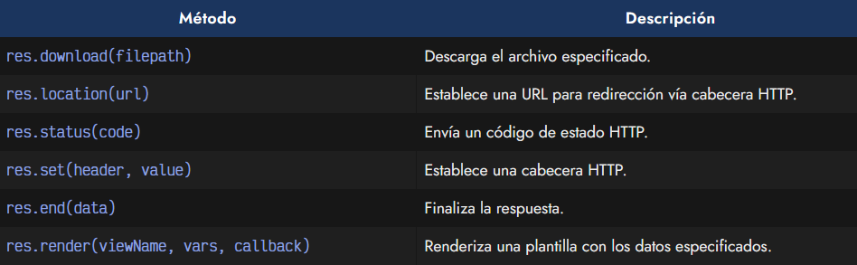
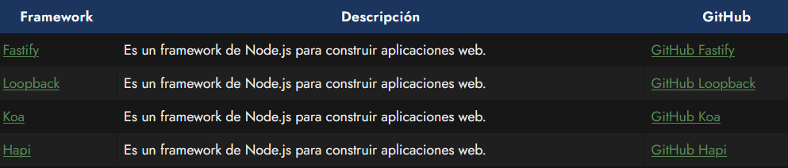

# 
Introducción a Express

Hasta ahora hemos visto como crear un servidor web donde incluso podríamos enviar respuestas dependiendo de la ruta indicada. Sin embargo, hay ciertas librerías de terceros que nos permiten hacer esta tarea de forma más cómoda y directa.

Una de estas librerías es Express. Express es una librería de terceros para NodeJS que nos permite crear un servidor web muy fácilmente. Con él, una de las tareas más comunes es crear un sistema de enrutado que nos permita gestionar lo que ocurrirá cuando el usuario acceda a ciertas rutas de la web.

## Instalación de Express.
Al ser una librería externa, debemos instalarla con el comando npm install. Esto hará que se descargue y se incorpore a los ficheros que se encuentran en el proyecto en la carpeta node_modules:

Añadiendo @next al final del comando anterior, instalaremos la nueva versión 5 de Express, que en el momento de escribir estas líneas se encuentra en beta. Ahora ya tenemos express instalado en nuestro proyecto.

## Crear un servidor web.
Vamos a importar express y crear un servidor web que nos realice diferentes acciones dependiendo de la ruta a la que acceda el usuario. En primer lugar realizamos la importación de express y creamos una constante app donde ejecutamos el método express() recién importado.

Esta app es la que usaremos para enrutar:

Observa que con muy poco código hemos creado dos rutas: / (la página principal) y /about (una página de información). Si accedemos a la ruta http://localhost:4321/about veremos el texto "About", mientras que si accedemos a la página principal http://localhost:4321/ veremos el texto "Home".

   - Ten en cuenta que en el caso de acceder a una ruta que no esté definida, express nos devolverá un error Cannot GET /ruta-que-no-existe.
  
## Redireccionar rutas.
Para redireccionar una ruta, podemos usar el método redirect() de la respuesta de una ruta. Por ejemplo, si queremos que al acceder a la ruta /about se nos redirija a la página principal /, lo haremos como vemos en el fragmento de código siguiente:

Por defecto, redirect() realizará una redirección HTTP 302 (redirección temporal). Si queremos que sea una redirección permanente (más apropiada para temas de SEO), lo haremos como el segundo ejemplo.

## Enviar un JSON.
En general, cuando construimos un backend, muchas veces lo que queremos crear es una API RESTful, es decir, un sistema que nos permite obtener datos, generalmente en formato JSON, a través de ciertas peticiones.

En Express, ya sabemos crear rutas, pero si queremos enviar información en formato JSON de forma sencilla, podemos hacer uso del método json() de la respuesta de una ruta:

Esto hará que al consultar la ruta https://localhost:4321/api/manzdev nos devuelva la información del objeto userData estructurado en formato JSON.

## Enviar un fichero.
En el caso de querer enviar una página web específica, podemos hacer uso del método sendFile() del objeto de respuesta. Ten en cuenta que primero obtenemos la ruta actual con cwd(), para poder crear una ruta absoluta:

## Otras operaciones.
El objeto response de las rutas de Express nos proporciona muchas otras funciones que nos permiten enviar información o realizar operaciones. Aquí algunos ejemplos que pueden resultarnos prácticos:

## Alternativas a Express.
Express no es el único framework de Node.js para construir aplicaciones web y gestionar rutas, pero si es el más popular. Además, hay otros frameworks que tienen diferentes características. Aquí algunos ejemplos:

