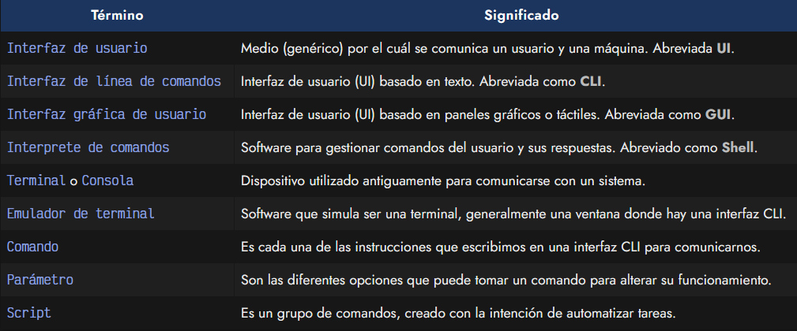
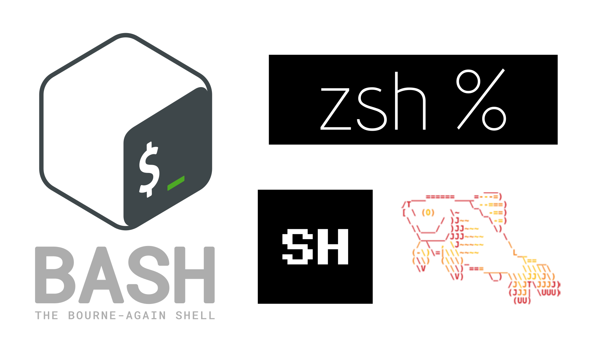
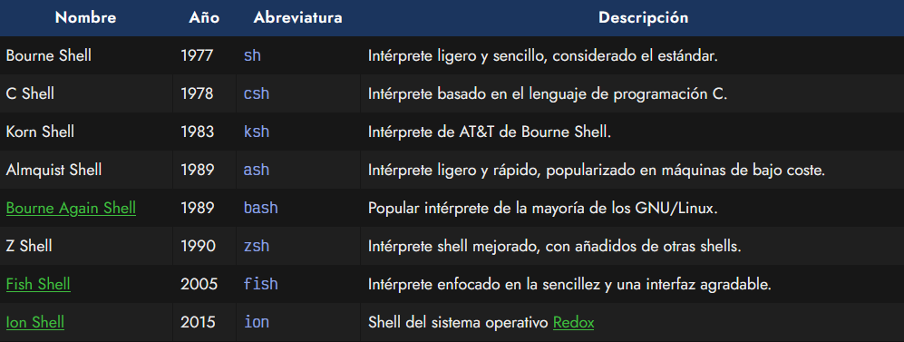

# 
¿Qué es una terminal?

La terminal o consola es una forma generalizada de llamar a la interfaz de usuario de línea de comandos: una pantalla (generalmente, de color de fondo negro sobre letras blancas) donde escribiendo comandos (secuencias de palabras especiales) ordenamos al sistema realizar acciones concretas.

Estas interfaces de usuario fueron muy populares en la década de los 70 y 80, ya que los sistemas de la época carecían de interfaces gráficas y era el sistema habitual para comunicarse con un dispositivo. Con el tiempo, las interfaces gráficas de usuario ganaron popularidad y relegaron a las interfaces de línea de comandos a un segundo plano, aunque nunca terminaron de perder la popularidad que las caracterizaba, sobre todo entre los usuarios más técnicos.

## ¿Por qué una terminal?.
Aunque una interfaz gráfica de usuario (GUI) puede ser más cómoda y agradable para el usuario, las razones para preferir una interfaz de línea de comandos son muchas:

   - Es más rápido crear un programa para línea de comandos.
   - Suele ser más potente en cuanto a personalización de opciones.
   - Permite creación de scripts para automatizar tareas repetitivas.
   - Suele ser una opción más universal entre sistemas.
   - Suele ser instantáneo, al no tener que cargar pantallas gráficas.

Es por ello que en el mundo de la informática, y del desarrollo en particular, es una vertiente muy utilizada aún en nuestros días, que no suele ser comprendida por personas externas al sector, que lo consideran un «atraso» al no conocer sus ventajas y sólo conocer sus desventajas.

No obstante, el panorama de línea de comandos ha mejorado muchísimo desde estas primeras décadas y hoy en día existen multitud de opciones para convertir una terminal en una herramienta de trabajo muy productiva.

## Conceptos básicos.
Hasta ahora, para simplificar, hemos utilizado una gran cantidad de términos que no son exactamente lo que parecen, por lo que antes de continuar, vamos a dedicar unos minutos a explicarlos, ya que los utilizaremos bastante:

## Interfaz de Usuario: ¿Qué es?.
Una interfaz de usuario (UI) es como se denomina al medio que utiliza un usuario para comunicarse con una máquina. En nuestro caso nos vamos a referir a interfaces de línea de comandos (CLI) cuando son basadas en texto, donde los usuarios escriben órdenes o comandos y el sistema las lee y realiza, o devuelve resultados e información.

Por otra parte, las interfaces gráficas de usuario (GUI) son la evolución natural de estas, utilizando pantallas gráficas o sistemas táctiles, mucho más sencillos y agradables de utilizar para la mayoría de los usuarios, sin embargo, habitualmente menos apropiadas y flexibles en contextos informáticos de desarrollo o sistemas.

## Intérprete de comandos: ¿Qué es?.
Como mencionamos en un apartado anterior, el intérprete de comandos (también llamado shell) es el software o programa que gestiona los comandos que introduce el usuario, para intentar comprenderlos lo mejor posible y comunicarselos a la máquina o sistema de la mejor forma posible. Por ejemplo, una interfaz de línea de comandos puede utilizar varios intérpretes diferentes, como por ejemplo: Bash o Zsh.

En GNU/Linux, existen multitud de intérpretes de comandos, siendo quizás los más conocidos bash y zsh. Sin embargo, existen multitud de ellos, como los que puedes ver a continuación:

## Terminal vs Emulador de terminal.
Es también muy frecuente utilizar la palabra terminal (en esta misma página lo hago frecuentemente) en lugar de emulador de terminal. Se hace para acortar, porque en realidad una terminal es un aparato que antiguamente se utilizaba para comunicarse con otro sistema, mientras que un emulador de terminal, que es lo que realmente utilizamos en nuestros dispositivos, es un software que simula ser una de esas terminales, habitualmente con apariencia de ventana de línea de comandos, aunque se puede encontrar de todo, como [EDEX-UI](https://github.com/GitSquared/edex-ui).

## ¿Qué es un comando?.
Solemos utilizar la palabra comando para referirnos a la instrucción que escribimos en el emulador de terminal para comunicarnos con el sistema, mientras que opciones o parámetros son los detalles que se suelen escribir a continuación para personalizar la forma de trabajar del comando o alterar su funcionamiento.

En el día a día del uso de terminal utilizamos múltiples comandos, y es conveniente aprender a utilizarlos (al menos los más frecuentes).

## ¿Qué es un script?.
Por último, también es muy común crear scripts, que no son más que ficheros de texto donde se escriben una colección de comandos para realizar una tarea concreta, con la intención de automatizarla y sea mucho más fácil para nosotros realizarla, ya que en lugar de escribir todos esos comandos por separado, sólo tenemos que llamar a ese script.

Por ejemplo, en el ejemplo anterior, tenemos lo siguiente:

   - El comando (verde). Muestra todos los ficheros que tenemos en la carpeta actual.
   - El primer parámetro (amarillo). Muestra ese listado en formato ancho.
   - El segundo parámetro (azul). Muestra sólo el contenido de la carpeta folder.

