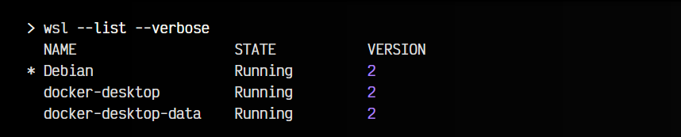
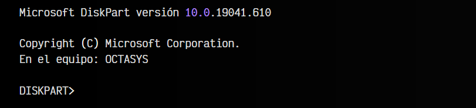
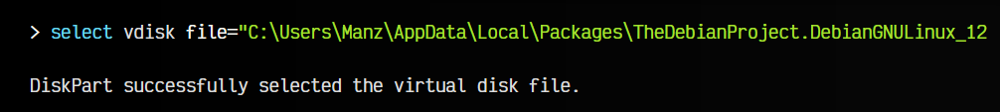
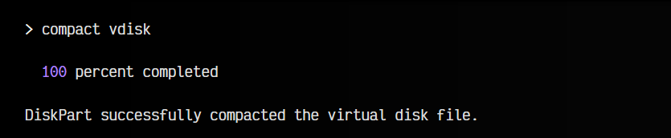

# 
Liberar espacio en disco en WSL

OJO: Este artículo trata específicamente de distribuciones WSL (Windows Subsystem for Linux). Si lo que quieres hacer es borrar archivos y hacer espacio en un disco Linux, quizás te interese más este artículo: [Cómo liberar espacio en un disco Linux](https://terminaldelinux.com/terminal/ficheros/espacio-libre-usado-disco/).

En ciertas ocasiones, es muy posible que la distribución de GNU/Linux que utilizamos día a día en Windows este creciendo y cada vez ocupe más espacio en disco, haciendo más posible la posibilidad de quedarse sin espacio en la unidad C (sobre todo en casos de discos SSD pequeños).

Esto suele ocurrir porque Windows tiene toda la información de nuestra distribución de Linux alojada en un archivo de extensión VHDX, un formato de disco duro virtual que utiliza Microsoft para sus sistemas, sobre todo en máquinas virtuales.

Por defecto, este formato de archivos suele crecer bastante, ya que reservan el espacio necesario en disco de forma dinámica, pero en el caso de que en nuestra distribución liberemos espacio o borremos archivos, el tamaño del archivo .vhdx no se reduce de forma automática, sino que hay que compactarlo de forma manual.

Para ello, vamos a seguir una serie de sencillos pasos que te permitirán reducir el tamaño de este archivo y ahorrar espacio en disco.

## Distribución a compactar.
En primer lugar, debemos asegurarnos de que distribución estamos utilizando y donde se guardan sus archivos. Para ello, el primer paso es ejecutar desde una terminal de Windows (cmd.exe) el comando wsl --list --verbose. Nos mostrará una lista con las distribuciones WSL utilizadas en el sistema:

En la columna nombre se suele indicar la distribución que tenemos instalada. Dependiendo de la distribución que sea, se guardará en una carpeta diferente, en el interior de la carpeta Packages en la ruta %LocalAppData%, o lo que es lo mismo, C:\Users\Manz\AppData\Local\Packages\ (donde Manz es el nombre de Usuario de Windows).

Por ejemplo, Debian se instala en una carpeta que empieza por TheDebianProject.DebianGNULinux, Ubuntu en una que empieza por CanonicalGroupLimited, y así con otras distribuciones. En cualquiera de los casos, tendrán dentro una carpeta LocalState que es la que guarda el mencionado fichero ext4.vhdx.

## Hacer una copia de seguridad.
Si has llegado a este punto y tienes información muy valiosa en esta distribución de Linux, quizás lo más conveniente es que hagas una copia de seguridad de los datos que contiene en algún otro disco externo o en la nube.

Copiar el fichero .vhdx es una forma rústica (pero efectiva) de hacer una copia de seguridad. Sin embargo, si quieres hacer una que no ocupe tanto espacio, puedes ejecutar el siguiente comando:

Donde Debian es el nombre de la distribución (que vimos anteriormente) y D:\DebianLinux.tar.gz es la ruta donde vamos a guardar un fichero comprimido en .tar.gz con el contenido del sistema de ficheros de nuestra distribución. En el peor de los casos, siempre podremos volver a restaurarlos más adelante con el comando wsl --import.

## Compactar un disco WSL.
Una vez dicho esto, vamos a realizar la operación de compactación del disco. El primer paso es cerrar cualquier tipo de acceso al disco, puesto que debemos desconectarlo y conseguir acceso único al mismo. Para ello, una vez cerremos todo lo que tengamos abierto, escribimos desde una terminal de Windows el comando wsl --terminate Debian.

Esto terminará la distribución indicada (en nuestro caso, Debian). En algunos casos, puede que esto no sea suficiente, para lo cuál recomendaría ejecutar el comando wsl --shutdown, que termina todas las distribuciones que estén abiertas y apaga el subsistema WSL2 temporalmente. Una vez hecho esto, escribimos el comando diskpart.

Nos pedirá permiso de administrador y abrirá una nueva ventana del Símbolo de sistema donde veremos algo similar a lo siguiente:

Ahora nos toca escribir el siguiente comando (ten en cuenta que la ruta depende de tu propio caso; el usuario no será Manz, y la carpeta que contiene la distribución se llamará de alguna otra forma diferente o tendrá alguna variación):

Si no nos aparece el mensaje de selección correcta de disco, es posible que se haya vuelto a iniciar la distribución. Si es así, ejecuta de nuevo el comando wsl --shutdown para finalizarla y vuelve a intentar lo anterior.

Aunque no es absolutamente necesario, podemos escribir los comandos attach vdisk readonly (antes del comando de compactación) y detach vdisk (después del comando de compactación) para asegurarnos que no se escriben datos durante el proceso.

Una vez hecho, escribimos finalmente el comando de compactación:

En este proceso es cuando se realizará la compactación del disco .vhdx. Aparecerá un mensaje de progreso que aparentemente tardará mucho, pero que irá más rápido en cuanto avance.

Depende del uso del disco que tengas para reducir más o menos tamaño de disco. En mi caso pasé de un archivo .vhdx de 41GB a uno de tan sólo 11GB.