# 
Tutorial de ffmpeg

Una de mis herramientas preferidas para conversión multimedia es ffmpeg. Se trata de una herramienta de línea de comandos que permite realizar multitud de tareas relacionadas con video, audio o incluso imágenes.

Aunque su uso no es excesivamente complejo, la gran cantidad de parámetros, combinaciones y el inmenso abanico de formatos y sus características, hacen que el uso de ffmpeg sea poco intuitivo cuando empezamos a utilizarlo (o incluso más tarde, si no lo tenemos bien claro).

En este artículo vamos a explicar como utilizar esta herramienta de forma sencilla, dando un repaso a las tareas de edición de video más comunes y prácticas, viendo ejemplos prácticos para aplicar.

## Instalación de ffmpeg.
La herramienta ffmpeg es multiplataforma, por lo que puede instalarse en cualquier sistema, ya sea GNU/[Linux](https://www.ffmpeg.org/download.html#build-linux), [Windows](https://www.ffmpeg.org/download.html#build-windows) o [Mac](https://www.ffmpeg.org/download.html#build-mac). En nuestro caso, que es GNU/Linux (o Windows bajo WSL), puedes utilizar el siguiente comando:

Si quieres comprobar si todo ha ido bien y ya tienes disponible el comando, puedes escribir which ffmpeg, el cuál debería devolverte algo similar a /usr/bin/ffmpeg. Eso significa que ya está instalado.

## Ver información de un fichero.
Una vez instalado, podemos ver información sobre nuestros videos de la siguiente forma:

El parámetro -i indica que se va a especificar un archivo de entrada (en nuestro caso, el video) y a continuación, dicho archivo. Veremos que ffmpeg nos devuelve gran cantidad de información, sin embargo no te asustes, solo tendremos que fijarnos en algunos detalles:

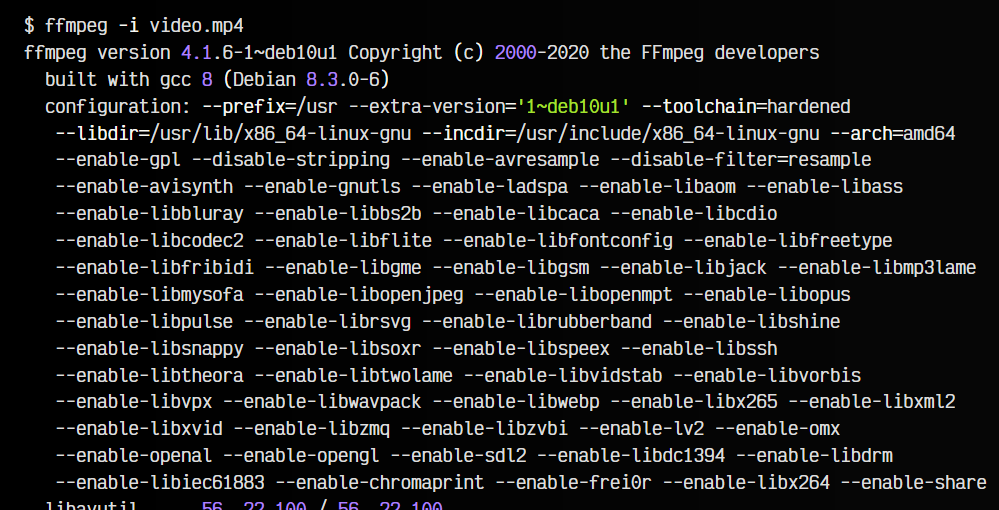
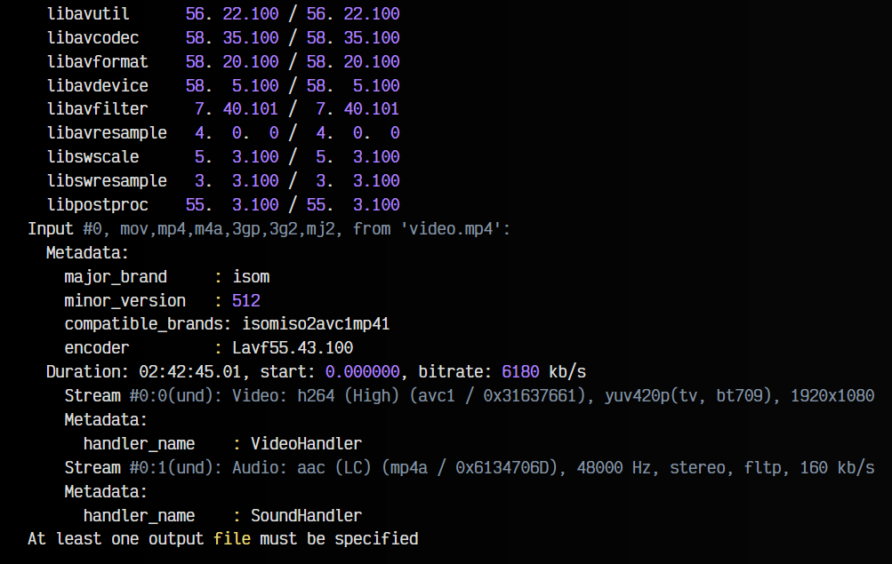

La parte clave es la que resalto a continuación:

   - El comando que hemos escrito: Se trata del comando que escribimos en la terminal de texto para lanzar ffmpeg y realizar alguna acción. En este caso, obtener información del video.
   - La fila Duration y bitrate: Características del archivo en general (duración y bitrate del video+audio, por ejemplo).
   - Stream #0:0: Información sobre el canal de video: codec, resolución, proporción de aspecto, calidad de video, fps, etc...
   - Stream #0:1: Información sobre el canal de audio: codec, frecuencia de muestreo, calidad de audio, etc...

Con esto puedes obtener información sobre un archivo de video y sus características. En la siguiente tabla puedes ver algunos parámetros interesantes, que explicaremos poco a poco más adelante:

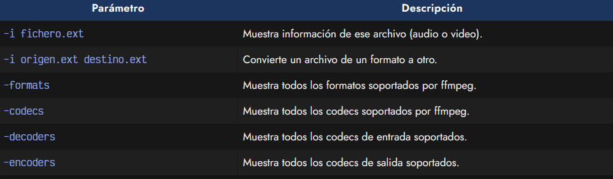

## Conversión entre formatos.
Uno de los puntos fuertes de ffmpeg es que permite realizar practicamente cualquier tipo de conversión entre los diferentes formatos de video y audio (que no son pocos). Es requisito recomendable tener una idea general de los diferentes formatos y codecs de video y formatos y codecs de audio que existen antes de comenzar a utilizar ffmpeg.

## Conversión rápida.
Podemos realizar conversiones aprovechándonos de las extensiones comunes de ciertos formatos de video, ya que ffmpeg los detecta automaticamente. Por ejemplo:

En este ejemplo, le indicamos a ffmpeg que el formato de entrada es video_original.avi (mediante el parámetro -i) y que lo convierta a un archivo de destino al cuál le hemos indicado la extensión .mp4. De esta forma, ffmpeg busca los codecs de video y de audio apropiados para este formato (automáticamente selecciona h264 para video y aac para audio).

Si realizaramos otra conversión desde un fichero .mp4 a otro .mkv, podremos fijarnos en estas líneas, las cuales nos indican que tipo de conversión se está realizando:

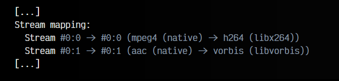

## Conversión específica.
No obstante, podemos ser más específicos y personalizar los formatos que queremos utilizar. Por ejemplo, especificando el codec de video y el codec de audio que queremos en el archivo de destino:

En ambos ejemplos anteriores estamos creando un archivo de video Matroska (MKV), con canal de audio vorbis en ambos casos. Sin embargo, en el primer ejemplo, estamos utilizando el codec de video h264 (mediante la librería libx264), mientras que en el segundo ejemplo utilizamos el codec de video h265 (mediante la librería libx265), aún en desarrollo y futuro sucesor de H264.

Los resultados son bastante interesantes, puesto que el primer archivo resultante ocupa 120MB, mientras que el segundo 69MB. Ambos a 1080p (HD) y con la misma aparente calidad (eso sí, el segundo tarda más en comprimir y crearse).

También podemos hacer lo mismo con los canales de audio:

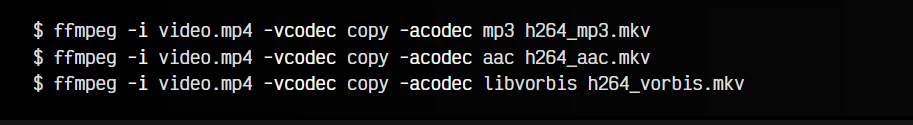

Observa que en estos casos, hemos especificado copy en el codec de video, lo que obliga a ffmpeg a no hacer conversión de formatos de video, sino utilizar el que ya tiene (ahorrando mucho tiempo porque no hay que recomprimir el video), mientras que le especificamos el codec de audio mediante acodec.

Tanto con -vcodec como con -acodec tenemos que especificar la librería de codec a utilizar. En el caso de especificar solo la extensión en el archivo (por ejemplo, .mp3), el ffmpeg se encarga de seleccionar la librería más apropiada (libmp3lame, en este caso).

## Listar codecs de video/audio.
Podemos ver las librerías de codecs y formatos que soporta ffmpeg escribiendo en una terminal las lineas de comandos ffmpeg -formats o ffmpeg -codecs.

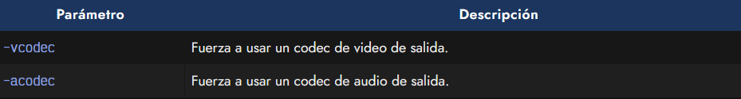

## Reducir calidad (bitrate).
Por defecto, ffmpeg se encarga de detectar la calidad (bitrate) del video y audio del archivo original y le asigna uno equivalente al archivo de destino. Sin embargo, esto depende mucho del archivo en cuestión y puede que ffmpeg reduzca demasiado la calidad (y se vea con mala calidad el archivo resultante) o mantenga una calidad demasiado alta (y ocupe demasiado el archivo final).

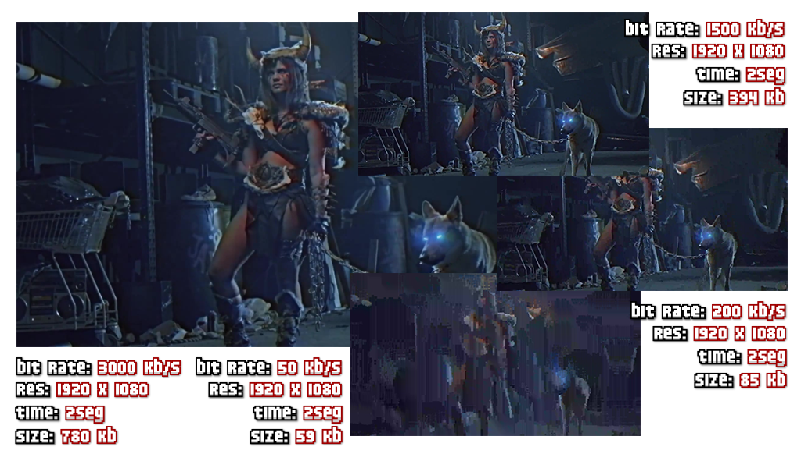

Generalmente, ffmpeg hace un gran trabajo en este aspecto. Pero si queremos personalizar la calidad, utilizaremos el parámetro -b:v para el bitrate de video y -b:a para el bitrate de audio. Por ejemplo:

Esto conseguiría que el archivo MP4 final tenga un video con un bitrate de 2500kb/s y un audio con un bitrate de 192kb/s.

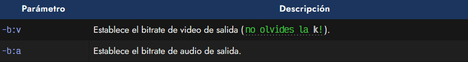

## Extraer audio de un video.
Otra operación muy común es querer extraer el audio de un video, para pasarlo a un archivo MP3, por ejemplo. Esto es muy sencillo de hacer con ffmpeg:

n algunos casos, como el caso anterior, ffmpeg detectará que el archivo de destino es un archivo de audio y hará la conversión automáticamente sin necesidad de indicar parámetros como -vn. Sin embargo, será necesario si queremos hacerlo en un formato final mkv sin canal de video.

## Silenciar el audio de un videoo.
De la misma forma análoga al ejemplo anterior (donde eliminabamos el canal de video en un archivo de video), podemos eliminar el canal de audio de un archivo de video:

## Subir el volumen.
Muchas veces tenemos un video que tiene un audio muy bajo. Podemos subirle el volumen del canal de audio con el parámetro -vol, indicándole un valor numérico donde 256 es el volumen original, pudiendo subirlo o bajarlo:

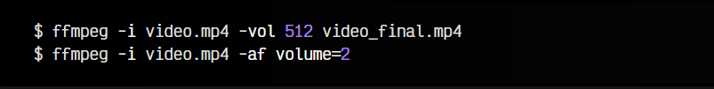

En el segundo ejemplo vemos una forma alternativa utilizando filtros de audio, en el que subimos el volumen al doble de su volumen original.

## Pistas de audio en video.
La mayoría de formatos de video de la actualidad funcionan como contenedores que son capaces de incluir varios canales de audio (e incluso de otros tipos). Es muy común, por ejemplo, para añadir audio en diferentes idiomas. Con ffmpeg podemos gestionar esas pistas múltiples presentes en un archivo de video.

Un ejemplo de uso podrían ser los siguientes comandos:

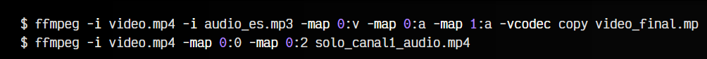

En el primer ejemplo, obtenemos dos archivos de entrada: video.mp4 (un video en inglés) y audio_es.mp3 (el audio en español). Nuestra intención es añadir este audio en el video, de modo que se pueda seleccionar el idioma. Con -map 0:v y -map 0:a indicamos que utilizaremos el video y audio del primer archivo de entrada (video.mp4) y con -map 1:a indicamos que utilizaremos el audio del segundo archivo de entrada (audio_es.mp3) para incorporarlo al video final.

En el segundo ejemplo, partimos de un archivo video.mp4 que tiene varios canales de audio, y con los parámetros -map 0:0 y -map 0:2 indicamos que queremos generar un archivo con el video (canal 0) y la segunda pista de audio (canal 2), eliminando por tanto la primera pista (canal 1).

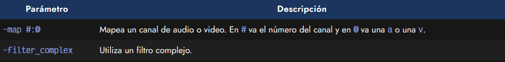

## Mezclar pistas de audio.
Pero en algunas ocasiones no interesa añadir otra pista de audio al video, sino mezclarla con la pista existente. Para ello, podemos utilizar el filtro de audio amerge, como vemos en el siguiente ejemplo:

## Rotar o girar un video.
También es muy común tener la necesidad de rotar un video, ya sea porque nos interesa tenerlo así o porque alguien tuvo la osadía de hacer un maldito vídeo vertical. Para solucionarlo, podemos rotar el video haciendo lo siguiente:

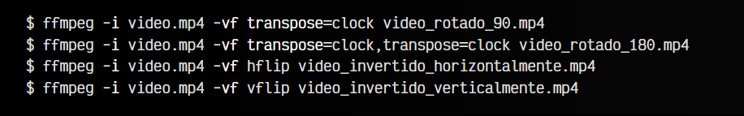

En el primer ejemplo, utilizamos el filtro de video transpose para girar 90 grados en el sentido de las agujas del reloj. En el caso de indicar el valor cclock en lugar de clock, se gira en el sentido contrario de las agujas del reloj. En el segundo ejemplo, aplicamos el filtro dos veces, por lo que conseguimos como resultado un giro de 180 grados. Los dos últimos ejemplos son para invertir un video horizontal o verticalmente.

Existe un parámetro rotate en ffmpeg que es mucho más flexible, pero cuidado, los valores deben expresarse en [radianes](https://es.wikipedia.org/wiki/Radi%C3%A1n).

## Redimensionar video.
Otra operación bastante frecuente es la de redimensionar el tamaño de un video. También es una operación muy sencilla de realizar con ffmpeg, aunque hay que tener en cuenta la proporción de aspecto, de modo que al redimensionar no se deforme el mismo. Veamos algunos ejemplos:

En el primero de los casos, obligamos a ffmpeg a redimensionar el video a la resolución 320x240, independientemente del tamaño del video original. En la segunda opción, sin embargo, al indicar -1 le decimos a ffmpeg que utilice el alto apropiado para que el video no se deforme, reemplazándolo por su alto equivalente:

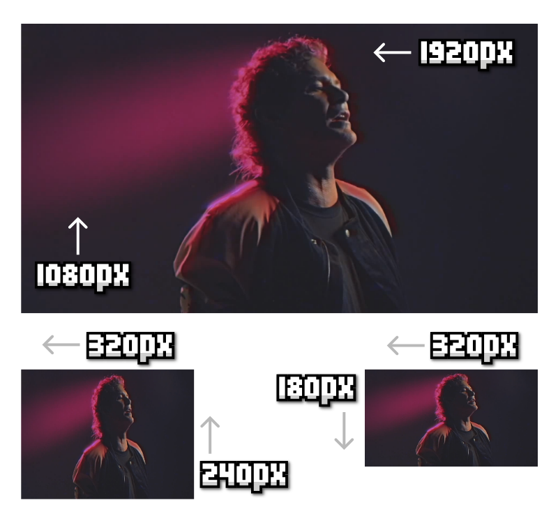

En el tercer ejemplo, utilizamos las palabras clave iw (input width) y ih (input height). Al dividirlas entre dos, lo que indicamos es que el video resultante tenga la mitad de tamaño tanto de ancho como de alto.

Nota: Hay que tener cuidado con algunos codecs, puesto que no permiten redimensiones a tamaños que no sean múltiplos de 4 o restricciones similares.

## Recortar fragmentos.
Otra operación interesante que nos puede surgir es la de recortar un fragmento de tiempo de un video más largo. Por ejemplo, obtener el fragmento de video desde los 35seg hasta los 65seg (30seg de duración).

Existe un parámetro con el que podemos realizar estas operaciones:

En el primer ejemplo, estamos seleccionando el fragmento de video desde los 35seg (como marca de inicio), y a partir de ahí, 30seg hacia adelante. En el segundo ejemplo, estamos seleccionando el fragmento de video desde la marca de tiempo de 35seg hasta 1min 5seg, ambos del video original.

## Recorta zonas del video.
Imagina por un momento que tienes un video, pero sólo te interesa quedarte con una región concreta del mismo. Esto es lo que se llama crop (recortar), y también se puede realizar con ffmpeg, con una línea de comandos como la que vemos a continuación:

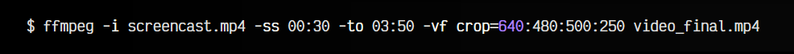

En ella, escogemos un fragmento de video, en el que sólo nos quedamos con una región de tamaño 640x480 desde la posición (500,250) de la pantalla. Esto puede ser muy útil para recortar grabaciones que hemos hecho y queremos extraer sólo una región de la pantalla.

## Extraer fotogramas de un video.
Con ffmpeg también podemos realizar tareas con formatos de imágenes. Es posible extraer los fotogramas de un video (o un fragmento de video) y pasarlos a imágenes individuales. Para hacerlo, simplemente escribimos la siguiente línea de comandos:

Teniendo en cuenta que los videos, por lo general, tienen entre 25-30fps (fotogramas por segundo), esto quiere decir que, salvo que se trate de un video muy corto, cada video generará gran cantidad de imágenes.

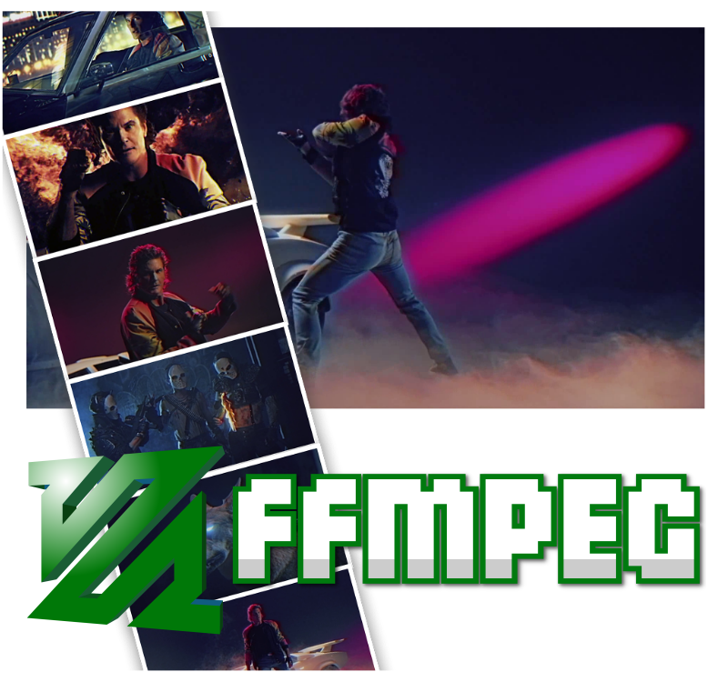

Para evitarlo, se puede reducir los fotogramas por segundo a uno, por ejemplo, utilizando el siguiente filtro:

De esta forma, sólo generará una imagen por segundo. También podemos realizar la operación contraria, de modo que teniendo una serie de imágenes, las unamos y convirtamos en un video, algo ideal para técnicas de [stop-motion](https://es.wikipedia.org/wiki/Stop_motion), realizadas con una cámara digital:

## Aplicar un viñeteado al video.
Un efecto muy elegante y utilizado es el viñeteado, muy utilizado por los fans de Instagram. Con ffmpeg podemos también aplicar un viñeteado a nuestro video, en todos sus fotogramas, dándole un aspecto más elegante y profesional.

Para aplicarlo, basta con utilizar el filtro de video vignette, junto a un valor que representa el ángulo del mismo en radianes:

El valor aplicado por defecto al viñeteado es pi/5, sin embargo se pueden hacer cosas un poco más complejas, como el segundo ejemplo, donde se crea un viñeteado que vibra aleatoriamente, simulando un efecto retro de reproducción antigua.

## Crear fundidos (fadeout/fadein).
Otro efecto elegante utilizado a menudo en videos es el de los «fundidos a negro» (fade-out) o su proceso inverso (fade-in). Estos fundidos son muy comunes al inicio o al final de un video, ya que es una forma elegante de terminarlo.

Con ffmpeg se pueden crear de la siguiente forma:

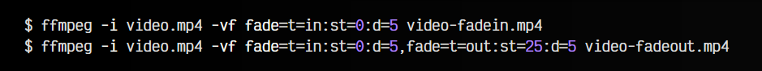

Teniendo en cuenta que nuestro video.mp4 tiene una duración de 30 segundos, en el primer ejemplo, creamos un fundido desde negro (fade-in). Los parámetros indicados fade=t=in:st=0:d=5 son para realizar un tipo de fundido de entrada (fade-in), que comience en la marca de tiempo de 0seg y dure 5seg desde que pasa de negro a desvanecerse por completo.

En el segundo ejemplo, añadimos además un fundido a negro (fade-out), que comienza a los 25seg y dura 5seg. También podríamos añadir un párametro c=white para realizar los fundidos al color blanco, en lugar de negro.

Sin embargo, ya que tenemos el fundido a negro visualmente hecho, también podemos utilizar el filtro de audio afade para hacer lo mismo con el sonido:

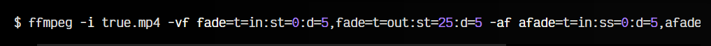

## Añadir marca de agua en video.
Quizás, uno de los ejemplos más prácticos puede ser el siguiente. En él, lo que hacemos es insertar una imagen en una posición concreta de la imagen. Esto es ideal para insertar logotipos o marcas de agua en un video. Ten en cuenta, que si utilizas imágenes PNG puedes aprovechar el canal alfa de transparencia del mismo y colocar marcas de aguas que no sean totalmente opacas. El primer ejemplo que se ve a continuación inserta la imagen logo.png en la posición (10,10), comenzando desde la esquina superior izquierda:

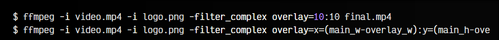

Por otro lado, el segundo ejemplo realiza la misma tarea, pero utilizando variables predefinidas, que equivalen a colocar ese logotipo en la esquina inferior derecha, algo quizás más habitual.

## Otros comandos.
Añado algunos otros comandos interesantes que he utilizado en alguna ocasión:

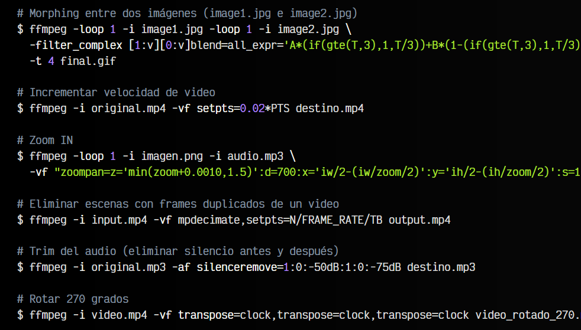

Esto sólo es una selección práctica con algunos pequeños ejemplos de lo que se puede hacer con ffmpeg. Si te ha resultado útil o conoces algún parámetro interesante que no esté en la lista, por favor, compártelo con nosotros en los comentarios.