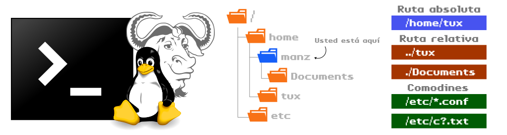

# 
Manipular ficheros y carpetas

Para trabajar desde una terminal, es muy necesario saber moverse entre carpetas y manipular ficheros y carpetas. Acciones como copiar, mover y borrar ficheros o crear carpetas forman parte del día a día en nuestras terminales de texto.

Por esa razón es necesario conocer algunos de los comandos más habituales para estas y otras tareas relacionadas, así como sus parámetros o curiosidades más importantes.

## El comando file.
Existe un comando no demasiado conocido llamado file con el cuál puedes saber con que tipo de fichero estás trabajando. En principio, normalmente identificamos a los ficheros por sus extensiones, si es .txt es un fichero de texto y si es .mp3 se trata de un archivo de audio. Sin embargo, estas extensiones son una convención. Nada me impide renombrar un fichero .txt como .mp3. Simplemente, no funcionará si lo abro con un reproductor de audio.

Sin embargo, file no se guiará por la extensión, sino que analizará su contenido, más concretamente su número mágico, para intentar reconocer que tipo de archivo es.

Nota: Si file no es lo suficientemente exhaustivo para ti, existe un proyecto llamado trID que tiene la misma filosofía que file pero analiza los ficheros en mayor profundidad.

## El comando cp.
Una operación básica a la hora de usar una terminal es la de copiar ficheros. Nos encontramos continuamente haciendo copias de ficheros o carpetas, ya sea de una ruta a otra o sobre la misma carpeta donde nos encontramos. Para ello, utilizamos el comando cp (copy), que suele utilizarse de la siguiente forma:

En este sencillo ejemplo hemos copiado el fichero origen.txt desde la carpeta /home/manz a la carpeta /home/tux cambiándole el nombre a destino.txt.

Asumamos que seguimos en la carpeta /home/manz:

La forma en la que especificamos las rutas y copiamos ficheros, pueden simplificarse y hacerse más flexibles dependiendo de si utilizamos rutas absolutas o rutas relativas:

Veámoslo con varios ejemplos:

Vamos a explicar cada caso:

   - El primer caso, equivalente al primer ejemplo, pero indicando rutas absolutas.
   - El segundo caso, creamos una copia con nombre destino.txt en la misma ruta.
   - El tercer caso, asumiendo que seguimos en la ruta /home/manz, copiamos el fichero origen.txt a la ruta relativa ../tux, es decir, a /home/tux, con nombre destino.txt.
   - El cuarto caso, copiamos el fichero resolv.conf de la ruta /etc a ., o sea, la carpeta actual donde nos encontramos, pero con el nombre backup.conf.

Por otro lado, es importante recalcar que el comando cp tiene algunos parámetros que pueden resultarnos útiles, como por ejemplo el parámetro -r que nos permite hacer copias recursivas, esto es, no sólo copiar ficheros, sino carpetas y su contenido, ya que por defecto cp solo copia ficheros.

Los parámetros más populares son los siguientes:

## El comando mv.
Al igual que hemos utilizado cp para copiar ficheros, podríamos utilizar mv (move) para mover archivos. La diferencia entre estos dos comandos es que, mv en lugar de mantener el fichero original como hace cp, lo elimina tras la copia:

Obsérvese que en el primer caso, se está moviendo un fichero a una ruta concreta, pero podemos utilizar mv para renombrar a la vez que movemos (como en el caso 2) o simplemente renombrar sin mover de ruta (caso 3).

De la misma forma que cp, el comando mv tiene los mismos parámetros que mencionamos.

## El comando rm.
Probablemente, otro de los comandos más utilizados en la terminal es rm (remove), que sirve para eliminar ficheros o carpetas de nuestro sistema. Hay que tener mucho cuidado con él, ya que una vez un fichero es eliminado, aunque no es imposible, es complicado recuperarlo.

Como mencionamos anteriormente, el comando rm realmente no borra un fichero, sino que lo «marca» en el disco como reutilizable. Si la zona del disco donde residía es sobreescrita con otro fichero, probablemente sea imposible recuperarlo, pero en caso contrario hay cierta posibilidad.

Nota: Si deseas eliminar por completo un fichero, sin posibilidad de recuperación, es mejor utilizar el comando shred -u seguido del nombre del fichero a eliminar. Este comando sobreescribe con información aleatoria el fichero, y luego lo elimina (parámetro -u).

## El comando rip (mejora de rm).
Si la filosofía por defecto del comando rm no te agrada, o eres una persona que suele eliminar ficheros por accidente, quizás te interese el comando [rip](https://github.com/nivekuil/rip) (rm improved).

Se trata de una alternativa a rm desarrollada en Rust, que establece que al eliminar un archivo con rip, pasa a estar «muerto» en una zona del disco denominada «cementerio» (por defecto, /tmp/graveyard-user, donde user es el nombre de usuario), que hace las veces de papelera de reciclaje tétrica.

Si hemos borrado accidentalmente el fichero, podemos «resucitarlo» escribiendo rip -u (undelete) o simplemente acceder a los ficheros dentro de la estructura del cementerio. Si queremos vaciar el cementerio, basta con escribir rip -d (decompose) o eliminar la estructura de carpetas manualmente.

Otra alternativa similar a rm podría ser [trash-cli](https://github.com/sindresorhus/trash-cli).

## El comando mkdir.
Mediante el comando mkdir, seguido de un nombre de carpeta, podemos crear nuevas carpetas vacías.

Si queremos crear una estructura de varias carpetas una dentro de otra, en vez de hacerlo una por una. El siguiente comando crea una carpeta parent, que dentro tiene una carpeta child y dentro de ella, una carpeta grandchild:

## El comando touch.
Por otro lado, el comando touch sería la versión de mkdir orientada a ficheros en lugar de carpetas. Si necesitamos crear un archivo vacío, por ejemplo, para editar más tarde, podemos hacerlo rápidamente con touch:

El comando anterior crearía un fichero vacío con nombre file.txt. Si ya existiera el archivo, simplemente actualiza su fecha de modificación.

## El comando ln.
El comando ln (link names) permite crear enlaces entre ficheros, una especie de referencias o accesos directos a ficheros, rutas o carpetas. Existen dos tipos de enlaces:

   - Los enlaces duros. Son los ficheros que apuntan a otro fichero basándose en su número interno (inodo). Se crean utilizando el comando ln. De esta forma podemos tener varios archivos con el mismo contenido, pero sus copias no duplican el contenido del fichero original, sino que son una referencia al primero. Son poco utilizados.

   - Los enlaces simbólicos (también considerados enlaces blandos). Son un tipo de referencia a otros ficheros, pero esta vez basándose en su ubicación. Se crean utilizando el comando y parámetro ln -s. De esta forma, cuando accedemos a un enlace simbólico, realmente estamos accediendo al fichero que apunta. Si creamos un enlace simbólico y borramos su archivo original, el enlace aparecerá en rojo y se considerará un enlace simbólico roto.

Veamos un ejemplo:

Como se puede ver, con el comando ln creamos un enlace, y con el parámetro -s indicamos que queremos que sea simbólico. El primer fichero indicado sería el archivo original al que queremos apuntar, mientras que el segundo fichero indicado sería el enlace simbólico que queremos crear.

Al hacer un ls, observaremos que nos indica a donde apunta el enlace simbólico (puede ser un fichero, una carpeta, etc...). En el caso de que el enlace se encuentre correcto, aparecerá en azul cyan, pero si el fichero original a donde apunta no existiera, aparecería en rojo.

Estos enlaces pueden ser realmente útiles cuando necesitamos que en la carpeta actual exista el contenido de otra carpeta, pero no queramos duplicar la información (son carpetas con mucho espacio ocupado) o queremos mantenerlo actualizado y simplemente queremos una referencia de una carpeta a otra.