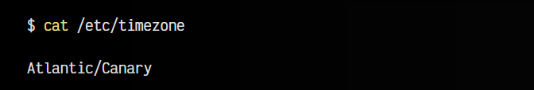
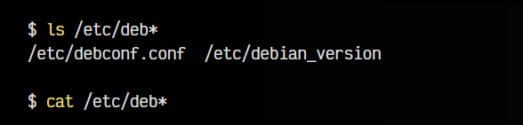
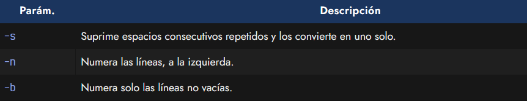
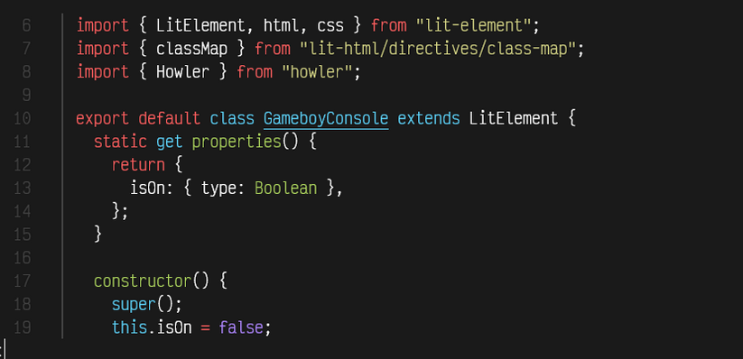
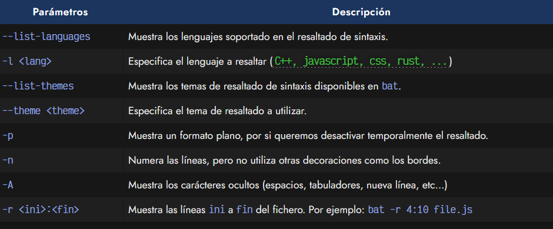
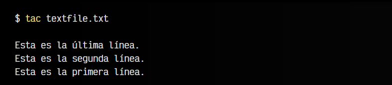
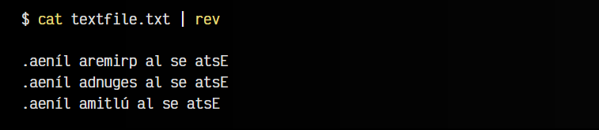
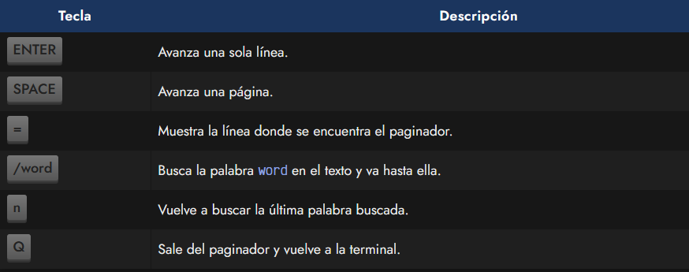
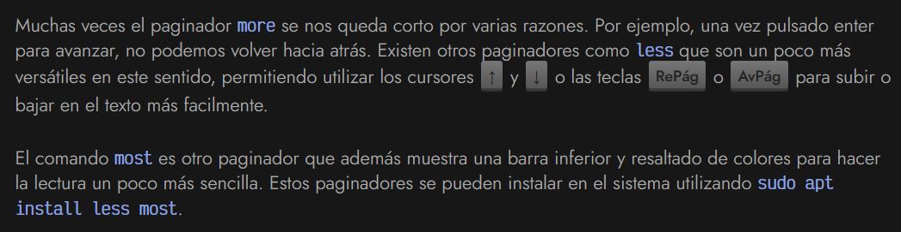
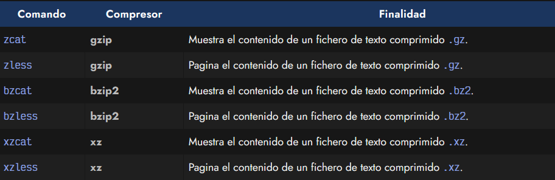

# 
Mostrar contenido de fichero

A medida que trabajamos con ficheros en una terminal, el nombre del fichero, su ubicación o su extensión puede no ser información suficiente para saber si se trata del fichero que buscamos, e interesarnos mostrar el contenido de un fichero rápidamente, para saber si es el que buscamos o simplemente porque queremos ver su contenido.

## El comando cat.
Para ello, se suele utilizar el comando cat (conCATenate files), que técnicamente se considera un comando que concatena (une) la salida de uno o varios ficheros. Esto, dicho de otra forma, es que cat no se limita a mostrar el contenido de un solo fichero (como suele usarse habitualmente), sino que puede hacer cosas aún más potentes.

Por ejemplo, el caso más básico sería el siguiente:

En este ejemplo, mostraríamos el contenido del fichero timezone ubicado en la ruta /etc. Se trata de un fichero que guarda la zona horaria del sistema. De esta forma, podríamos consultarla rápidamente, sin tener que abrirla con un editor. Sin embargo, también podríamos hacer lo siguiente para mostrar el contenido de varios ficheros:

Con el comando cat /etc/deb* indicamos que queremos que nos muestre el contenido de todos los fichero que comiencen por deb y estén situados en /etc (en este caso 2 ficheros) y no tendríamos que hacerlo individualmente, uno por uno.

El comando cat tiene algunos parámetros interesantes:

## El comando bat (mejora de cat).
Existe una alternativa muy interesante al comando cat, llamada bat y desarrollada en Rust. Dicho comando mejora sustancialmente al comando cat, utilizando características como resaltado de sintaxis en color para lenguajes de programación, soporte para cambios de git, paginación (ver más adelante) automática, etc...

Para instalarla, necesitaremos tener en nuestro sistema Rust instalado, y utilizar su gestor de paquetes cargo. Con él, podremos escribir cargo install bat y lo tendremos disponible. Las últimas versiones de Debian, ya lo incorporan para instalar con un simple sudo apt install bat.

La salida del comando bat de un fichero Javascript sería similar a la siguiente:

El comando bat dispone de varios parámetros interesantes:

Nota: Ejecutando bat --list-themes veremos la lista de temas disponibles para el resaltado de sintaxis. Puedes usar uno de ellos escribiendo bat --theme base16 (por ejemplo). También puedes aprovechar para incluirlo en un alias de la shell y que se ejecute al hacer un cat.

## El comando tac (al revés).
Si el comando cat nos muestra el contenido de un fichero de arriba a abajo, es decir, desde su primera línea a su última línea, el comando tac (cat al revés) hace justo lo contrario, mostrar el contenido de un fichero de abajo a arriba, desde su última línea a la primera.

Otra opción posible, aunque menos común, es que si buscamos mostrar el contenido de un archivo al revés, pero en lugar de abajo a arriba, de derecha a izquierda, podemos utilizar el comando rev, que invierte el orden horizontal:

## El comando more.
Pero en algunos casos, nos encontraremos que el contenido de un archivo es demasiado extenso y no nos da tiempo de leer su contenido antes de que siga avanzando en el contenido. La mejor forma de solucionar ese problema es utilizar un paginador.

Se trata de un comando que, una vez detecta que la pantalla está llena, hace una pausa, y no continua hasta que el usuario pulse una tecla. De esta forma, puede ir leyendo poco a poco los contenidos mostrados en pantalla. El paginador más conocido se llama more y se utiliza de la siguiente forma:

En este caso estamos utilizando un pipe | que obtiene la salida por pantalla del primer comando y se lo envía al segundo, que es el paginador.

De esta forma, el paginador hace una pausa cuando se llena la pantalla, mostrando una línea more al final de la pantalla y esperando a que el usuario pulse una tecla. Dependiendo de la tecla que se pulse, el paginador more hará una acción concreta:

Sin embargo, el more es bastante limitado en cuanto a ciertas acciones.

## El comando less (mejora de more).

Nota: Tanto more, como less como most pueden utilizarse directamente como alternativa de cat. Es decir, ejecutar less largetextfile.txt para mostrar el contenido paginado.

## Soporte de compresión.
En Linux, es muy habitual trabajar con ficheros de texto plano, aunque en el caso de registros o logs, cuando son muy extensos suelen terminar ocupando mucho espacio. Para evitarlo, se suelen comprimir utilizando formatos muy comunes en Linux como .gz, .bz2 o .xz, de modo que podríamos tener los ficheros de texto originales access.log o los ficheros comprimidos, por ejemplo access.log.gz.

Los comandos cat y less tienen unas versiones alternativas que permiten realizar su finalidad (mostrar contenido o paginar) sobre archivos de texto comprimidos. De esta forma, nos ahorramos tener que descomprimir el fichero, visualizar su contenido y volverlo a comprimir, ya que estos comandos lo hacen todo sobre el archivo comprimido, sin alterarlo.

Los comandos son los siguientes:

Si quieres más información sobre formatos de compresión, echa un vistazo al artículo de compresores de Linux.