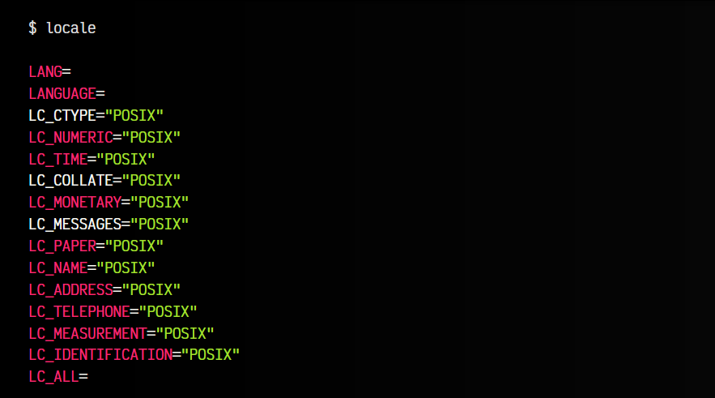
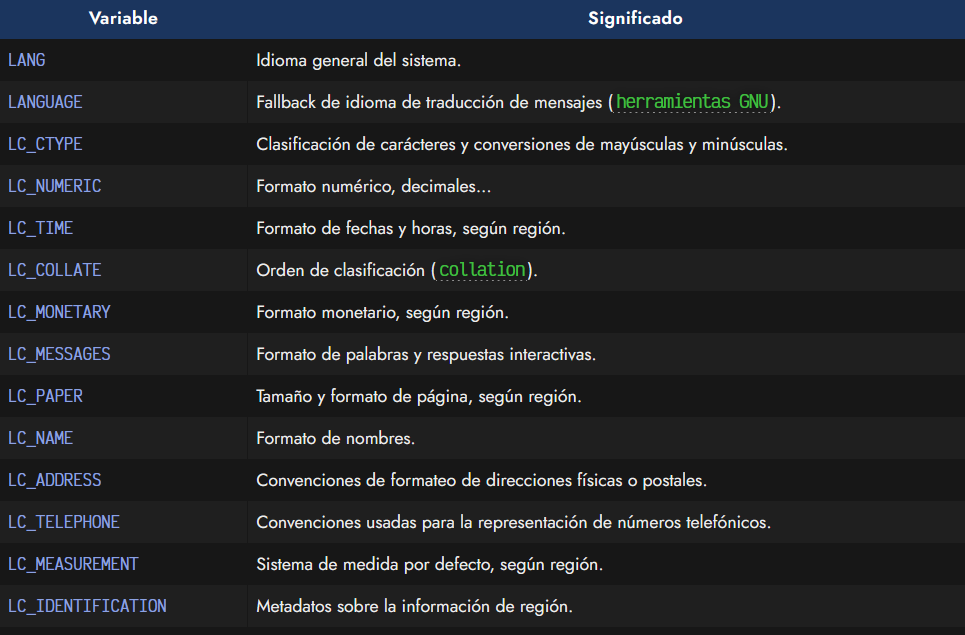
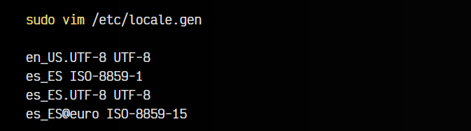
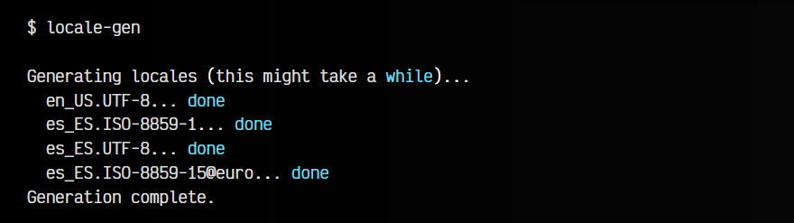
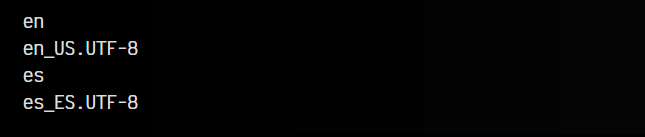
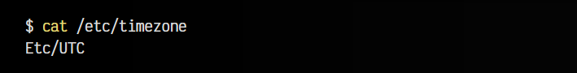
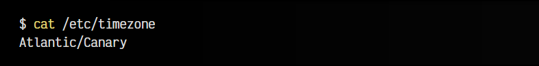

# 
Cambiar idioma de la terminal

Pueden ocurrir situaciones donde el idioma de la terminal está establecido a otro diferente del que queremos. Esto, en algunos casos, puede chocar con nuestro objetivo. Aunque es muy habitual trabajar en terminales con el idioma inglés (ya que los comandos siempre van a mantener el mismo nombre), es posible que queramos traducir las respuestas de los comandos, los mensajes de error o incluso los mensajes de ayuda o manuales, así como gestionar ciertos detalles interesantes relacionados con el idioma.

## Cambiar idioma a español.
El primer paso es asegurarnos cuál está tomando como idioma por defecto el sistema. Por ejemplo, si realizamos un sudo apt update podremos observar en que idioma nos muestra los procesos de actualización de los repositorios de apt. Es muy probable que nos aparezcan en inglés, lo que significaría que tenemos ese idioma por defecto.

Vamos a comprobar que idioma o configuración regional tenemos en el sistema. Para ello, utilizaremos el comando locale:

Vemos que la mayoría de variables de localización nos aparecen con la palabra clave POSIX, la cuál también podría aparecer con otros valores, como por ejemplo en_US.UTF-8, que significaría que tiene establecido el idioma Inglés (Americano).

Cada una de esas variables que aparece, tiene como objetivo definir el idioma de una característica concreta:

Ojo: Ten cuidado en el caso de establecer un valor a LC_ALL, el cuál se desaconseja utilizar si quieres establecer excepciones particulares en alguna de las variables anteriores, ya que sobreescribe las demás.

Nuestro sistema puede estar preparado para soportar diferentes idiomas. Con el parámetro locale -a podemos ver cuales son los que tenemos a nuestra disposición. En el caso de que no tengamos el idioma que queremos establecer, lo que podemos hacer es instalar el paquete de generación de localizaciones con sudo apt install locales y editar el fichero /etc/locale.gen, donde descomentaremos los idiomas que queremos activar:

En el ejemplo anterior, he descomentado el idioma inglés (en_US) y las diferentes variaciones del español (es_ES). Una vez hecho esto, guardamos los cambios y ejecutamos el comando locale-gen, que generará los idiomas descomentados, poniéndolos a nuestra disposición:

Si tuvieramos algún tipo de problema al generarlos, también podemos instalar el paquete locales-all de APT, donde generalmente se incluyen todos los datos regionales precompilados.

Nota: En algunos casos, esta operación puede realizarse de forma mucho más guiada y automática con un dpkg-reconfigure locales, eligiendo posteriormente los idiomas que nos interesan de la lista que nos muestran.

Una vez terminados todos estos pasos, sólo nos quedaría añadir la siguiente línea a nuestro fichero de arranque, como por ejemplo, en la última linea de ~/.bashrc si usamos Bash, o ~/.zshrc si usamos Zsh:

Con ello añadimos la variable LANG para indicar que nuestro idioma por defecto será el aplicado. Esto se puede escribir en la línea de comandos directamente (sólo se usará ese idioma en la sesión actual) o se puede añadir al fichero que comentabamos anteriormente, para que los cambios se guarden de forma permanente.

Nota: Ten cuidado a la hora de establecer el idioma en las variables de sistema. En este ejemplo he puesto es_ES.UTF-8, pero en algunos casos puede ser es_ES.utf8 o tener un nombre ligeramente diferente. Es aconsejable mirar con el comando locale -a cuál es el que nos interesa y como se escribe concretamente.

## Man pages en español.
Es posible que aún realizando los pasos anteriores, las páginas man no muestren la ayuda en español y sólo lo haga la salida de ciertos comandos, por ejemplo. Normalmente esto se suele solucionar instalando los paquetes manpages-es (en el caso del idioma español):

Con dichos paquetes instalaremos las páginas man en español (ojo, siguen haciendo falta los pasos del primer apartado).

## Eliminar idiomas innecesarios.
Si acostumbramos a instalar muchos paquetes, comandos o aplicaciones, debemos saber que las «páginas man» suelen venir junto a cada paquete, de modo que si instalamos un comando concreto, también se instala su ayuda en formato «man pages».

De la misma forma, algunos paquetes solo incorporan la ayuda en un idioma (inglés), pero en otras ocasiones, incorporan ayuda en muchos otros idiomas diferentes, cosa que puede llegar a ocupar bastante espacio en disco, y que probablemente, nunca consultemos en algún idioma diferente a los que establecemos en el primer apartado.

Justo en esta dirección va el objetivo del comando localepurge, el cuál se encarga de eliminar todas las páginas de ayuda en idiomas que no tenemos predefinidos como preferidos. De esta forma, cada vez que instalamos algo con apt, el sistema se tomará un pequeño fragmento de tiempo en eliminar las páginas man en otros idiomas, para dejar sólo las que tengamos marcadas, ahorrando así espacio en disco (en algunas situaciones es esencial, por ejemplo, docker).

Para configurarlo todo correctamente, editaremos el fichero /etc/locale.nopurge. En él podemos establecer algunas configuraciones, pero sobre todo, los idiomas permitidos que no deben ser eliminados. Un ejemplo de las últimas líneas de este fichero:

Así pues, localepurge mantendrá toda la ayuda y páginas del manual que se encuentren en inglés o en español.

## Cambiar la zona horaria.
Otro problema bastante frecuente es el de querer cambiar la zona horaria del sistema. Para consultar la zona horaria que tenemos establecida, se puede hacer simplemente haciendo un cat al fichero /etc/timezone. De esta forma nos dirá que zona horaria tenemos configurada:

Para cambiarla nos basta con editar ese fichero y establecer la zona horaria que queremos utilizar, o utilizar el comando tzselect, el cuál nos permitirá seleccionar la zona horaria de una lista.

Si queremos optar por un proceso interactivo más automatizado, podemos utilizar el comando dpkg-reconfigure tzdata y seleccionar las opciónes 7 (Atlántico) de Área geográfica y 3 (Canarias) de Zona horaria.

Si volvemos a consultar, veremos que ahora ya tenemos otra zona horaria configurada.