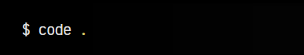
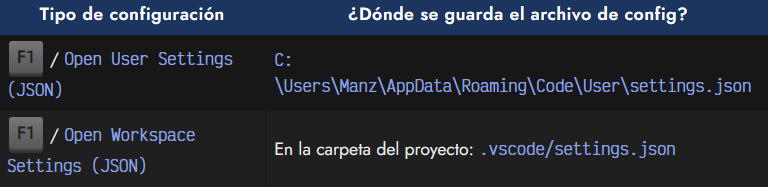

# 
Instalar VSCode

Visual Studio Code es un fantástico editor de textos enfocado en el sector de la programación. Es uno de los editores más utilizados por la comunidad para proyectos de código y programación. Entre las múltiples ventajas que posee, podemos destacar el tener una amplia gama de extensiónes o plugins, temas de estilo, sistema de configuración, integración con otros servicios y una capacidad de personalización bastante grande.

## Instalación de VSCode.
Podemos descargar Visual Studio Code desde su web oficial, concretamente desde la categoría [Download](https://code.visualstudio.com/Download). Si eres amante del Software Libre, también puedes descargar [Visual Studio Codium](https://vscodium.com/) (VSCodium), que es la versión open source de VSCode, donde no tienes los sistemas de tracking o telemetría de Microsoft.

## El comando code.
Si te encuentras en Windows y piensas instalar WSL (Linux dentro de Windows), te recomiendo hacerlo primero. Si instalas VSCode después de instalar WSL, te habilitará el comando code. Este comando permite abrir el editor Visual Studio Code simplemente escribiendo lo siguiente desde una terminal:

Esto significa que quieres abrir VSCode en la carpeta actual. Si no estás seguro si tienes instalado el comando, puedes escribir code --version, si te devuelve la versión, está correctamente instalado.

En caso contrario, de no tenerlo instalado, puedes instalarlo pulsando F1 en VSCode y buscando la opción Install code command. Otro detalle importante, sería comprobar si tienes instalada la extensión WSL de Microsoft. En las últimas versiones se instala automáticamente, pero es posible que no la tengas disponible si instalaste VSCode cuando aún no tenías WSL instalado.

## Temas e iconos.
Cuando queremos trabajar con Visual Studio Code, es un buen consejo elegir un tema para nuestro editor, donde estemos cómodos con su esquema de colores, bordes, fondos, etc... A continuación tienes una tabla con algunos de los temas que considero más interesantes:

  - 🌈 [Monokai Accents](https://marketplace.visualstudio.com/items?itemName=tw.monokai-accent)
  - 🍮 [Flatland Monokai](https://marketplace.visualstudio.com/items?itemName=gerane.Theme-FlatlandMonokai)
  - 👀 [Enfocado Theme](https://marketplace.visualstudio.com/items?itemName=wuelnerdotexe.vscode-enfocado)
  - 🟡 [Bluloco Dark Theme](https://marketplace.visualstudio.com/items?itemName=uloco.theme-bluloco-dark)
  - 🧔 [Bearded Theme](https://marketplace.visualstudio.com/items?itemName=BeardedBear.beardedtheme)
  - 🐼 [Panda Theme](https://marketplace.visualstudio.com/items?itemName=tinkertrain.theme-panda)
  - 🟣 [2077 Theme](https://marketplace.visualstudio.com/items?itemName=Endormi.2077-theme)
  - 🧛‍♀️ [Dracula Dark Theme](https://marketplace.visualstudio.com/items?itemName=dracula-theme.theme-dracula)
  - 💠 [SynthWave 84](https://marketplace.visualstudio.com/items?itemName=HelligeChris.synthwave-vscode-renew)
  - 🤍 [GitHub Light Theme](https://marketplace.visualstudio.com/items?itemName=Hyzeta.vscode-theme-github-light)
  - 😸 [Gatito Theme](https://marketplace.visualstudio.com/items?itemName=pawelgrzybek.gatito-theme)
  - 💚 [Vue Theme](https://marketplace.visualstudio.com/items?itemName=mariorodeghiero.vue-theme)
  - ⚫ [One Monokai Theme](https://marketplace.visualstudio.com/items?itemName=azemoh.one-monokai)
  - 🌃 [Palenight Theme](https://marketplace.visualstudio.com/items?itemName=whizkydee.material-palenight-theme)
  - 👧 [Doki Theme](https://marketplace.visualstudio.com/items?itemName=unthrottled.doki-theme)
  - 🗻 [Monokai Theme](https://marketplace.visualstudio.com/items?itemName=fabiospampinato.vscode-monokai-night)
  - 🔵 [Cobalt2 Theme](https://marketplace.visualstudio.com/items?itemName=wesbos.theme-cobalt2)
  - 🐺 [Winter is Coming](https://marketplace.visualstudio.com/items?itemName=johnpapa.winteriscoming)

Si no te convencen estos temas, sólo son algunos ejemplos, hay muchos más. Puedes encontrar más temas en el VSCode Themes.

También se aconseja instalar un tema de iconos en nuestro Visual Studio Code. Por defecto, VSCode no trae iconos para identificar los archivos, pero con un tema de iconos cada archivo .html, .css, .js, .json, .php, .py u otro formato, tendrá su propio icono particular, que nos permitirá identificar los ficheros de forma más rápida.

   -   💖 VSCode Icons
   -   🟦 Material Icon

## Extensiones.
De la misma forma que instalamos temas visuales que nos permiten modificar el aspecto visual del editor, también podemos instalar extensiones o plugins, que añadirán ciertas características a Visual Studio Code que por defecto no posee. De esta forma, podemos ampliar sus características y que se adapte mejor a nuestras necesidades.

► [Ver más sobre las extensiones que uso en VSCode](https://manz.dev/software/vscode)

## Configuración.
Nuestro Visual Studio Code tiene algunas opciones establecidas por defecto. Nosotros podemos querer cambiar ciertas opciones para que funcionen de otra forma, y esto se puede hacer tanto desde los menús de VSCode, o desde su panel, pulsando F1 o pulsando CTRL + SHIF y buscando la opción adecuada.

Estos cambios se pueden quedar almacenados en un fichero .json que puede estar en varios lugares:

Recuerda que la configuración que escribamos afectará a todos los proyectos abiertos con VSCode si se guarda en el primer fichero de configuración (user), o afectará sólo al proyecto en cuestión si se guarda en el segundo fichero de configuración (workspace).

► [Ver más sobre configuración de VSCode](https://terminaldelinux.com/terminal/preparacion-entorno/configuracion-vscode/)

