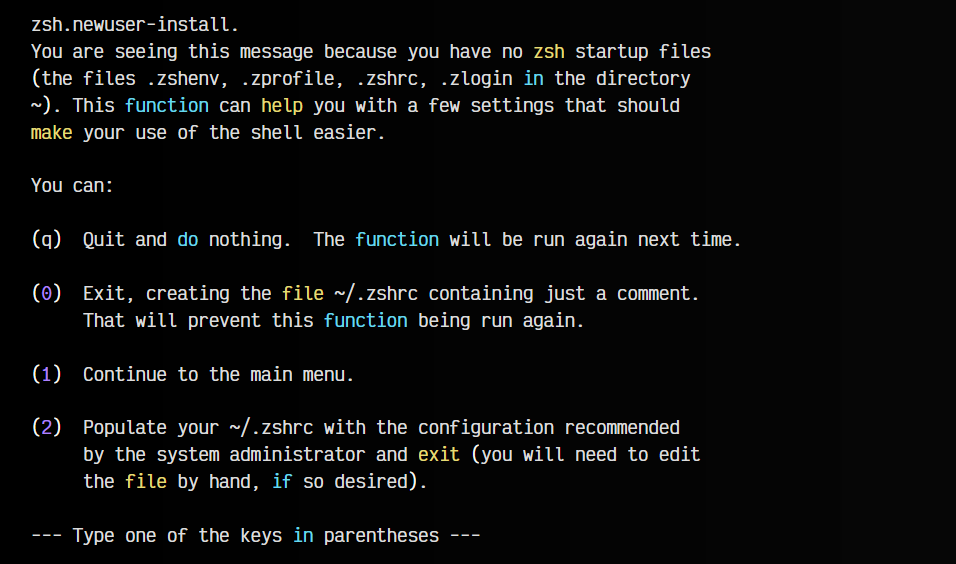
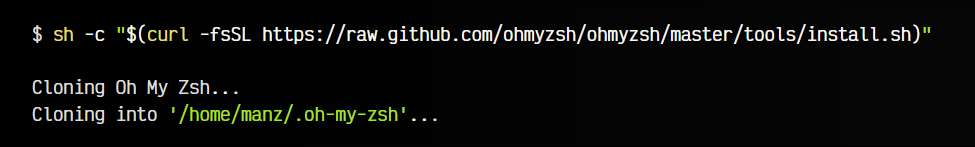
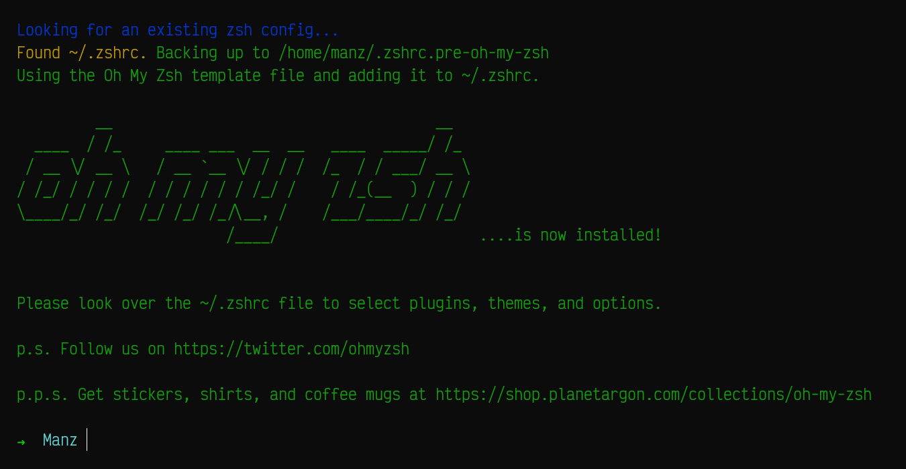
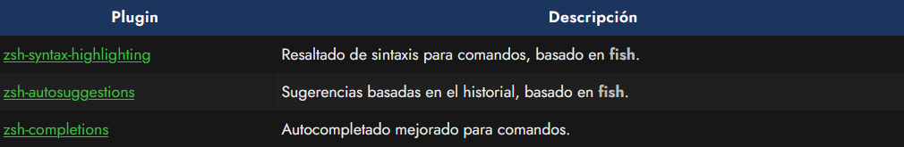
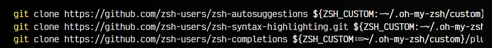
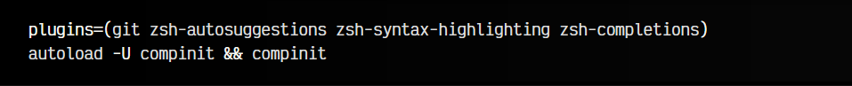

# 
Instalación de zsh

En este artículo veremos como instalar y configurar zsh para tener una terminal moderna, atractiva y con funcionalidades interesantes como autocompletado de comandos basado en el historial, resaltado y detección de comandos existentes o completado avanzado de comandos.

## Instalar Z Shell (zsh).
El intérprete Z Shell (más conocido como zsh) es uno de los shells más conocidos de GNU/Linux, adoptado hace poco por Apple como su intérprete de terminal por defecto desde 2019. Hoy en día, quizás el más extendido es bash, sin embargo, zsh gana cada día más adeptos debido a su capacidad y potencia de personalización y su activa comunidad. Es una excelente alternativa a bash.

Si tenemos un sistema recién instalado (o por defecto), lo más probable es que tengamos un bash o un sh (más simple). Lo primero que necesitamos tener instalado en nuestro sistema es el intérprete de zsh. Para instalarlo utilizaremos apt, que se encargará de buscar los paquetes necesarios y sus dependencias:

Con esto tendríamos el intérprete instalado, pero se trata de un «zsh pelado», sin configuración. De hecho, de momento ni siquiera se va a iniciar por si solo y seguiremos utilizando el interprete que teníamos antes. Si escribimos zsh podemos obligar al sistema a abrir zsh y ver si se ha instalado correctamente. Nos debería aparece una pantalla similar a la siguiente:

Esta es la pantalla de bienvenida de zsh, que nos da varias opciones para configurarlo manualmente, dejar su configuración vacía, entre otras. Marcamos la opción 0, que simplemente creará nuestro fichero de configuración ~/.zshrc para que no nos vuelva a salir este mensaje de bienvenida cada vez que arranquemos zsh.

Si todo ha ido bien, debería aparecernos algo parecido a esto (con el nombre de nuestro sistema):

Escribimos exit para salir de esta sesión y volver a la anterior (donde aún no usabamos zsh).

## Utilizar zsh por defecto.
Habrás comprobado que si cierras la terminal y la vuelves a abrir, parece no haber cambiado nada y no inicia zsh. Esto ocurre porque aunque está instalada en el sistema, aún estás usando otro intérprete de comandos (probablemente, el anterior que tenías). Para saber que intérprete de comandos o shell estamos utilizando, puedes escribir echo $0 o echo $SHELL, el cuál debería mostrarte cuál estas utilizando en el momento actual.

Por otro lado, escribiendo cat /etc/shells podemos ver que intérpretes tenemos instalados en nuestro sistema y podemos utilizar. Si queremos cambiar el shell con el que inicia un usuario (por ejemplo, manz), solo tenemos que utilizar el comando chsh (change shell):

Perfecto. Ahora cuando volvamos a abrir una terminal, nos arrancará la shell zsh. Ahora que ya lo tenemos todo listo, toca configurarlo para que haga magia.

## Framework Oh-My-Zsh.
Uno de los frameworks más populares de zsh es Oh-My-Zsh!, el cuál podremos instalar para dotar a nuestro sistema de funcionalidades muy interesantes que nos harán más cómodo su uso. Para instalarlo necesitaremos curl y git, por lo que instalamos dichos requisitos previamente:

Una vez los tengamos instalados, escribimos el comando siguiente, el cuál descargará el script oficial de instalación de Oh-my-zsh!:

Es posible que al finalizar la instalación nos pregunte si queremos sobreescribir la configuración de ~/.zshrc o si queremos establecer zsh como shell por defecto, si corresponde. Una vez terminado el proceso, debería aparecernos algo como lo siguiente:

Podemos ver que el prompt de la shell ya ha cambiado a algo más bonito y amigable, haciendo uso de colores. Sin embargo, puede resultarnos demasiado simple. Veamos como podemos cambiarlo por otro theme.

## Cambiar el tema de zsh.
Una de las características más llamativas de zsh es la posibilidad de cambiar el theme de la terminal, a uno más vistoso y llamativo. La shell zsh incorpora de serie varios themes para la terminal que podemos utilizar según nuestros gustos.

Por ejemplo, uno de mis preferidos es agnoster. Para seleccionar este tema, simplemente tenemos que editar el archivo de configuración ~/.zshrc y buscar la línea siguiente:

El tema robbyrussell es el que viene por defecto, pero podemos cambiarlo por agnoster o por cualquier otro de la lista de themes de zsh. De hecho, incluso podemos indicar random como tema, y descomentar una línea que aparece más abajo, que nos activar un tema aleatorio de esa lista, de forma aleatoria cada vez que abramos una terminal:

Si todo ha ido bien al cambiar el tema por agnoster, al guardar el fichero de configuración y abrir una nueva terminal ya debería aparecernos la nueva interfaz del intérprete de comandos:

Ten en cuenta que es posible que algunos carácteres se nos muestren incorrectamente (como cuadrados o similar). Esto suele ocurrir cuando usamos una tipografía que no es capaz de mostrar los carácteres especiales que necesitamos. Para solucionarlo, te recomendamos instalar y utilizar una [tipografía de NerdFonts](https://www.nerdfonts.com/font-downloads).

## Error 12: character not in range.
Es muy común, que instalando los plugins, gestionando los themes y personalizando los apartados anteriores, te puedas encontrar de repente con que al iniciar la terminal, nos aparece un error similar al siguiente:

Este problema ocurre por conflictos en la lectura de carácteres Unicode, ya que es posible que esté intentando leer alguno que no exista en el conjunto de carácteres instalados (es muy común en Docker, donde no tienes los locales preinstalados). Para resolverlo, simplemente instala los paquetes de localización escribiendo sudo apt install locales-all y reinicia la sesión de usuario.

## Autocompletado y sugerencias.
Existen una serie de plugins creados por la comunidad de zsh muy interesantes, que podemos instalar en nuestra terminal para ampliar sus capacidades y hacerla mucho más cómoda.

El primero de ellos, zsh-syntax-highlighting, es el resaltado de color de comandos, el cuál viene de una característica que incorporaba inicialmente el intérprete de comandos fish. Al escribir un comando en la terminal nos aparecerá en rojo si no está instalado en el sistema o en verde si está disponible para utilizar. De esta forma sabremos, a medida que vamos escribiendo los comandos, si los estamos escribiendo bien (o por lo contrario, tenemos erratas) o si no se encuentra instalado un comando, por ejemplo, incluso antes de pulsar la tecla ENTER.

El segundo, zsh-autosuggestions, es un plugin que a medida que escribimos un comando, nos sugiere y recuerda comandos escritos anteriormente (que residen en el historial de la terminal) en color gris de fondo, para que sea más sencillo para nosotros identificarlos. Pulsando FLECHA-DCHA le decimos a zsh que lo recupere íntegro, lo que puede ser útil para comandos largos.

Autocompletado y sugerencias de zsh

Por último, el plugin zsh-completions nos permite activar ciertas características interesantes de autocompletado en zsh, como por ejemplo atajos al pulsar TAB en git, composer de PHP, nano, el firewall ufw, node y muchos otros.

Para instalar estos plugins, lo que tendremos que hacer es simplemente copiar y pegar los siguientes comandos. En ellos, lo que estamos haciendo es descargarnos (clonar el repositorio del plugin de git) y guardándolo en nuestra carpeta personal, en un apartado de plugins personalizados de oh-my-zsh. Podemos hacerlo todo con estos tres comandos:

Una vez hecho, editamos el fichero ~/.zshrc y bajamos hasta la linea donde se cargan los plugins, generalmente con esta configuración plugins=(git). Ampliamos esa lista de plugins, escribiendo lo siguiente:

Con esto, cargaremos esos 4 plugins y tendremos listo estas funcionalidades adicionales desde que volvamos a abrir una nueva terminal.

Es posible que el plugin de autocompletado no aplica el color adecuado. Puedes solucionarlo editando el archivo ~/.zshrc y añadiendo la linea export ZSH_AUTOSUGGEST_HIGHLIGHT_STYLE="fg=5". Esto permitirá cambiar el color del autocompletado desde el historial, donde el 5 es el color (en este caso color morado).

