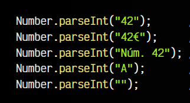

# 
Convertir texto a número

## Números enteros
Para convertir un string en number en Javascript, lo ideal es utilizar las funciones de parseo numérico, .parseInt() y .parseFloat(), que aunque son sencillas, tienen algunos detalles que deberíamos mencionar:

Para ilustrar esto, veamos un ejemplo con el método .parseInt() cuando sólo le pasamos un parámetro (texto) que queremos convertir a número:

!
!

Nota que el método .parseInt() funciona perfectamente para variables de texto que son números (o que empiezan por números). Esto es muy útil para eliminar unidades de variables de texto que se extraen de una página. Sin embargo, si la variable de texto comienza por un valor que no es numérico, .parseInt() descartará todo el texto y devolverá un NaN.

Observa también que si utilizamos .parseInt() con un String que contiene números decimales, sólo se quedará con la parte entera, descartando el resto del número:

Si queremos quedarnos con el número decimal completo, necesitamos el método que explicamos en el siguiente apartado.

## Números decimales
De forma análoga a .parseInt() tenemos otro método llamado .parseFloat(). Funciona exactamente igual a la primera, sólo que está enfocada para trabajar con números decimales, en lugar de números enteros. Si utilizamos .parseInt() con un número decimal, nos quedaremos sólo con la parte entera, mientras que con .parseFloat() conservará también la parte decimal (si la tiene).

Veamos unos ejemplos utilizados con .parseFloat():

Recuerda utilizar .parseFloat() siempre que necesites mantener los decimales.

## Convertir desde otra base.
Habrás observado que tanto .parseInt() como .parseFloat() tienen un segundo parámetro Number radix. Este parámetro sirve para indicar la base numérica desde la que procede el número del String. Por defecto, cuando se omite este parámetro, se asume que la base es 10 (base decimal), pero indicando este parámetro podemos cambiar la base.

## ¿Qué es una base numérica?.
Los humanos solemos utilizar una base numérica decimal, es decir, contamos desde el 0 al 9, es decir, 10 números. Sin embargo, existen otras bases numéricas:

## Convertir a decimal.
Así pues, podemos convertir de cualquier base numérica a la decimal, utilizando el parámetro radix de estos métodos:

Otra forma de representar estos números en una base numérica específica en Javascript es utilizando la nomenclatura de la base numérica mediante un prefijo 0b, 0o o 0x. Al utilizarlos, se convertirán automáticamente a base decimal:

## Convertir desde decimal.
También nos podría interesar hacer la operación inversa. Es decir, tenemos un número en base decimal y queremos convertirlo a una base numérica diferente. Para ello, lo ideal es utilizar el método .toString() de los String:

Vamos a realizar varias operaciones de ejemplo para ejemplificar su utilización:

